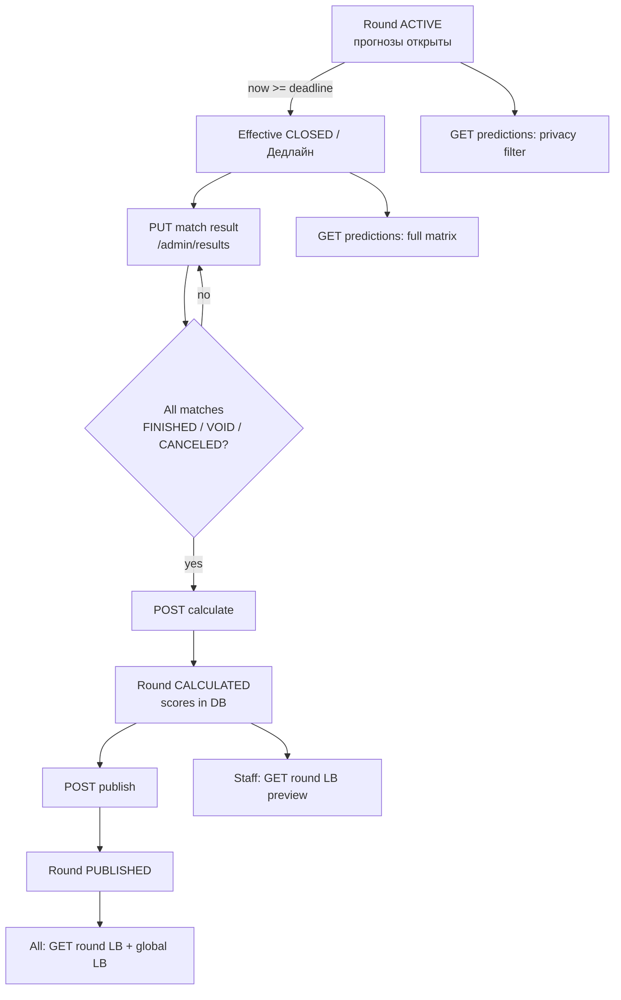

# Supervisor Admin UI — Status & Capability Matrix

> **Purpose:** single place linking **backend statuses**, **frontend-derived statuses**, **display-only labels**, **scoring/visibility rules**, and **cross-page dependencies** (Туры, Результаты, прогнозы, таблицы, ДопТур).  
> **Audience:** frontend/backend developers and QA — avoid re-reading `api_v1.yaml` for UI gating rules.  
> **Not a replacement for:** API transition guards (`contest_lifecycle_flow.md`), scoring math (`scoring_flow.md`, `bonus_rules.md`), or human manual (`manuals/STATUS_REFERENCE.md`).

## Related documents

| Document | Scope |
|----------|--------|
| [contest_lifecycle_flow.md](contest_lifecycle_flow.md) | API state machines, transition guards, auto-close |
| [scoring_flow.md](scoring_flow.md) | Base points, logical tour, settlement timeline |
| [bonus_rules.md](bonus_rules.md) | Bonus 1/2/3, deferred bonuses (`bonuses_pending`) |
| [leaderboard_tiebreakers.md](leaderboard_tiebreakers.md) | Standings order, count columns |
| [frontend_api_integration.md](frontend_api_integration.md) | HTTP paths, types, auth, errors |
| [manuals/STATUS_REFERENCE.md](../../manuals/STATUS_REFERENCE.md) | Russian labels, product meaning, public visibility |
| [manuals/API_GUIDE.md](../../manuals/API_GUIDE.md) | Endpoint behaviour, error codes |
| **This file** | UI: derived status, per-page capabilities, **results → scores → visibility** |

### Industry pattern (what we follow)

There is no single ISO name for this artefact. Common equivalents:

- **State machine spec** (backend) — we have this in `contest_lifecycle_flow.md`
- **UI capability / permission matrix** — derived states × allowed actions per screen
- **Decision table** — condition → outcome (used below for match phases)

We **do not duplicate** API transition rules here; we **extend** them with frontend-only derived states and display labels. When backend and UI disagree, **backend wins** for mutations; UI may show effective state earlier via client clock (`isDeadlinePassedNow`).

---

## 1. Terminology: `effectiveRoundStatus` vs `displayRoundStatus`

| Name | What it is |
|------|------------|
| **`effectiveRoundStatus()`** | **Function** in `frontend/src/lib/admin/roundEffectiveStatus.ts`. Input: API `round.status` + optional `deadlinePassed` flag. Output: status used for **UI routing and gating**. |
| **`displayRoundStatus`**, **`effectiveStatus`**, **`displayStatus`** | **Local variable names** at call sites — all hold the **return value** of `effectiveRoundStatus(...)`. No semantic difference. |

```ts
// ResultsEntryPanel.tsx
const displayRoundStatus = selectedRound ? effectiveRoundStatus(selectedRound) : null;

// RoundManagementPanel.tsx
const effectiveStatus = effectiveRoundStatus(selectedRound, effectiveDeadlinePassed);

// roundLabel.ts
const displayStatus = effectiveRoundStatus(round);
```

**Rule for new code:** always pass **effective** round status (not raw `round.status` from API) into match gating, phase labels, and result entry — unless you intentionally need the persisted DB value (e.g. “server still catching up” hints).

### Effective round mapping

| API `rounds.status` | Condition | **Effective** status (UI logic) | UI label (`roundStatusLabel`) |
|---------------------|-----------|----------------------------------|-------------------------------|
| `DRAFT` | — | `DRAFT` | Черновик |
| `ACTIVE` | `now < deadline` | `ACTIVE` | Активен |
| `ACTIVE` | `now >= deadline` | **`CLOSED`** | **Дедлайн** |
| `CLOSED` | — | `CLOSED` | Дедлайн |
| `CALCULATED` | — | `CALCULATED` | Рассчитан |
| `PUBLISHED` | — | `PUBLISHED` | Опубликован |

**Inputs for “deadline passed”** (any one is enough):

1. API `deadline_passed: true` from `GET …/rounds/{id}/predictions`
2. Client `isDeadlinePassedNow(round.deadline)` — `now >= deadline` UTC
3. API `rounds.status === 'CLOSED'` after lazy auto-close

**Backend note:** `rounds.status` may lag as `ACTIVE` for seconds until the next contest-scoped request runs `ensure_round_closed_if_expired`. UI must not wait for that to show «Дедлайн» or to gate results entry — but only when client clock agrees with backend deadline semantics (see §1.1).

### 1.1 Datetime: UTC storage, display zone for input

| Layer | Zone | Config |
|-------|------|--------|
| **DB / API storage** | UTC | Backend `API_TIMESTAMP_TIMEZONE`; frontend `NEXT_PUBLIC_API_TIMESTAMP_TIMEZONE` |
| **Wire / parse** | UTC | `parseApiUtc()` — naive ISO without `Z` = UTC wall clock |
| **Supervisor input** | Display wall clock | `NEXT_PUBLIC_DISPLAY_TIMEZONE` (e.g. `Europe/Moscow`) → `fromDatetimeLocal()` |
| **UI labels** | Display zone | `formatDateTimeRu()` + `NEXT_PUBLIC_DATETIME_LOCALE` |
| **Unset display zone** | Browser local | Omit `NEXT_PUBLIC_DISPLAY_TIMEZONE` |

Template: `frontend/.env.local.example`. Hub: `frontend/src/lib/datetime/config.ts`.

**Rule:** user types **display/local wall time**; API stores **UTC instant**. Do not use bare `Date.parse(naiveIso)` on API fields.

Mismatch: UI «Дедлайн» + `403 DEADLINE_NOT_PASSED` — missing/wrong display config or old data saved before `fromDatetimeLocal` conversion.

---

## 2. Three layers of “status”

```
┌─────────────────────────────────────────────────────────────┐
│ Layer 1 — API / DB (authoritative for mutations)            │
│   rounds.status, matches.status                             │
└───────────────────────────┬─────────────────────────────────┘
                            │ effectiveRoundStatus()
┌───────────────────────────▼─────────────────────────────────┐
│ Layer 2 — Effective round phase (admin UI routing)          │
│   Same enum as API; ACTIVE+deadline → CLOSED                │
└───────────────────────────┬─────────────────────────────────┘
                            │ matchPhaseLabel() [CLOSED only]
┌───────────────────────────▼─────────────────────────────────┐
│ Layer 3 — Display-only match phase (not in API)             │
│   «Идёт» when SCHEDULED + kickoff ≤ now + round CLOSED      │
└─────────────────────────────────────────────────────────────┘
```

| Layer | Stored in DB? | Example |
|-------|---------------|---------|
| Round API | Yes | `ACTIVE`, `CLOSED` |
| Round effective | No (computed) | `CLOSED` while API still `ACTIVE` |
| Match API | Yes | `SCHEDULED`, `FINISHED` |
| Match display phase | No | «Идёт», «Запланирован» (CLOSED round only) |

---

## 3. Match statuses

### 3.1 API (`matches.status`)

| API | UI label (`matchStatusLabel`) | Set by |
|-----|------------------------------|--------|
| `SCHEDULED` | Запланирован | Round create / restore |
| `POSTPONED` | Перенесён | Supervisor on **Туры** |
| `CANCELED` | Отменён | Supervisor on **Туры** |
| `VOID` | Аннулирован | Supervisor on **Результаты** |
| `FINISHED` | Завершён | `PUT …/matches/{id}/result` (scores saved) |

### 3.2 Display-only phases (effective round = `CLOSED` only)

Used by `matchPhaseLabel(status, date_time, roundStatus)` in `format.ts`.  
**Only when `roundStatus === 'CLOSED'`** (pass **effective** status, not raw `ACTIVE`).

| Match API | Extra condition | Display label | Real meaning |
|-----------|-----------------|---------------|--------------|
| `SCHEDULED` | `kickoff > now` | Запланирован | Deadline passed; match not started |
| `SCHEDULED` | `kickoff <= now` | **Идёт** | Deadline passed; match started; score not entered |
| `FINISHED` | — | Завершён | Score entered |
| `CANCELED` / `VOID` | — | Отменён / Аннулирован | Terminal |

> **«Идёт» is not an API value.** Backend keeps `SCHEDULED` until `set_result`. Both **Туры** and **Результаты** must use the same effective round status when calling `matchPhaseLabel`.

### 3.3 Result entry gating (`canEnterMatchResult`)

| Effective round | Match API | Kickoff | Enter/edit score? |
|-----------------|-----------|---------|-------------------|
| `CLOSED` | `SCHEDULED` | future | No — «Матч ещё не начался» |
| `CLOSED` | `SCHEDULED` | past | **Yes** |
| `CLOSED` | `FINISHED` | past | **Yes** (re-edit before calculate) |
| `CLOSED` | `CANCELED` / `VOID` | any | No |
| `CALCULATED` | `FINISHED` | any | **Yes** (auto-recalc on save) |
| `CALCULATED` | `SCHEDULED` | any | No |
| `ACTIVE` / `DRAFT` / `PUBLISHED` | any | any | No |

Implementation: `frontend/src/lib/admin/matchResultsGating.ts`.

---

## 4. Page: `/admin/rounds` (Туры)

**Shell:** `RoundManagementPanel` + `RoundStatusSidebar` + `RoundPhasePanel` (phase rounds).

**Round selector label:** `formatRoundOptionLabel` → uses `effectiveRoundStatus(round)`.

| Effective round | Panel shown | Match table | Allowed mutations |
|-----------------|-------------|-------------|-------------------|
| `DRAFT` | Inline editor / activate | Full editor (teams + dates) | Create structure, set deadline, activate |
| `ACTIVE` | Active hints + deadline field + match table | `MatchEditorRow` schedule mode | Reschedule before kickoff; cancel/postpone; **not** team swap |
| `CLOSED` | `RoundPhasePanel` (read-only) | `matchPhaseLabel` → Идёт/Запланирован | **No** schedule edits; link to **Результаты** |
| `CALCULATED` | Phase panel + scores visible | Read-only scores | Link to **Результаты** |
| `PUBLISHED` | Phase panel | Read-only | Link to **Результаты** |

**Deadline field (ACTIVE only):**

| Condition | Deadline input |
|-----------|----------------|
| `now < deadline` and outside 24h lockout | Editable |
| Within 24h of current deadline (`canChangeDeadline`) | Disabled + warning |
| `deadline >= first match` (placement) | Warning; save blocked if deadline dirty |
| Effective `CLOSED` | Hidden (phase panel) |

**Match schedule (ACTIVE):** `matchScheduleEdit.ts` — reschedule until kickoff; cancel anytime (non-terminal).

---

## 5. Page: `/admin/results` (Результаты)

**Shell:** `ResultsEntryPanel` + `MatchResultRow`.

**Eligible rounds in dropdown:**

```text
status ∈ { CLOSED, CALCULATED, PUBLISHED }
OR (status === ACTIVE AND isDeadlinePassedNow(deadline))
```

**Critical rule:** pass `displayRoundStatus = effectiveRoundStatus(selectedRound)` to `MatchResultRow.roundStatus` — **never** raw `selectedRound.status` alone.

| Effective round | Score inputs | Status column | Actions |
|-----------------|--------------|---------------|---------|
| `CLOSED` | Enabled per `canEnterMatchResult` | `matchPhaseLabel` (Идёт/…) | Apply score; no Calculate until all terminal |
| `CALCULATED` | Edit `FINISHED` only | `matchStatusLabel` | Apply, VOID, Calculate hidden if incomplete |
| `PUBLISHED` | Read-only | `matchStatusLabel` | VOID only (if policy allows) |

**Calculate button:** visible when `uiMode.canCalculate` and every match is `FINISHED`, `VOID`, or `CANCELED`.  
→ See **§9** for what calculate writes and **§12** if bonuses stay pending.

**Publish button:** when `round.status === 'CALCULATED'` (API). → **§10** for visibility after publish.

---

## 6. Dependency chains (worked example)

### Tour phase: **Дедлайн** (effective / API `CLOSED`)

#### Match display: **Идёт**

| | |
|--|--|
| **Depends on** | Effective round = `CLOSED`; API `matches.status = SCHEDULED`; `now >= match.date_time` |
| **Shown on** | Туры (`RoundPhasePanel`), Результаты (`MatchResultRow`) |
| **Allowed** | Ввод счёта на **Результаты** (`canEnterMatchResult` → true) |
| **Forbidden** | Прогнозы; смена состава; перенос расписания на **Туры**; `PUT` result before kickoff |
| **API on save** | `ensure_round_closed_if_expired` → `PUT …/result` → `FINISHED` |

#### Match display: **Запланирован** (CLOSED, kickoff in future)

| | |
|--|--|
| **Depends on** | Effective `CLOSED`; `SCHEDULED`; `now < kickoff` |
| **Allowed** | Просмотр; ждать начала |
| **Forbidden** | Ввод счёта (UI + backend before kickoff) |

#### Match API: **Завершён** (`FINISHED`)

| | |
|--|--|
| **Depends on** | Successful `PUT …/result` |
| **Influences** | When **all** matches are `FINISHED` / `VOID` / `CANCELED` → button **Рассчитать** enabled |
| **Next step** | `POST …/calculate` → round `CALCULATED` |

### Tour phase: **Рассчитан** (`CALCULATED`)

| | |
|--|--|
| **Depends on** | `POST …/calculate` (all matches terminal) |
| **Allowed** | Edit scores on finished matches; VOID; **Опубликовать**; staff LB preview (§10) |
| **Forbidden** | Schedule changes on Туры; public LB until publish |
| **Scores in DB** | Yes — but **hidden** from USER/guest until `PUBLISHED` |
| **Bonuses** | May be `bonuses_pending` if postponed matches remain (§12) |

---

## 7. UI mode hub (`deriveAdminUiMode`)

Single aggregator for banners and flags. Uses **effective** round status internally.

| Flag | Typical use |
|------|-------------|
| `canEditRoundStructure` | DRAFT only |
| `canEditMatchStatusAndDate` | DRAFT or effective ACTIVE |
| `canEditDeadline` | DRAFT or ACTIVE (not passed, lockout open) |
| `roundEditorReadonly` | CLOSED, CALCULATED, PUBLISHED |
| `canEnterResults` | CLOSED or CALCULATED |
| `canCalculate` | CLOSED (all matches terminal) |
| `canPublish` | CALCULATED |
| `resultsReadonly` | PUBLISHED |
| `showDeadlinePassedHint` | API `ACTIVE` but deadline passed (sync lag hint) |

File: `frontend/src/lib/admin/deriveAdminUiMode.ts`.

---

## 9. End-to-end pipeline: results → scores → tables

Match results on **Результаты** drive scoring; public points appear only after **publish**.



| Step | API / trigger | `rounds.status` | `scores` table | Who sees points |
|------|---------------|-----------------|----------------|-----------------|
| Прогнозы | `POST …/predictions` | `ACTIVE`, `now < deadline` | — | — |
| Дедлайн | auto-close / clock | `CLOSED` (effective OK) | — | — |
| Ввод счёта | `PUT …/matches/{id}/result` | `CLOSED` or `CALCULATED` | unchanged until calculate | — |
| Рассчитать | `POST …/calculate` | `CLOSED → CALCULATED` | **rows written** per user | **Nobody public** |
| Правка счёта | `PUT …/result` on `CALCULATED` | stays `CALCULATED` | **auto `recalculate_round`** | Staff preview only |
| Опубликовать | `POST …/publish` | `CALCULATED → PUBLISHED` | same rows, now public | **USER, guest, global LB** |
| VOID после publish | `PATCH …/status` → `VOID` | `PUBLISHED` | recalc if policy allows | Updated after recalc |

**Key rule:** `CALCULATED` means «очки посчитаны в БД, но супервайзер ещё не выпустил». **`PUBLISHED`** means «очки в публичных таблицах».

Sources: `scoring_persistence.calculate_round`, `match_service.set_result` (recalc on `CALCULATED`), `leaderboard_service._assert_round_visible`.

---

## 10. Scores & leaderboard visibility

### 10.1 By round status and role

| Round API status | USER / guest | SUPERVISOR / ADMIN | Global `GET …/leaderboard` |
|------------------|--------------|--------------------|-----------------------------|
| `DRAFT` / `ACTIVE` / `CLOSED` | 403 / stub | 403 / no preview | **Excluded** |
| `CALCULATED` | 403 `RESULTS_NOT_AVAILABLE` | **Preview** `GET …/rounds/{id}/leaderboard` | **Excluded** |
| `PUBLISHED` | **Visible** | **Visible** | **Included** in sum |

Frontend gate: `isRoundPubliclyVisible(status)` → only `PUBLISHED` (`roundPublicVisibility.ts`).  
Staff preview: `RoundLeaderboardPreview` on **Результаты** when `CALCULATED`.

Stub copy (participant): «Будет доступно после проверки организатором».

### 10.2 What «calculate» writes

On `POST …/calculate` for origin round `R`:

| Written to `scores` (per user, `round_id = R`) | When final |
|------------------------------------------------|------------|
| Base points + Bonus 1 per **FINISHED** match in **logical tour** | At calculate (and on each later result in ДопТур) |
| Bonus 2, Bonus 3, `total_with_bonus3` | **Only when no pending postponed/scheduled matches** in logical tour |

See §11 if `bonuses_pending`.

### 10.3 Cross-page effects after publish

| Page / feature | After `PUBLISHED` |
|----------------|-------------------|
| Public contest round LB | Fetch allowed |
| Public global LB | Tour included in aggregate |
| **Туры** phase panel | Read-only + «Применено» |
| **Результаты** | Scores readonly; VOID still allowed |

---

## 11. Predictions matrix visibility

**Endpoint:** `GET …/rounds/{id}/predictions` → `deadline_passed`, `matches`, `entries`.

| Phase | Condition | USER / SUPERVISOR see others' scores | ADMIN |
|-------|-----------|--------------------------------------|-------|
| Before deadline | `now < deadline`, round `ACTIVE` | **No** — only `submitted: true` for others; own scores visible | **All** scores (support) |
| After deadline | `now >= deadline` (effective **Дедлайн**) | **Full matrix** for all participants | Full matrix |

Backend: `prediction_service.visible_predictions` — `after_deadline = now >= deadline` (auto-close on same request).

**UI implication (participant / future matrix UI):**

- Do **not** show full prediction comparison table before deadline (except own picks).
- After deadline (round effective `CLOSED`+): show full tour matrix — aligns with «таблица прогнозов на тур видна только после дедлайна».
- Admin **Туры** uses same endpoint via `useRoundMatches` for `deadline_passed` flag only (not participant matrix UI yet).

**Submit:** `POST …/predictions` only while `ACTIVE` + `now < deadline` + contest `RUNNING`.

---

## 12. Postponed matches, ДопТур, deferred bonuses

When matches are **POSTPONED** on **Туры** and later played in **ДопТур** (free tour), scoring stays on the **origin** round row.

### 12.1 Logical tour

One scoring unit = origin round `R`:

- matches with `round_id = R.id`
- plus matches with `origin_round_id = R.id` (moved to supplementary round)

`scores` = one row per `(user_id, round_id = R.id)` — **no** separate row for ДопТур.

### 12.2 Settlement timeline

| Event | Base + Bonus 1 | Bonus 2 & 3 |
|-------|----------------|-------------|
| Main tour calculated (`POST calculate`) while some matches still `POSTPONED`/`SCHEDULED` | Written for **finished** matches | **`bonuses_pending`** — not final |
| Postponed match finished in ДопТур → result on **Результаты** | **Added** to same `scores` row | Still pending until all non-excluded matches terminal |
| All logical-tour matches terminal (`FINISHED` or excluded `CANCELED`/`VOID`) | Complete | **Recomputed**; `bonuses_pending` cleared |

**Excluded** (`CANCELED`, `VOID`): do not block bonus settlement.

### 12.3 UI signals

| Where | Signal |
|-------|--------|
| **Результаты** | Amber note if `roundHasVisiblePostponements(matches)` or API `bonuses_pending` |
| **Результаты** → «Результаты участников» preview | `GET …/leaderboard` → `bonuses_pending`, `bonuses_pending_message` |
| **Туры** | `POSTPONED` status → prompt free tour |

Fallback message: `roundScoringPending.ts` — «Бонусы тура будут рассчитаны после сыгранных перенесённых матчей…».

Contract detail: [bonus_rules.md](bonus_rules.md) § Deferred bonuses; [scoring_flow.md](scoring_flow.md) §6.

---

## 13. Cross-page links (beyond Туры / Результаты)

| From | To | Linking rule |
|------|-----|--------------|
| **Настройки** (`/admin/settings/*`) | **Туры** | First round **activate** → `contest.is_locked = true` → structure readonly on settings |
| **Туры** | **Результаты** | Phase panel «Перейти к результатам» when effective `CLOSED`+ |
| **Туры** | **ДопТур** | Match → `POSTPONED` → free-tour modal → new supplementary round |
| **ДопТур** (activate) | **Результаты** | Results for moved matches still score against **origin** round |
| **Результаты** | **Public LB** | Publish required before participant sees points |
| **Результаты** | **Global LB** | Only `PUBLISHED` rounds count |
| **Predictions API** | **Туры / Results** | Shared `deadline_passed`; drives effective `CLOSED` on admin |
| **Contest lifecycle** | All admin | `PAUSED` / `FINISHED` → `deriveAdminUiMode.disableAllMutations` |

### 13.1 Participant-facing pages (when built)

| Feature | Gate |
|---------|------|
| Submit predictions | `ACTIVE` round, before deadline |
| View others' predictions | After deadline (effective `CLOSED`+) |
| Round leaderboard / results | `PUBLISHED` only (`isRoundPubliclyVisible`) |
| Global standings | Sum of `PUBLISHED` rounds only |

---

## 14. Code index (implementation)

| Concern | File |
|---------|------|
| Effective round status | `frontend/src/lib/admin/roundEffectiveStatus.ts` |
| UI labels (RU) | `frontend/src/lib/admin/format.ts` |
| Admin capability flags | `frontend/src/lib/admin/deriveAdminUiMode.ts` |
| Result entry gate | `frontend/src/lib/admin/matchResultsGating.ts` |
| ACTIVE schedule rules | `frontend/src/lib/admin/matchScheduleEdit.ts` |
| Deadline placement / 24h | `frontend/src/lib/admin/deadlineRule.ts` |
| Туры page | `frontend/src/app/admin/rounds/page.tsx`, `RoundManagementPanel.tsx`, `RoundPhasePanel.tsx` |
| Результаты page | `frontend/src/app/admin/results/page.tsx`, `ResultsEntryPanel.tsx`, `MatchResultRow.tsx` |
| Auto-close (backend) | `src/services/round_auto_close_service.py` |
| Scoring calculate / recalc | `src/services/scoring_persistence.py` |
| Visible predictions | `src/services/prediction_service.py` → `visible_predictions` |
| Leaderboard visibility | `src/services/leaderboard_service.py` → `_assert_round_visible` |
| Public visibility helper | `frontend/src/lib/contest/roundPublicVisibility.ts` |
| Bonuses pending UI | `frontend/src/lib/admin/roundScoringPending.ts`, `RoundLeaderboardPreview.tsx` |
| Staff LB preview | `frontend/src/components/admin/RoundLeaderboardPreview.tsx` |

| Set result (backend) | `src/services/match_service.py` → `set_result` |

---

## Changelog

| Date | Change |
|------|--------|
| 2026-06-28 | Initial matrix: effective vs API status, match display phases, Туры/Результаты linkage, terminology |
| 2026-06-28 | §1.1: datetime policy via env config (`NEXT_PUBLIC_*`, `API_TIMESTAMP_TIMEZONE`) |
