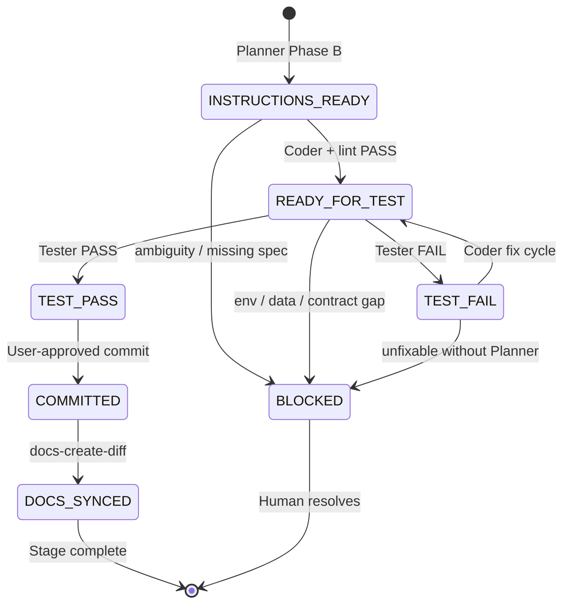

# Cursor Rules Redesign — Analysis & Migration Guide

> **Status:** PROPOSAL ONLY — no `.cursorrules`, `.cursor/`, or sub-agent files have been changed yet.  
> **Purpose:** Document current gaps and a target architecture for context-scoped Cursor rules. Apply on future projects or when this repo is ready for a rules migration.  
> **Date:** 2026-07-10

---

## 1. Executive summary

The project currently spreads agent guidance across three layers that are **not synchronized**:

| Layer | Location | Activation |
|-------|----------|------------|
| **Always-on rules** | `.cursorrules` (root) | Every session, every file |
| **Partial always-on** | `.cursor/index.mdc` | Every session (`applyTo: "*"`) |
| **Role-specific** | `.cursor/agents/*.md` | Only when a sub-agent is invoked |

**Problem:** Sub-agents carry rich domain rules (backend invariants, E2E Playwright setup, code-review criteria, bug triage), but the always-on rules only cover isolation, docs boundaries, and lint commands. A general Cursor agent working on `frontend/` never sees planner/tester/coder frontend guidance unless it happens to read `agent_docs/ui/design_system.md` on its own.

**Risk:** Expanding `.cursorrules` to include backend, frontend, tests, linting, and review criteria will inflate the always-on context window and cause agents to **drown in irrelevant instructions** (e.g. Playwright browser cache rules while editing Python services).

**Recommendation:** Split into a **thin core** (always apply) + **context-scoped rules** (`.cursor/rules/*.mdc` with `globs`) + **workflow agents** (`.cursor/agents/`) that **reference** rules instead of duplicating them.

**Workflow gap:** Handoffs between @Planner, @Coder, and @Tester exist (`INSTRUCTIONS_READY` → `READY_FOR_TEST` → `TEST_PASS`), but there is **no unified end-to-end pipeline** tying success to commit and post-commit documentation sync. See §13.

---

## 2. Current inventory (as of 2026-07-10)

### 2.1 Always-on: `.cursorrules`

| Section | Content |
|---------|---------|
| Isolation | `docs/` read-only; write paths; `.env` forbidden |
| Honesty | `BLOCKED.md` protocol |
| Tooling | `uv add` only; pinned deps |
| Artifacts | `agent_docs/progress/` append-only |
| Language | English for code/docs unless user specifies other |
| Documentation boundaries | `docs/` / `agent_docs/` / `manual/` roles |
| Linting | Python (ruff, mypy, bandit) + TypeScript (eslint, tsc, prettier) |

**Notable:** Six duplicate YAML frontmatter blocks (`alwaysApply: true`) with empty `description` — likely accidental paste. Adds noise without value.

### 2.2 Always-on: `.cursor/index.mdc`

| Content | Overlap with `.cursorrules` |
|---------|----------------------------|
| Language (English) | ✅ duplicate |
| Secrets (`.env`, etc.) | partial — `.cursorrules` mentions `.env` only |
| Destructive commands / `.trash/` policy | ❌ only here |
| Dependencies (no install without approval) | partial — `.cursorrules` says `uv add` |
| Context injection (`@Files` not `@Codebase`) | ❌ only here |
| `docs/` read-only + `agent_docs/` for agent output | ✅ duplicate |

### 2.3 Sub-agents: `.cursor/agents/`

| Agent | Primary scope | Rules NOT in `.cursorrules` |
|-------|---------------|----------------------------|
| `planer.md` | Phase A/B, contracts, instructions | 2-phase workflow, Russian/English split, data rules (CSV `;`, NULL semantics), delegation table |
| `coder.md` | Backend `src/`, `config/` | Architectural invariants, debug-first protocol, scope limits, **frontend out of scope** |
| `tester.md` | `tests/`, reports | Never modify `src/`, project invariants to verify, **full Playwright E2E setup**, process teardown |
| `bug-fix-coordinator.md` | Bug lifecycle | TRIVIAL/BUG/DESIGN triage, artifact templates, delegation |
| `code-reviewer.md` | Quality review | 13 review criteria, verdict rules, report template — **no frontend UI criteria** |

### 2.4 Missing

| Expected (modern Cursor) | Status |
|--------------------------|--------|
| `.cursor/rules/*.mdc` | **Does not exist** |
| Frontend-specific agent | **Does not exist** — frontend done by general agent |
| Single source of truth map | Rules duplicated across 2 always-on files + 5 agents |

### 2.5 Domain docs (not Cursor rules, but should be referenced)

| Doc | Role |
|-----|------|
| `agent_docs/ui/design_system.md` | Frontend reuse mandate, layer model, primitives |
| `agent_docs/ui/components.md` | Component catalogue |
| `agent_docs/reports/frontend_design_consistency_audit.md` | Baseline audit + workflow recommendations |

These documents **define** frontend policy but are **not wired** into Cursor rule activation.

---

## 3. Problems identified

### 3.1 Context pollution

`.cursorrules` is `alwaysApply: true`. Every lint command (backend + frontend) loads on every task — including backend-only DB migrations, contract drafting, or bug triage.

**Symptom:** Agents may run `cd frontend && npm run lint` on backend tasks, or ignore linting entirely because the instruction block is long and unfocused.

### 3.2 Duplication without single source of truth

The same concepts appear in multiple places with slight differences:

| Concept | `.cursorrules` | `index.mdc` | Sub-agents |
|---------|----------------|-------------|------------|
| `docs/` read-only | ✅ | ✅ | ✅ (all 5) |
| `uv add` only | ✅ | — | ✅ (coder, tester, bug-fixer) |
| NULL / missing prediction semantics | — | — | ✅ (planer, coder, tester, reviewer) |
| Language (EN code / RU user for agents) | EN only | EN only | ✅ per-agent split |
| Lint before complete | ✅ commands | — | ✅ planer references `.cursorrules` |
| File deletion → `.trash/` | — | ✅ | — |

When one file is updated, others drift. Example: `index.mdc` has stricter dependency policy ("no install without approval") than `.cursorrules` ("use `uv add`").

### 3.3 Sub-agent knowledge is invisible to the default agent

Most work in this repo (especially Stage 2 frontend) is done by the **main Cursor agent**, not `@Coder` (which explicitly excludes frontend). Therefore:

- Playwright browser cache rules in `tester.md` apply only when @Tester is invoked.
- Design system reuse in `design_system.md` applies only if the agent reads it.
- Code review criteria in `code-reviewer.md` apply only on explicit review.

### 3.4 Frontend policy gap (detailed analysis)

See §4. This is the most visible consequence of the architecture gap.

### 3.5 `.cursorrules` format debt

- Legacy single-file pattern (pre-`.cursor/rules/`).
- Repeated empty frontmatter blocks.
- Mixes **policy** (isolation) with **procedure** (exact lint commands) with **domain** (frontend + backend lint in one block).

---

## 4. Frontend-specific analysis

### 4.1 What exists today

After fix 2.5.3, the codebase has a real shared UI layer:

```
frontend/src/components/ui/     Button, Modal, DataTable, AdminTable, Callout, …
frontend/src/lib/table/         columnStyles, tableHeaderStyles, headerLabel
frontend/src/components/contest/ ContestResultsView, ContestLeaderboardView
frontend/src/hooks/             usePersistedRoundSelection
```

Policy is documented in `agent_docs/ui/design_system.md` §1:

- Reuse before invent
- Fix once, apply everywhere
- Update `design_system.md` + `components.md` on new primitives
- Every `coder_*.md` / `fix_*.md` touching UI should include reuse mandate

### 4.2 What still fails at the workflow level

| Gap | Impact |
|-----|--------|
| No `.cursor/rules/frontend-*.mdc` | General agent can inline Tailwind without triggering reuse rules |
| `planer.md` has no UI section | New `coder_*.md` may list files but not primitives to reuse/create |
| `bug-fix-coordinator.md` has no UI block in `fix_XXX.md` template | Styling bugs get point fixes, not library extensions |
| `code-reviewer.md` has no UI consistency criteria | Duplicated `bg-blue-600` not flagged in review |
| `coder.md` excludes frontend | No dedicated frontend implementer agent with design-system workflow |
| `tester.md` defers frontend unless in instructions | No `[UI-CONSISTENCY]` checklist for styling fixes |

### 4.3 Root cause (from audit)

> Component catalogue exists; **reuse is optional in practice** because agent instructions require updating the catalogue but not consuming shared primitives.

Fix 2.5.3 addressed code and `agent_docs/ui/*` but **not** Cursor rule activation — hence this redesign proposal.

### 4.4 Target frontend rule (for future `.cursor/rules/frontend-design-system.mdc`)

**Activation:** `globs: frontend/src/**/*.{tsx,ts}` — NOT `alwaysApply`.

**Content (summary, not full text):**

1. Read `agent_docs/ui/design_system.md` before styling work.
2. Reuse `components/ui/*`, `lib/table/*`, shared contest views.
3. If the same pattern appears in 2+ places → extract to `components/ui/` first.
4. Update `design_system.md` + `components.md` when adding primitives.
5. Pages (`app/*`) = layout; domain components compose primitives; no ad-hoc table shells.

**Planner integration:** Phase B instructions must include a **UI reuse** section (list primitives to reuse + new primitives to create). See §6.3 template.

---

## 5. Target architecture

### 5.1 Three-layer model

```
┌─────────────────────────────────────────────────────────────┐
│  LAYER 1 — CORE (alwaysApply: true)                         │
│  .cursor/rules/00-core.mdc  OR  slim .cursorrules            │
│  ~30–50 lines: isolation, secrets, docs map, honesty,       │
│  language default, file deletion policy                     │
├─────────────────────────────────────────────────────────────┤
│  LAYER 2 — CONTEXT RULES (globs / agent-requested)          │
│  .cursor/rules/backend.mdc      → src/**, config/**         │
│  .cursor/rules/frontend.mdc     → frontend/**               │
│  .cursor/rules/testing.mdc      → tests/**, frontend/e2e/** │
│  .cursor/rules/linting.mdc      → invoked before handoff    │
│  .cursor/rules/code-review.mdc  → on review request        │
│  .cursor/rules/git.mdc          → on commit/PR request      │
├─────────────────────────────────────────────────────────────┤
│  LAYER 3 — WORKFLOW AGENTS (.cursor/agents/*.md)            │
│  Role, phase workflow, delegation, output format            │
│  MUST reference Layer 2 rules by path — not copy them       │
└─────────────────────────────────────────────────────────────┘
```

### 5.2 What belongs in CORE (always apply)

| Include | Exclude |
|---------|---------|
| Directory access matrix (`docs/`, `agent_docs/`, `manual/`, `src/`, …) | Backend NULL semantics |
| `.env` / secrets forbidden | Playwright install procedure |
| `BLOCKED.md` honesty protocol | ruff/mypy command lines |
| `agent_docs/progress/` append-only | Code review 13 criteria |
| Default language for code/commits | Frontend component catalogue |
| `.trash/` instead of `rm` | Bug triage TRIVIAL/BUG/DESIGN |
| One-line pointer: "Domain rules → `.cursor/rules/`" | Per-stage planner workflow |

**Target size:** ≤ 60 lines. If it grows beyond that, move content to a scoped rule.

### 5.3 What belongs in context rules

| Rule file | `globs` | Contents |
|-----------|---------|----------|
| `backend.mdc` | `src/**`, `config/**`, `alembic/**` | Layer boundaries (router → service), no magic numbers, NULL semantics, `uv add`, config-driven rules |
| `frontend.mdc` | `frontend/**` | Design system reuse, `components/ui/*`, `lib/table/*`, Tailwind-only, no animation libs |
| `testing.mdc` | `tests/**`, `frontend/e2e/**`, `frontend/**/*.test.*` | Scope boundaries (tester vs coder), Playwright cache path, E2E teardown, contracted data paths |
| `linting.mdc` | `alwaysApply: false` — agents invoke explicitly | Exact commands for Python and TS; "run before handoff" |
| `code-review.mdc` | manual / review trigger | Criteria 1–13 + frontend UI consistency extension |
| `planner.mdc` | `agent_docs/**` | Phase A/B, language split, instruction templates, UI reuse section for frontend tasks |
| `bug-fix.mdc` | `agent_docs/instructions/fix_*`, `agent_docs/reports/bug_*` | Triage classes, artifact templates, delegation |
| `git.mdc` | manual | Commit only when asked, no force push, HEREDOC messages |
| `workflow.mdc` | `agent_docs/**`, handoff triggers | End-to-end pipeline: instruction → code → test → commit → docs (see §13) |

### 5.4 What stays in sub-agents (thin wrappers)

Sub-agents should shrink to:

- **Identity** — who you are
- **Workflow phases** — ordered steps unique to the role
- **Delegation table** — who hands off to whom
- **Output format** — Russian summary template
- **Pointers** — "Follow `.cursor/rules/backend.mdc`" (not inline copy)

Example — future `coder.md` addition (conceptual):

```markdown
Before coding: apply rules from `.cursor/rules/backend.mdc` and `.cursor/rules/linting.mdc`.
Your instruction spec: `agent_docs/instructions/coder_X.md`.
```

---

## 6. Duplication matrix → migration map

Use this when splitting rules. **Single source of truth** = the `.mdc` file; agents and core only link to it.

| Topic | Current location(s) | Target owner |
|-------|---------------------|--------------|
| `docs/` read-only | `.cursorrules`, `index.mdc`, all agents | `00-core.mdc` |
| Secrets / `.env` | `.cursorrules`, `index.mdc` | `00-core.mdc` |
| `.trash/` deletion | `index.mdc` | `00-core.mdc` |
| `uv add` / no pip | `.cursorrules`, coder, tester, bug-fixer | `backend.mdc` + one line in core |
| NULL / missing prediction | planer, coder, tester, reviewer | `backend.mdc` |
| CSV `;` delimiter | planer, coder, tester | `backend.mdc` |
| Lint commands | `.cursorrules` | `linting.mdc` |
| Run lint before complete | `.cursorrules`, planer | `linting.mdc` |
| Playwright E2E setup | `tester.md` only | `testing.mdc` |
| Never modify `src/` in tests | `tester.md` | `testing.mdc` |
| Design system reuse | `design_system.md` only | `frontend.mdc` (links to doc) |
| Code review criteria | `code-reviewer.md` | `code-review.mdc` |
| Bug triage TRIVIAL/BUG/DESIGN | `bug-fix-coordinator.md` | `bug-fix.mdc` |
| Planner Phase A/B | `planer.md` | `planner.mdc` + slim `planer.md` |
| Russian user / English artifacts | each agent | `planner.mdc` or `00-core.mdc` (one table) |
| Delivery pipeline (instruction→docs) | implicit in agents only | `workflow.mdc` (§13) |
| Post-commit docs sync | `docs-create-diff` command only | `workflow.mdc` + `git.mdc` |

---

## 7. Proposed file tree (future project)

```
.cursor/
├── index.mdc                    # Optional: merge into 00-core or delete if redundant
├── rules/
│   ├── 00-core.mdc              # alwaysApply: true  (~40 lines)
│   ├── backend.mdc              # globs: src/**, config/**, alembic/**
│   ├── frontend.mdc             # globs: frontend/**
│   ├── testing.mdc              # globs: tests/**, frontend/e2e/**
│   ├── linting.mdc              # alwaysApply: false; referenced in handoff checklists
│   ├── code-review.mdc          # alwaysApply: false
│   ├── planner-workflow.mdc     # globs: agent_docs/**
│   ├── bug-fix-workflow.mdc     # globs: agent_docs/instructions/fix_*, agent_docs/reports/bug_*
│   ├── workflow.mdc             # delivery pipeline (§13)
│   └── git.mdc                  # alwaysApply: false
├── agents/
│   ├── planer.md                # thin: workflow + "see planner-workflow.mdc"
│   ├── coder.md                 # thin: backend implementer
│   ├── frontend-coder.md        # NEW: frontend implementer (optional)
│   ├── tester.md
│   ├── bug-fix-coordinator.md
│   └── code-reviewer.md
├── commands/
└── hooks.json

.cursorrules                     # DEPRECATE: replace with pointer or delete
                                 # Option A: 5-line stub linking to .cursor/rules/00-core.mdc
                                 # Option B: remove after Cursor picks up .cursor/rules/
```

### 7.1 `.cursorrules` deprecation strategy

For repos that still require `.cursorrules` (older Cursor versions or team habit):

```markdown
# Project rules migrated to .cursor/rules/
# Always-on: .cursor/rules/00-core.mdc
# Do not add content here — edit scoped rules instead.
```

---

## 8. Migration plan (apply when ready — not now)

### Phase 0 — Preparation

- [ ] Approve this document
- [ ] Freeze rule changes during migration PR
- [ ] Audit `index.mdc` vs `.cursorrules` — resolve conflicts first

### Phase 1 — Create core + linting (low risk)

- [ ] Create `.cursor/rules/00-core.mdc` from merged core content
- [ ] Create `.cursor/rules/linting.mdc` — move commands out of `.cursorrules`
- [ ] Slim `.cursorrules` to stub pointer
- [ ] Verify always-on context size decreased (inspect rule picker / token estimate)

### Phase 2 — Domain rules

- [ ] `backend.mdc` — extract from coder + planer data rules
- [ ] `frontend.mdc` — link `design_system.md`, reuse mandate
- [ ] `testing.mdc` — extract Playwright section from tester.md

### Phase 3 — Workflow rules + thin agents

- [ ] `planner-workflow.mdc`, `bug-fix-workflow.mdc`, `code-review.mdc`
- [ ] Rewrite each `.cursor/agents/*.md` to reference rules, remove duplicated tables
- [ ] Optionally add `frontend-coder.md`

### Phase 4 — Instruction templates + delivery workflow

- [ ] Create `.cursor/rules/workflow.mdc` — pipeline from §13
- [ ] Update planner Phase B template with **UI reuse** block
- [ ] Update bug-fixer `fix_XXX.md` template with UI section
- [ ] Add `[UI-REUSE]` / `[UI-CONSISTENCY]` to tester checklist template
- [ ] Wire `docs-create-diff` as mandatory post-commit step in `workflow.mdc` + `git.mdc`
- [ ] Add status `DOCS_SYNCED` to progress append template

### Phase 5 — Validation

- [ ] Backend task: agent should NOT load frontend rules
- [ ] Frontend task: `frontend.mdc` activates on `frontend/src/**/*.tsx`
- [ ] E2E task: `testing.mdc` loads Playwright cache rules
- [ ] Review task: `code-review.mdc` loads on demand
- [ ] Full stage cycle: instruction → code → test → commit → `docs-create-diff` → `DOCS_SYNCED`

---

## 9. Templates for future rule files

### 9.1 `00-core.mdc` (skeleton)

```yaml
---
description: Core invariants — docs access, secrets, honesty, progress logs
alwaysApply: true
---
```

Body: directory matrix, BLOCKED protocol, `.trash/` policy, language default, pointer to `.cursor/rules/`.

### 9.2 `frontend.mdc` (skeleton)

```yaml
---
description: Reuse shared UI primitives; extend component library before inline styles
globs: frontend/**/*
alwaysApply: false
---
```

Body: link `agent_docs/ui/design_system.md`, reuse paths, extract-if-duplicated rule, catalogue sync.

### 9.3 Planner UI reuse block (for `coder_*.md` / `fix_*.md`)

```markdown
## UI reuse (mandatory when touching frontend)

**Read:** `agent_docs/ui/design_system.md`, `agent_docs/ui/components.md`

| Action | Rule |
|--------|------|
| Buttons, modals, banners, empty states | `frontend/src/components/ui/*` |
| Tables | `lib/table/*` + `DataTable` / `AdminTable` |
| Public + admin same view | `ContestResultsView` / `ContestLeaderboardView` |
| Pattern used 2+ times | Create primitive in `components/ui/` first |
| Done | Update `design_system.md` + `components.md` logs |
```

---

## 13. End-to-end delivery workflow

### 13.1 Problem today

The repo has **partial** workflow pieces that do not form a closed loop:

| Piece | Exists | Gap |
|-------|--------|-----|
| Planner writes `coder_X.md` / `tester_X.md` | ✅ | No mandatory "done" definition at instruction level |
| Coder sets `READY_FOR_TEST` in progress | ✅ | Lint step referenced but not in a fixed sequence |
| Tester sets `TEST_PASS` / `TEST_FAIL` | ✅ | FAIL loops back informally; no max-retry policy |
| `BLOCKED.md` on ambiguity | ✅ | Not a first-class terminal state in progress |
| Commit on success | ⚠️ | "Only when user asks" — decoupled from TEST_PASS |
| `docs-create-diff` after commit | ⚠️ | Command exists (`.cursor/commands/docs-create-diff.md`) but **not wired** into any agent handoff |

**Result:** Code merges with stale `manuals/`, or agents commit before tests pass, or documentation sync is forgotten until much later.

### 13.2 Target pipeline

Single mandatory sequence for every **stage** or **fix** (except TRIVIAL bugs):

```
┌─────────────┐    ┌─────────────┐    ┌─────────────┐    ┌─────────────┐    ┌──────────────────┐
│ INSTRUCTION │ →  │    CODE     │ →  │    TEST     │ →  │   COMMIT    │ →  │  DOCS SYNC       │
│  (Planner)  │    │  (Coder)    │    │  (Tester)   │    │  (on PASS)  │    │ (docs-create-diff)│
└─────────────┘    └─────────────┘    └─────────────┘    └─────────────┘    └──────────────────┘
       │                  │                  │                  │
       │                  │                  │                  └── only if user approved commit
       │                  │                  │
       └──────────────────┴──────────────────┴── BLOCKED (any step) → HALT, no commit
```

**Mermaid (for plans / onboarding):**



### 13.3 Status gates (`agent_docs/progress/stage_X.md`)

Append-only entries. Each handoff **must** set exactly one status:

| Status | Set by | Meaning | Next step |
|--------|--------|---------|-----------|
| `INSTRUCTIONS_READY` | @Planner | `coder_X.md` + `tester_X.md` approved | Invoke @Coder |
| `READY_FOR_TEST` | @Coder | Code done, **lint PASS**, local checks run | Invoke @Tester |
| `TEST_PASS` | @Tester | All acceptance criteria met | Request commit |
| `TEST_FAIL` | @Tester | Defects found — report in `reports/test_X.md` | @Coder fix cycle |
| `BLOCKED` | Any agent | `agent_docs/reports/BLOCKED.md` created | Human / @Planner |
| `COMMITTED` | Human or agent (if user asked) | Git commit created with stage/fix scope | Run `docs-create-diff` |
| `DOCS_SYNCED` | Agent after docs command | `manuals/` updated from last commit | Stage closed |

**Fix workflow** (`fix_XXX.md`): same gates, but progress may append to `stage_X.md` or a dedicated `bug_XXX.md` status section — pick one convention per project and document in `workflow.mdc`.

### 13.4 Step-by-step responsibilities

#### Step 1 — Instruction (@Planner)

**Input:** Approved Phase A drafts, user ✅  
**Output:** `agent_docs/instructions/coder_X.md`, `tester_X.md`  
**Gate:** Append `INSTRUCTIONS_READY` to progress

Instruction file **must** end with:

```markdown
## Acceptance criteria
- [ ] …

## Verification (Coder, before READY_FOR_TEST)
- Lint: see `.cursor/rules/linting.mdc`
- …

## Verification (Tester, before TEST_PASS)
- …

## On TEST_PASS
- Commit message template: `feat(stage-X): …` / `fix(BUG-XXX): …`
- Docs sync: run `/docs-create-diff` immediately after commit
```

#### Step 2 — Code (@Coder or frontend implementer)

**Input:** `INSTRUCTIONS_READY`, instruction file  
**Pre-handoff checklist:**

1. Implement only files listed in instruction.
2. Run lint per scope (backend / frontend — see `linting.mdc`).
3. Run any local verification commands from instruction.
4. Update living docs in scope (`agent_docs/ui/*`, contracts) if instruction requires — **not** `manuals/` (that is post-commit).

**Output:** Append `READY_FOR_TEST` with files list + commands run  
**On block:** `BLOCKED` + `reports/BLOCKED.md` — do **not** set `READY_FOR_TEST`

#### Step 3 — Test (@Tester)

**Input:** `READY_FOR_TEST`  
**Actions:**

1. Lint again (catch drift since Coder handoff).
2. Run integration / E2E per `tester_X.md`.
3. Write `agent_docs/reports/test_X.md`.

**Output:**

| Result | Status | Next |
|--------|--------|------|
| All criteria met | `TEST_PASS` | Proceed to commit |
| Defects found | `TEST_FAIL` | @Coder with report |
| Cannot test (env, data, contradiction) | `BLOCKED` | Human / @Planner |

**Rule:** @Tester never commits. @Tester never weakens tests to get PASS.

#### Step 4 — Commit (on TEST_PASS only)

**Preconditions:**

- Status is `TEST_PASS` (not `READY_FOR_TEST`, not `TEST_FAIL`)
- User has approved commit (per project git rules — agent does not commit silently unless user asked)

**Actions:**

1. `git status` / `git diff` — review scope matches instruction.
2. Stage relevant files (exclude secrets, accidental debug).
3. Commit with HEREDOC message tied to stage or `BUG-XXX`.
4. Append `COMMITTED` to progress with commit hash + message.

**On TEST_FAIL or BLOCKED:** **no commit.** Fix or escalate first.

#### Step 5 — Documentation sync (immediately after commit)

**Trigger:** Status just became `COMMITTED`  
**Command:** Cursor slash command `/docs-create-diff` (spec: `.cursor/commands/docs-create-diff.md`)

**What it does:**

1. Diff last commit (`HEAD~1..HEAD`) or staged files.
2. Filter to relevant source paths (`src/`, `config/`, `alembic/`, `frontend/src/` — extend mapping as needed).
3. Update `manuals/*.md` (DB, API, scoring, config, frontend reference).
4. Mark sections `[UPDATED]` / `[NEW]`.

**Agent actions after `/docs-create-diff`:**

1. Review generated `manuals/` changes for accuracy.
2. If docs changes are correct → **second commit** (optional but recommended):
   ```
   docs(stage-X): sync manuals after <feature>
   ```
   Or squash into feature commit only if team policy allows — prefer **separate docs commit** for review clarity.
3. Append `DOCS_SYNCED` to progress.

**If docs-create-diff returns "No relevant source changes":** still append `DOCS_SYNCED` with note "no manuals update required".

**Frontend gap today:** `docs-create-diff` maps `src/`, `config/`, `alembic/` but not `frontend/` explicitly. **Extend the command** when adopting this workflow:

```markdown
# Add to docs-create-diff mapping (future):
- frontend/src/app/, routes, pages → manuals/FRONTEND_REFERENCE.md
- frontend/src/components/ui/* → manuals/FRONTEND_REFERENCE.md § components
- agent_docs/ui/* changes → do NOT sync to manuals automatically (living agent docs)
```

### 13.5 How to implement (rules + agents + commands)

#### A. New rule: `.cursor/rules/workflow.mdc`

```yaml
---
description: Delivery pipeline — instruction → code → test → commit → docs sync
globs: agent_docs/**
alwaysApply: false
---
```

Body (summary):

- Never skip test gate before commit.
- Never commit on `TEST_FAIL` or `BLOCKED`.
- After every user-approved commit → run `/docs-create-diff` before marking stage complete.
- Progress append-only; use status table from §13.3.

Optionally set `alwaysApply: true` with **≤15 lines** in core that only say: "Full delivery workflow → `.cursor/rules/workflow.mdc`".

#### B. Thin agent updates (future)

Each agent adds one line + status enforcement:

| Agent | Add |
|-------|-----|
| `planer.md` | Instruction template includes acceptance + post-commit docs step |
| `coder.md` | Handoff only as `READY_FOR_TEST` after lint; never commit |
| `tester.md` | Handoff as `TEST_PASS` / `TEST_FAIL`; remind user to commit then `/docs-create-diff` |
| `bug-fix-coordinator.md` | BUG/DESIGN: same pipeline after `fix_XXX.md`; TRIVIAL: commit + docs-create-diff if user asks |

#### C. Extend `git.mdc`

```markdown
## Commit gate
- Allowed only when progress status is TEST_PASS (or TRIVIAL fix verified).
- Forbidden on TEST_FAIL, BLOCKED, READY_FOR_TEST.

## Post-commit (mandatory)
- Run `/docs-create-diff` before closing the task.
- Append DOCS_SYNCED to progress.
```

#### D. Optional: Cursor hook (advanced)

`.cursor/hooks.json` — `afterFileEdit` or post-commit hook is limited; **reliable approach** is:

- Document in `workflow.mdc` as mandatory agent step (not automated hook).
- Optional CI check: fail if `manuals/` untouched when `src/` changed in same PR (future).

#### E. User-facing checklist (chat summary template)

After `TEST_PASS`, agent reports in Russian:

```
✅ Тесты пройдены (TEST_PASS)
📋 Следующие шаги:
   1. Коммит (если подтверждаете): <предложенное сообщение>
   2. Сразу после коммита: /docs-create-diff
   3. Проверить manuals/, при необходимости docs-коммит
   4. Статус DOCS_SYNCED → этап закрыт
```

### 13.6 Exception paths

| Case | Pipeline |
|------|----------|
| **TRIVIAL bug** (bug-fixer) | Skip full instruction file; still: fix → verify → commit (if asked) → docs-create-diff |
| **DESIGN bug** | Planner updates contracts first → then normal pipeline |
| **Docs-only change** | Skip code/test; commit → docs-create-diff may no-op |
| **User declines commit** | Stay at `TEST_PASS`; do not run docs-create-diff until commit exists |
| **docs-create-diff finds nothing** | `DOCS_SYNCED` with note; not a failure |

### 13.7 Bug-fix variant

Same pipeline, different instruction source:

```
bug report → triage → fix_XXX.md → Coder → Tester → TEST_PASS → commit → docs-create-diff
```

`agent_docs/reports/bug_XXX.md` tracks status in parallel:

```markdown
## Status
OPEN → IN_PROGRESS → READY_FOR_TEST → TEST_PASS → COMMITTED → DOCS_SYNCED → VERIFIED
```

`VERIFIED` = tests + docs sync complete (rename current `VERIFIED` to align or map 1:1).

### 13.8 Success criteria for workflow adoption

| Check | Expected |
|-------|----------|
| No commit without `TEST_PASS` in progress | Enforced by `git.mdc` + agent habit |
| Every merged feature commit followed by manuals update | `DOCS_SYNCED` within same session |
| `TEST_FAIL` loops to Coder with report | No silent retries |
| `BLOCKED` stops pipeline | No drive-by commits |
| Planner instructions include post-commit docs step | 100% of new `coder_*.md` |

---

## 10. Anti-patterns to avoid

| Anti-pattern | Why it fails |
|--------------|--------------|
| Put everything in `alwaysApply: true` | Context bloat; agents ignore or contradict rules |
| Duplicate full rule text in every sub-agent | Drift on next edit |
| Put frontend lint in core | Backend tasks pay frontend tax |
| Replace `design_system.md` with Cursor rules | Rules should be short pointers; detailed catalogue stays in `agent_docs/ui/` |
| Delete sub-agents when adding rules | Agents carry workflow/delegation; rules carry constraints |
| Migrate without deprecating `.cursorrules` | Two always-on sources fight each other |
| Commit before `TEST_PASS` | Untested code in main; breaks trust in pipeline |
| Skip `docs-create-diff` after commit | `manuals/` drifts from `src/` — humans read wrong docs |
| Run docs-create-diff before commit | Diff targets wrong revision (staged vs HEAD) |
| Set `DOCS_SYNCED` without running the command | False completion signal in progress |

---

## 11. Success metrics

| Metric | Baseline (now) | Target |
|--------|----------------|--------|
| Always-on rule lines | ~78 (`.cursorrules`) + ~16 (`index.mdc`) + duplicates | ≤ 50 lines single file |
| Frontend task loads Playwright rules | Only if @Tester invoked | When `tests/` or `e2e/` open |
| New UI fix duplicates inline Tailwind | Observed in audit (25+ files) | Reviewer + `frontend.mdc` flag |
| Planner instructions include UI reuse | Rare (fix 2.5.3 exception) | Every frontend `coder_*.md` / `fix_*.md` |
| Rule update touch points | 2–7 files per concept | 1 `.mdc` file |
| Stages with `DOCS_SYNCED` after commit | Rare / manual | Every `TEST_PASS` → commit → docs cycle |
| Commits without prior `TEST_PASS` | Observed in ad-hoc work | Zero for stage/fix work |

---

## 12. References

| Artifact | Path |
|----------|------|
| Current always-on rules | `.cursorrules` |
| Current index invariants | `.cursor/index.mdc` |
| Sub-agents | `.cursor/agents/*.md` |
| Frontend design system | `agent_docs/ui/design_system.md` |
| Component catalogue | `agent_docs/ui/components.md` |
| Consistency audit | `agent_docs/reports/frontend_design_consistency_audit.md` |
| Fix 2.5.3 (example UI instruction) | `agent_docs/instructions/fix_2.5.3.md` |
| Docs sync command | `.cursor/commands/docs-create-diff.md` |
| Progress status examples | `agent_docs/progress/stage_1.md`, `stage_2.md` |
| Cursor rule format skill | `create-rule` skill (`.mdc` frontmatter spec) |

---

## Update log

| Date | Change |
|------|--------|
| 2026-07-10 | Initial proposal: inventory, frontend analysis, 3-layer target, migration plan. No repo rules modified. |
| 2026-07-10 | §13: end-to-end workflow (instruction → code → test → commit → docs-create-diff); `workflow.mdc` in target tree; migration Phase 4 updated. |
