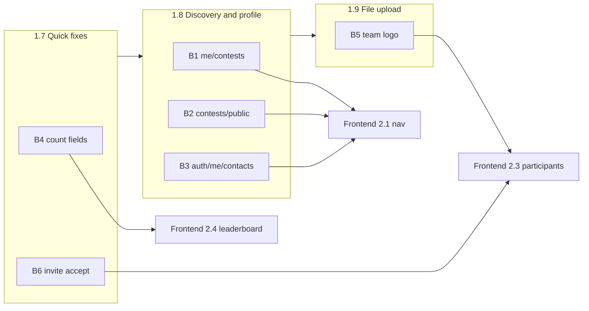

# Draft Plan — Stage 1.7–1.9: Frontend Backend Prerequisites

> **Status:** ✅ Approved (2026-06-21). Ready for Phase 2: `instructions/coder_1.7.md` … `tester_1.9.md`.
> **Sources:** `agent_docs/reports/BLOCKED.md`, `agent_docs/plans/draft_2.md` §13, `agent_docs/contracts/api_v1.yaml` v1.1.0, `manuals/{API_GUIDE,DB_REFERENCE}.md`, codebase audit 2026-06-21.
> **Prerequisite:** Stage 1.6 at `TEST_PASS`.

---

## 1. Problem statement

While planning Stage 2 (Frontend), six API gaps were identified when reconciling `docs/03`, `docs/04`, reference screenshots (`docs/screens/`), and the current contract v1.1.0. Frontend **must not mock data**; each gap has a documented UI fallback, but dependent screens cannot reach "done" without backend delivery.

| ID | Gap | DB / service ready? | HTTP today | Frontend sub-stage blocked |
|----|-----|---------------------|------------|----------------------------|
| **B4** | `ScoreDetail` missing `count_*` | ✅ `scores.count_*` populated | ❌ not serialized | 2.4 Leaderboard |
| **B6** | Invite accept `PENDING→ACCEPTED` | ✅ `contest_participants.status` | ❌ no transition on password change | 2.3 Participants |
| **B1** | User contest picker | ✅ `contest_participants` | ❌ no `/me/contests` | 2.1 User nav |
| **B2** | Visitor contest discovery | ✅ `contests` table | ❌ no `/contests/public` | 2.1 / 2.4 Home |
| **B3** | Profile contacts | ✅ `contacts` table | ❌ no GET/PATCH | 2.1 Profile |
| **B5** | Team logo file upload | ✅ `teams.logo_url` column | ❌ string URL only | 2.3 Teams admin |

**Root cause:** Stage 1 focused on contest-scoped operational API; user-discovery, profile, file storage, and response completeness for UI columns were deferred.

---

## 2. Goals

1. Close all six blockers (B1–B6) with contract-first changes in `api_v1.yaml`.
2. Split delivery into **three sequential sub-stages** (1.7 → 1.8 → 1.9) so frontend can start dependent work early.
3. Bump OpenAPI to **v1.2.0** when 1.9 completes (or per sub-stage minor notes in progress log).
4. Resolve **B6 product question** without a new endpoint (see §5.3).
5. Update `manuals/API_GUIDE.md` and append `agent_docs/progress/stage_1.md` after each sub-stage.

## 3. Non-goals

- Frontend implementation (`frontend/` — Stage 2).
- Email sending for invites or contact notifications (Stage 3 newsletters).
- `role_in_contest` per-contest RBAC (global `users.role` only; `role_in_contest` in B1 response = alias of global role or omitted — see §4.2).
- CDN / S3 for logos — local filesystem + `StaticFiles` is sufficient for Stage 2.
- Removing legacy deprecated shims (unchanged).

---

## 4. Sub-stage sequencing



| Sub-stage | Blockers | Rationale | Unblocks frontend |
|-----------|----------|-----------|-------------------|
| **1.7** | B4, B6 | Smallest diffs; no new routers/infra; fixes scoring visibility + invite lifecycle | 2.3 status display, 2.4 leaderboard columns |
| **1.8** | B1, B2, B3 | New read/write routes; no file I/O; all three are 2.1 prerequisites | 2.1 contest picker, visitor home, profile contacts |
| **1.9** | B5 | Static file mount, validation, storage path — largest isolated change | 2.3 team logo file picker |

**Parallelism:** After 1.7 `TEST_PASS`, frontend may start 2.4 and partial 2.3 (status). After 1.8, frontend may start 2.1. Logo UI waits for 1.9 (fallback: `logo_url` text input per `BLOCKED.md`).

---

## 5. API contracts

### 5.1 — B4: Extend `ScoreDetail` (Stage 1.7)

Add to `ScoreDetail` / `ScoreDetailOut`:

| Field | Type | Source |
|-------|------|--------|
| `count_exact_high` | integer ≥ 0 | Round: `scores.count_exact_high`; Global: `StandingRow.exact_high_count` |
| `count_exact` | integer ≥ 0 | Round: `scores.count_exact`; Global: `StandingRow.exact_count` |
| `count_diff` | integer ≥ 0 | Round: `scores.count_diff`; Global: `StandingRow.diff_count` |
| `count_outcome` | integer ≥ 0 | Round: `scores.count_outcome`; Global: `StandingRow.outcome_count` |

**Implementation notes:**
- Modify `src/schemas/leaderboard.py` and row dicts in `src/services/leaderboard_service.py` (`get_round_leaderboard`, `get_global_leaderboard`).
- No migration — columns exist since `a2b3c4d5e6f7`.
- ETag logic unchanged (counts derive from same score rows).

### 5.2 — B6: Invite accept on password change (Stage 1.7)

**Decision (planner recommendation — confirm on approval):**

> Accepting an invite = **first successful `POST /auth/change-password`** while `users.is_temp_password=true`. No dedicated `/accept` endpoint.

**Behaviour:**

1. On `change_password`, after clearing `is_temp_password`, run:
   - `UPDATE contest_participants SET status='ACCEPTED' WHERE user_id=:uid AND status='PENDING'`
2. **Prediction guard:** `prediction_service.submit_batch()` must reject users who are not `ACCEPTED` participants in the contest (403 `CONTEST_RULE_VIOLATION` or new code `PARTICIPANT_NOT_ACCEPTED`). Today PENDING users can submit but are excluded from scoring — guard closes the loophole.
3. Document flow in `manuals/API_GUIDE.md` §Authentication.

**No schema change.** `ParticipantOut.status` already exposes `PENDING | ACCEPTED`.

### 5.3 — B1: `GET /api/v1/me/contests` (Stage 1.8)

| | |
|---|---|
| **Auth** | Bearer, any authenticated role (`USER`, `SUPERVISOR`, `ADMIN`) |
| **Logic** | `Contest` ⋈ `contest_participants` WHERE `user_id = current_user.id`, ORDER BY `contests.name` |
| **Response** | `200` array of `UserContestOut` |

**`UserContestOut` schema:**

```yaml
UserContestOut:
  type: object
  required: [id, name, status, participant_status, role]
  properties:
    id: { type: integer }
    name: { type: string }
    status: { $ref: '#/components/schemas/ContestStatus' }
    participant_status: { type: string, enum: [PENDING, ACCEPTED] }
    role: { type: string, enum: [USER, SUPERVISOR, ADMIN], description: 'Global users.role echoed for convenience' }
    slug: { type: string, nullable: true }
```

**Notes:**
- `role` is **not** per-contest — always the caller's global `users.role` from JWT/`GET /auth/me`. No `role_in_contest` column.
- SUPERVISOR/ADMIN see only contests they are enrolled in via `contest_participants` (organizers use `GET /contests` separately).

**Router:** new `src/api/v1/me.py` with prefix `/me`, registered in `main.py`.

### 5.4 — B2: `GET /api/v1/contests/public` (Stage 1.8)

| | |
|---|---|
| **Auth** | None (Visitor) |
| **Filter** | `contests.status = 'RUNNING'` only — exclude `DRAFT`, `PAUSED`, `FINISHED` |
| **Response** | `200` array of `PublicContestOut` |

**`PublicContestOut`:**

```yaml
PublicContestOut:
  type: object
  required: [id, name, status]
  properties:
    id: { type: integer }
    name: { type: string }
    status: { $ref: '#/components/schemas/ContestStatus' }
    slug: { type: string, nullable: true }
```

**Route order:** Register `/contests/public` **before** `/contests/{contest_id}` in `contests.py` to avoid path capture.

Optional: HTTP caching `Cache-Control: public, max-age=60` (short TTL; list is small).

### 5.5 — B3: `GET/PATCH /api/v1/auth/me/contacts` (Stage 1.8)

**`ContactOut`:**

```yaml
ContactOut:
  type: object
  properties:
    email: { type: string, nullable: true }
    vk_id: { type: string, nullable: true }
    tg_id: { type: string, nullable: true }
    notify_enabled: { type: boolean }
```

**`ContactPatchRequest`** — all fields optional; partial update:

```yaml
ContactPatchRequest:
  type: object
  properties:
    email: { type: string, nullable: true }
    vk_id: { type: string, nullable: true }
    tg_id: { type: string, nullable: true }
    notify_enabled: { type: boolean }
```

| Method | Path | Behaviour |
|--------|------|-----------|
| GET | `/auth/me/contacts` | Return row or `{ email: null, vk_id: null, tg_id: null, notify_enabled: false }` if missing |
| PATCH | `/auth/me/contacts` | Upsert `contacts` for `current_user.id`; validate email format if present |

**Temp password:** Allow GET/PATCH under temp password (same as `/auth/me`) so user can set contacts after forced password change.

**Service:** `src/services/contact_service.py` — `get_contacts`, `upsert_contacts`.

Invite flow already creates `Contact` row with email in `contest_setup_service.add_participant()`.

### 5.6 — B5: Team logo upload (Stage 1.9)

**Endpoint:** `POST /api/v1/contests/{contest_id}/teams/{team_id}/logo` (dedicated multipart route; team CRUD stays JSON).

| | |
|---|---|
| **Auth** | SUPERVISOR+ |
| **Phase guard** | SETUP only (`!contest.is_locked`) — same as team PATCH |
| **Content-Type** | `multipart/form-data`, field name `file` |
| **Validation** | MIME: `image/png`, `image/jpeg`, `image/gif`; max **2_097_152** bytes (2 MiB) |
| **Storage** | `{UPLOAD_DIR}/teams/{contest_id}/{team_id}.{ext}` — normalized to target size on save |
| **Response** | `200` `{ "logo_url": "/static/teams/1/5.png" }` (+ optional full `TeamOut`) |

**Config (new env vars):**

| Variable | Default | Purpose |
|----------|---------|---------|
| `UPLOAD_DIR` | `./uploads` | Writable directory for uploaded logos |
| `STATIC_URL_PREFIX` | `/static` | URL prefix for served files |
| `MAX_LOGO_BYTES` | `2097152` | Upload size limit (2 MiB) |
| `DEFAULT_TEAM_LOGO_URL` | `/static/assets/default-team-logo.jpg` | Fallback when `teams.logo_url` is NULL |
| `TEAM_LOGO_TARGET_PX` | `64` | Square side in pixels — **canonical display/storage size** |

**Default logo asset:**
- Ship placeholder at `static/assets/default-team-logo.jpg` (repo path under project root, served via `StaticFiles`; source: `docs/screens/screen_team_default.jpg`).
- Document in `config/settings.py` and `manuals/CONFIG.md`: target **64×64 px** square; backend resizes uploads to this size (Pillow, LANCZOS, preserve aspect ratio → center-crop or letterbox to square — **recommend center-crop** for uniform UI).
- API behaviour: `TeamOut.logo_url` returns `DEFAULT_TEAM_LOGO_URL` when DB column is NULL (computed in serializer, not stored in DB).

**Resize strategy (approved direction):**

| Layer | Responsibility |
|-------|----------------|
| **Frontend (Stage 2)** | CSS fixed box + `object-fit: contain` for display; optional client-side downscale before upload for UX — **not required** |
| **Backend (Stage 1.9)** | **Required:** normalize every saved upload to `TEAM_LOGO_TARGET_PX`² — single source of truth, saves disk, consistent thumbnails |

Frontend-only resize is **insufficient alone** (large originals would still be stored/served). Backend normalize + frontend CSS is the recommended split.

**Infrastructure:**
- Mount `StaticFiles` for both `UPLOAD_DIR` (uploads) and bundled `static/assets/` (defaults).
- On re-upload: replace file, update `teams.logo_url`.
- Keep `logo_url` string on `TeamCreateRequest` / `TeamPatchRequest` for external URLs (fallback).

**Delete logo:** PATCH `logo_url: null` → API returns default URL on subsequent GETs.

**New dependency (1.9):** `Pillow` via `uv add pillow` — user approval at coder stage.

---

## 6. Files to create/modify (by sub-stage)

### 6.1 Stage 1.7

```
src/schemas/leaderboard.py              # +4 count fields
src/services/leaderboard_service.py     # serialize counts
src/api/v1/auth.py                      # accept hook in change_password
src/services/participant_service.py     # NEW — accept_pending_participations()
src/services/prediction_service.py      # guard ACCEPTED enrollment
agent_docs/contracts/api_v1.yaml        # ScoreDetail + doc note on B6
manuals/API_GUIDE.md
tests/api/test_leaderboard_counts.py    # NEW
tests/api/test_participant_accept.py    # NEW
agent_docs/progress/stage_1.md          # append
```

### 6.2 Stage 1.8

```
src/api/v1/me.py                        # NEW — GET /me/contests
src/api/v1/contests.py                  # GET /contests/public
src/api/v1/auth.py                      # GET/PATCH /me/contacts
src/services/contact_service.py         # NEW
src/services/contest_discovery_service.py  # NEW (optional thin layer)
src/schemas/contest.py                  # UserContestOut, PublicContestOut
src/schemas/auth.py                     # ContactOut, ContactPatchRequest
main.py                                 # register me router
agent_docs/contracts/api_v1.yaml
manuals/API_GUIDE.md
tests/api/test_me_contests.py           # NEW
tests/api/test_contests_public.py       # NEW
tests/api/test_contacts.py              # NEW
agent_docs/progress/stage_1.md
```

### 6.3 Stage 1.9

```
config/settings.py                      # UPLOAD_DIR, STATIC_URL_PREFIX, MAX_LOGO_BYTES
src/api/v1/contest_teams.py             # POST .../logo
src/services/team_logo_service.py       # NEW — validate, save, update url
main.py                                 # StaticFiles mount
agent_docs/contracts/api_v1.yaml
manuals/API_GUIDE.md
manuals/CONFIG.md                       # new env vars
.env.example                            # document upload settings
tests/api/test_team_logo_upload.py      # NEW
agent_docs/progress/stage_1.md
```

**Do NOT modify:** `docs/` (immutable), `src/scoring/*` math, existing 1.4–1.6 business rules except B6 guard.

---

## 7. Test scope

### 7.1 Stage 1.7

| ID | Scenario |
|----|----------|
| `[LB-COUNTS-ROUND]` | After calculate, round leaderboard rows include non-zero `count_*` matching DB |
| `[LB-COUNTS-GLOBAL]` | Global leaderboard aggregates `count_*` from `StandingRow` |
| `[LB-COUNTS-REG]` | Regression: existing leaderboard rank/ETag tests pass |
| `[ACCEPT-INVITE]` | Invite → login (temp) → change-password → participant `status=ACCEPTED` |
| `[ACCEPT-PRED-GUARD]` | PENDING user cannot POST predictions (403) |
| `[ACCEPT-REG]` | Existing `[SETUP-PART-AUTH]` flow still passes |

### 7.2 Stage 1.8

| ID | Scenario |
|----|----------|
| `[ME-CONTESTS-USER]` | USER sees enrolled contests with `participant_status` and global `role` |
| `[ME-CONTESTS-EMPTY]` | User with no enrollments → `[]` |
| `[ME-CONTESTS-RBAC]` | Unauthenticated → 401 |
| `[PUBLIC-LIST]` | Anonymous GET returns RUNNING only; excludes DRAFT, PAUSED, FINISHED |
| `[PUBLIC-NO-AUTH]` | No Bearer required |
| `[CONTACTS-GET]` | GET returns defaults or stored row |
| `[CONTACTS-PATCH]` | Partial PATCH upserts; GET reflects changes |
| `[CONTACTS-INVITE]` | Invited user inherits email from invite row |

### 7.3 Stage 1.9

| ID | Scenario |
|----|----------|
| `[LOGO-UPLOAD-OK]` | Valid PNG ≤2MB → 200, `logo_url` set, file exists, GET team shows URL |
| `[LOGO-UPLOAD-TYPE]` | Invalid MIME → 400 |
| `[LOGO-UPLOAD-SIZE]` | >2MB → 400 |
| `[LOGO-LOCKED]` | Upload when `is_locked` → 403 |
| `[LOGO-STATIC]` | GET `{STATIC_URL_PREFIX}/teams/...` returns image |
| `[LOGO-REG]` | Team CRUD without upload unchanged |

**Regression (each sub-stage):** `pytest tests/ --ignore=tests/manual` green.

---

## 8. Contract version strategy

| After | `api_v1.yaml` version | Notes |
|-------|----------------------|-------|
| 1.7 | 1.1.1 (optional tag) or stay 1.1.0 + changelog | Additive fields only |
| 1.8 | 1.2.0-rc | New paths |
| 1.9 | **1.2.0** | Final frontend prerequisite bundle |

Frontend `draft_2.md` references v1.1.0 today — update to v1.2.0 when 1.9 completes (in Phase 2 instructions).

---

## 9. BLOCKED.md resolution

After **1.9 TEST_PASS**, update `agent_docs/reports/BLOCKED.md`:

- Mark B1–B6 as **RESOLVED** with sub-stage references.
- Keep file for audit trail; frontend fallbacks remain documented but optional.

---

## 10. Decisions log

### Locked (user, 2026-06-21)

| # | Topic | Decision |
|---|-------|----------|
| 1 | Sub-stage split | ✅ **1.7 → 1.8 → 1.9** |
| 2 | B6 invite accept | ✅ **Password change flips PENDING→ACCEPTED**; no `/accept` endpoint |
| 3 | B1 response fields | ✅ **`UserContestOut` includes `role`** (global `users.role` echo) + `participant_status` |
| 4 | B2 public filter | ✅ **`status = RUNNING` only** (no PAUSED/FINISHED on discovery list) |
| 5 | B5 storage + logo | ✅ **Local `StaticFiles`**; `DEFAULT_TEAM_LOGO_URL`; **64×64 px** backend resize; frontend CSS for display |
| 6 | B5 upload route | ✅ **Dedicated `POST …/teams/{team_id}/logo`** |

Reference explanations for Q3–Q6 retained below for audit.

#### §10.1 — Q3 explained (B1 `/me/contests` fields)

Frontend asked for `{ id, name, status, role_in_contest, participant_status }`.

In the database there is **no per-contest role**. A user has one global role (`USER` / `SUPERVISOR` / `ADMIN` on `users.role`). Per contest we only store **membership** (`contest_participants`) and **invite status** (`PENDING` / `ACCEPTED`).

| Option | Response | When to pick |
|--------|----------|--------------|
| **A — minimal** | `id`, `name`, `status`, `participant_status`, optional `slug` | Frontend reads global role once from `GET /auth/me` — enough for «Конкурсы» picker |
| **B — with role** | Same + `role` (copy of global `users.role`) | Convenience: one request less; still **not** a per-contest role |

`role_in_contest` as a separate concept is **misleading** unless we add new DB column — not planned.

#### §10.2 — Q4 explained (B2 public list filter)

Anonymous Visitor needs a home-page list to pick a contest before opening `/contest/[id]/leaderboard`.

| Option | Statuses shown | Effect |
|--------|----------------|--------|
| **A — live only** | `RUNNING` | Home shows only active competitions; paused/finished hidden |
| **B — visible archive** | `RUNNING`, `PAUSED`, `FINISHED` | Visitor can open ended contests for results/leaderboard (public GETs already work per contest) |
| *(never)* | `DRAFT` | Setup contests stay hidden from everyone except SUPERVISOR+ |

**Recommendation:** **B** — matches «browse results» scenario; `DRAFT` always excluded.

#### §10.3 — Q6 explained (B5 how to upload)

Two ways to send the image file:

| Option | API | Pros | Cons |
|--------|-----|------|------|
| **A — dedicated POST** | `POST /contests/{id}/teams/{team_id}/logo` multipart | Clear separation; team CRUD stays JSON; easy to test | Two steps if creating team + logo (create team, then upload) |
| **B — multipart PATCH** | `PATCH /contests/{id}/teams/{team_id}` accepts file + JSON | Single request | Mixed content-type; OpenAPI messier; harder validation |

**Recommendation:** **A** — create team first (or use default logo), then upload logo in second call. Matches screenshot flow (edit existing team row).

---

## 11. Phase 2 deliverables (after approval)

| Sub-stage | Planner outputs |
|-----------|-----------------|
| 1.7 | `instructions/coder_1.7.md`, `instructions/tester_1.7.md` |
| 1.8 | `instructions/coder_1.8.md`, `instructions/tester_1.8.md` |
| 1.9 | `instructions/coder_1.9.md`, `instructions/tester_1.9.md` |

Frontend Phase 2 (`instructions/coder_2.md`) should reference v1.2.0 contracts and map each UI feature to the delivering sub-stage.

---

*End of Draft — Stage 1.7–1.9 Frontend Backend Prerequisites (Phase 1).*
