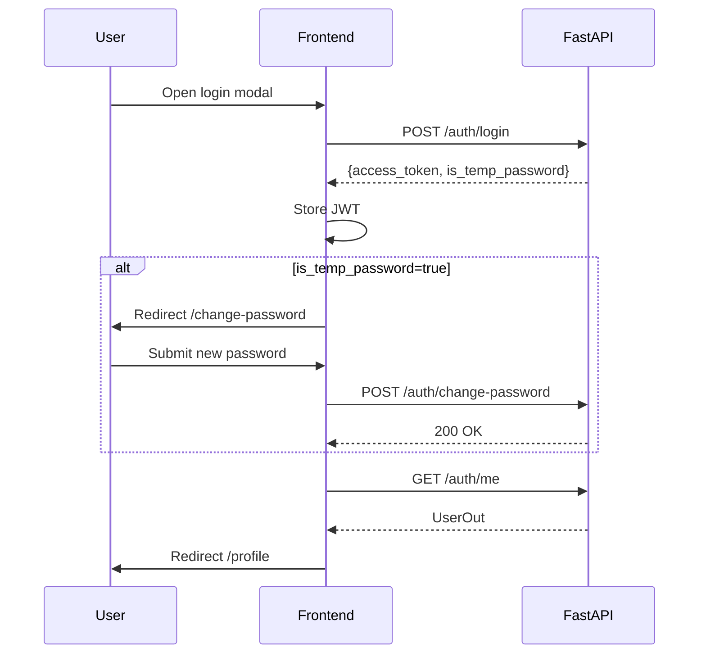

# Stage 2 — Frontend Development Plan

> **Status:** Phase 1 draft — awaiting user approval before agent instructions (Phase 2).
> **Sources:** `docs/roadmap.csv`, `docs/05_frontend.md`, `docs/01_tech_regulations.md`, `docs/02_project_structure.md`, `docs/03_user_scenarios.md`, `docs/04_supervisor_scenario.md`, `agent_docs/contracts/api_v1.yaml`, backend implementation in `src/`, `manuals/API_GUIDE.md`.
> **Backend prerequisite:** Stage 1 complete (API v1.1.0, multi-contest, auth, scoring, lifecycle).

---

## 1. Executive Summary

### 1.1 Scope

Build a **Next.js 14+ (App Router) + TypeScript + Tailwind CSS** single-page application that visualizes the existing FastAPI backend. The frontend covers three audience roles on the public/user side (Visitor, User) and operational management on the admin side (Supervisor, limited Admin).

> **Decisions locked (user, 2026-06-21):** see §12. Several items require **backend additions** treated as Stage-2 prerequisites (see §13 + `agent_docs/reports/BLOCKED.md`).

**In scope (Stage 2):**

- Public tabbed page (Лидерборд / Прогнозы / Результаты) + per-round deep links (Visitor + authenticated)
- **Visitor contest discovery**: public list of running contests (requires `GET /contests/public`)
- **User multi-contest picker**: «Конкурсы» tab listing only contests the user is invited to (requires `GET /me/contests`)
- Auth (login/logout), forced password change, JWT session handling
- User prediction entry (batch-only, 0–max scores, deadline enforcement, privacy rules)
- **User contacts** (email/VK/TG + notify toggle) — requires `GET/PATCH /auth/me/contacts`
- Supervisor contest setup (parameters, teams, participants), round/match management, results entry, scoring workflow
- **Team logo upload** — requires backend file-upload endpoint
- Newsletters tab as **placeholder page** (nav tab visible, "Stage 3")
- Admin-only surfaces: contest lifecycle (pause/resume/finish/delete), full recalculate, exceptional tie-break, organizer creation
- Leaderboard with full count columns — requires `ScoreDetail` extension (`count_*`)
- Playwright E2E tests for UC-7..UC-13 flows
- Visual alignment with reference screenshots (`docs/screens/`, §11)

**Explicitly out of scope for Stage 2** (deferred to Stage 3):

- Newsletter sending/scheduling logic & API (`docs/04` §4) — only placeholder UI in Stage 2
- Audit log viewer — no API
- CI/CD pipeline, Docker compose for frontend (Stage 3 per roadmap)
- External match schedule API integration ("Загрузить по API" button) — unspecified third-party API; manual entry only

### 1.2 Goals

| Goal | Success criterion |
|------|-------------------|
| API fidelity | All screens consume contest-scoped `/api/v1/contests/{contest_id}/…` paths; no legacy shims in new code |
| Business rules in UI | Client mirrors backend: batch predictions, NULL ≠ 0, 24h deadline rule, immutable after `is_locked`, privacy pre/post deadline |
| RBAC | Route guards + conditional UI by role; 401 → logout, 403 → toast |
| Reference UX | Layout and tables match scenario screenshots (column order, Russian labels, no animations, Tailwind-only) |
| Testability | Playwright E2E for documented flows; component-level tests for validation logic |

### 1.3 Tech Stack Alignment (`docs/02_project_structure.md`)

| Layer | Choice | Notes |
|-------|--------|-------|
| Framework | Next.js 14+ App Router | Matches project structure doc |
| Language | TypeScript 5.3+ | Strict mode |
| Styling | Tailwind CSS 3.4+ | **No external UI libraries** (no shadcn, MUI, etc.) |
| Forms | Controlled React components | No Formik/React Hook Form unless justified |
| Validation | Zod | Schemas driven by `contest.rules_json.constraints` (not hardcoded 20) |
| HTTP | `fetch` + thin typed client | Bearer JWT; ETag support for public GETs |
| State | React Context + hooks | Auth context, contest context; `localStorage` for JWT + last-viewed contest |
| Caching | `fetch` revalidate for SSR public pages; client ETag for leaderboard | Pre-deadline predictions never cached |
| E2E | Playwright | Per tech regulations |
| Package manager | npm or pnpm (TBD) | Backend uses `uv`; frontend is separate `package.json` in `frontend/` |

### 1.4 Current Codebase State

| Area | Status |
|------|--------|
| `frontend/` directory | **Does not exist** — greenfield |
| Backend API | ✅ Implemented — see `manuals/API_GUIDE.md` |
| OpenAPI contract | ✅ `agent_docs/contracts/api_v1.yaml` v1.1.0 |
| CORS | ✅ Configured via `CORS_ORIGINS` in `config/settings.py` (default `["*"]`) |
| Reference screenshots | ✅ **Available** in `docs/screens/` (`user_leaderboard.jpg`, `user_predict.jpg`, `user_result.jpg`, `supervisor_settings.jpg`, `supervisor_settings2.jpg`, `supervisor_settings3.jpg`, `supervisor_tours.jpg`, `supervisor_results.jpg`). Analyzed in §11. |
| Docker / frontend dev proxy | Not configured |

---

## 2. Roadmap Mapping

`docs/roadmap.csv` Stage 2 row decomposed:

| Roadmap artifact (Planner Phase A) | This document section | Phase 2 instruction target |
|-----------------------------------|----------------------|---------------------------|
| `plans/draft_2.md` | Entire document | — |
| `contracts/frontend_api_integration.md` | §7 API Integration | `instructions/coder_2.md` references |
| `ui/components.md` | §5 Component Breakdown | `instructions/coder_2.md` |
| `ui/pages.md` | §4 Screen Inventory | `instructions/coder_2.md` |
| `ui/forms_validation.md` | §5.3, §7.3 | `instructions/coder_2.md` |
| `ui/state_management.md` | §3.4 | `instructions/coder_2.md` |
| `instructions/coder_2.md` | — | Phase 2 only |
| `instructions/coder_2.1.md` | § Sub-stage 2.1 | **Ready** — foundation & auth |
| `instructions/coder_2.1.1.md` | § Sub-stage 2.1.1 | **Ready** — routing hotfix + admin stubs |
| `instructions/tester_2.1.1.md` | § Sub-stage 2.1.1 | **Ready** — role routing E2E + demo user |
| `instructions/coder_2.2.md` | § Sub-stage 2.2 | **Ready** — predictions & privacy |
| `instructions/tester_2.2.md` | § Sub-stage 2.2 | **Ready** — prediction E2E + unit |
| `instructions/coder_2.3.md` | § Sub-stage 2.3 | **Ready** — supervisor admin UI |
| `instructions/tester_2.3.md` | § Sub-stage 2.3 | **Ready** — supervisor admin E2E + unit |
| `instructions/coder_2.4.md` | § Sub-stage 2.4 | **Ready** — leaderboard, results, integration |
| `instructions/tester_2.4.md` | § Sub-stage 2.4 | **Ready** — full E2E gate + responsive LB |
| `instructions/tester_2.1.md` | § Sub-stage 2.1 | **Ready** — unit + E2E smoke |
| `instructions/tester_2.md` | §8 Testing | Phase 2 only |
| `reports/test_2.md` | — | @Tester deliverable |

### Stage dependencies

```
Stage 0 (DB) ──► Stage 1 (API) ──► Stage 2 (Frontend) ──► Stage 3 (CI/CD, optional features)
```

Frontend **must not** use mock API responses (`docs/03_user_scenarios.md`). Development assumes backend running at `http://localhost:8000` with seeded data (`load_test_data.py` / `bootstrap_users.py`).

### UC checklist mapping

| UC | Frontend responsibility | Sub-phase |
|----|--------------------------|-----------|
| UC-1 Contest creation + rules | Supervisor settings form (SETUP phase) | 2.3 |
| UC-2 Dynamic team add | Teams admin table | 2.3 |
| UC-3 Batch invites | Participants table + invite modal | 2.3 |
| UC-4 Force password change | Auth gate modal/page | 2.1 |
| UC-5 Create round (≤8 matches) | Round builder | 2.3 |
| UC-6 Deadline change (24h rule) | Round editor validation | 2.3 |
| UC-7 Batch prediction | Prediction form | 2.2 |
| UC-8 Hide predictions pre-deadline | Predictions table privacy rendering | 2.2 |
| UC-9 Auto-open post-deadline | Poll/refresh on deadline; readonly UI | 2.2 |
| UC-10 Results + batch calculate | Supervisor results workflow | 2.3 |
| UC-11 VOID match | Match status action + confirmation | 2.3 |
| UC-12 Public leaderboards | Home + round leaderboard | 2.4 |
| UC-13 Admin override + recalc | Admin tools (tie-break, recalculate) | 2.3 / 2.4 |

---

## 3. Architecture

### 3.1 Repository Layout

Proposed top-level structure (new `frontend/` package, keeps Python backend isolated):

```
frontend/
├── package.json
├── tsconfig.json
├── next.config.ts
├── tailwind.config.ts
├── playwright.config.ts
├── .env.local.example          # NEXT_PUBLIC_API_URL, NEXT_PUBLIC_DEFAULT_CONTEST_ID
├── src/
│   ├── app/                    # Next.js App Router pages
│   │   ├── layout.tsx
│   │   ├── page.tsx            # Public home / global leaderboard
│   │   ├── (auth)/
│   │   │   └── change-password/
│   │   ├── profile/
│   │   ├── round/[roundId]/
│   │   │   ├── predict/
│   │   │   ├── predictions/    # public predictions table
│   │   │   └── results/
│   │   └── admin/
│   │       ├── layout.tsx      # Supervisor/Admin shell + RBAC guard
│   │       ├── settings/
│   │       │   ├── parameters/
│   │       │   ├── participants/
│   │       │   └── teams/
│   │       ├── rounds/
│   │       ├── results/
│   │       ├── lifecycle/      # pause/resume/finish/delete (ADMIN)
│   │       └── users/          # create supervisor (ADMIN)
│   ├── components/             # Shared UI (see §5)
│   ├── modules/                # Feature modules (predictions, leaderboard, admin)
│   ├── lib/
│   │   ├── api/                # Typed client, endpoints, error parsing
│   │   ├── auth/               # Token storage, guards
│   │   ├── contest/            # Contest context, slug resolution
│   │   └── validation/         # Zod schemas
│   ├── hooks/
│   └── types/                  # Generated or hand-written API types
└── e2e/
    ├── user_full_flow.spec.ts
    ├── prediction_validation.spec.ts
    ├── deadline_block.spec.ts
    └── supervisor_*.spec.ts
```

Modular-by-feature (`docs/02_project_structure.md`): `modules/predictions`, `modules/leaderboard`, `modules/admin` — slice further only if duplication appears.

### 3.2 Routing Strategy

| Route pattern | Access | Purpose |
|---------------|--------|---------|
| `/` | Public | Contest discovery (list of running contests) → redirect/select |
| `/contests` | Public / USER | Visitor: public running contests; USER: contests they are invited to («Конкурсы») |
| `/contest/[contestId]` | Public | Tabbed page: Лидерборд / Прогнозы / Результаты (default Лидерборд) |
| `/contest/[contestId]/round/[roundId]` | Public | Deep link preserving active tab + round |
| `/contest/[contestId]/predict/[roundId]` | USER+ | Prediction entry/edit |
| `/profile` | USER+ | Hub: contacts + «Конкурсы» + active prediction shortcut |
| `/change-password` | Authenticated + `is_temp_password` | Forced password change gate |
| `/admin/*` | SUPERVISOR+ | All supervisor scenarios (top-nav shell, contest picker) |
| `/admin/lifecycle` | ADMIN | Pause/resume/finish/delete |
| `/admin/users` | ADMIN | Create organizer |

**Multi-contest routing — DECISION (locked, §12):**

Public/user side is **contest-scoped in the URL** via `contestId` so multiple concurrent contests with different rosters each get a shareable link. Within a contest page, Лидерборд/Прогнозы/Результаты are **tabs** (not sub-routes) per screenshots; round is chosen via the top-right selector and reflected in the URL for deep links.

- **Visitor** lands on `/` → sees public list of running contests (`GET /contests/public`), picks one → `/contest/{id}`.
- **User** has «Конкурсы» (`/contests`) showing only invited contests (`GET /me/contests`); selecting sets active contest context.
- **Supervisor/Admin** use the existing header contest picker (`GET /contests`, SUPERVISOR+) + `+ Новый конкурс`.
- `NEXT_PUBLIC_DEFAULT_CONTEST_ID` remains an optional convenience to auto-open a single contest in dev.

### 3.3 API Layer

```
┌─────────────┐     Bearer JWT      ┌──────────────────┐
│  Next.js    │ ──────────────────► │ FastAPI :8000    │
│  api client │ ◄────────────────── │ /api/v1/contests │
└─────────────┘   JSON + ETag       └──────────────────┘
```

**Client responsibilities:**

- Base URL from `NEXT_PUBLIC_API_URL` (default `http://localhost:8000`)
- Attach `Authorization: Bearer <token>` from `localStorage` on authenticated calls
- Inject `contest_id` into all contest-scoped paths
- Parse errors: Russian `detail` string (and optional `code` for `AppError` types)
- On `401`: clear token, redirect to home with login modal
- On `403`: toast with `detail`; distinguish temp-password block
- ETag: store per-resource; send `If-None-Match` on leaderboard/results refresh

**Type generation:** Hand-maintained TypeScript interfaces aligned with `api_v1.yaml` schemas (OpenAPI codegen optional in Phase 2 instructions).

### 3.4 State Management

| Concern | Mechanism |
|---------|-----------|
| Auth (user, role, `is_temp_password`) | `AuthProvider` context; hydrate from `GET /auth/me` on load |
| JWT storage | `localStorage` key `fp_access_token` |
| Active contest | `ContestProvider` — `contest_id`, `ContestOut`, `is_locked`, `rules_json` |
| Round list cache | SWR-like pattern: fetch on mount, invalidate after admin mutations |
| Prediction form | Local component state; optimistic UI optional post-save |
| Deadline countdown | `useDeadlineTimer(deadline)` — disables form at `now >= deadline` |
| Public leaderboard | SSR/ISR with `revalidate: 300` + client ETag refresh |

No Redux/Zustand unless complexity demands it in a later iteration.

### 3.5 Auth Flow



**Guards:**

- `requireAuth` — any authenticated role
- `requireRole('USER' | 'SUPERVISOR' | 'ADMIN')` — hierarchical: ADMIN ⊃ SUPERVISOR ⊃ USER
- `requireNotTempPassword` — block mutations until password changed (mirror backend `require_not_temp_password`)
- Admin layout wraps all `/admin/*` with SUPERVISOR+ check

### 3.6 Immutable & Phase-Aware UI

Derive UI mode from `ContestOut`:

| Signal | UI behavior |
|--------|-------------|
| `status=DRAFT`, `is_locked=false` | Setup forms editable (teams, participants, rules) |
| `is_locked=true` | Parameters/teams/participants CRUD disabled; show readonly values |
| `status=PAUSED` | All mutation buttons disabled; banner "contest paused" |
| `status=FINISHED` | Read-only admin; recalculate button for ADMIN only |
| Round `ACTIVE`, `now < deadline` | Prediction form editable |
| Round `ACTIVE`, `now >= deadline` | Auto-close expected on next API call; form readonly |
| Round `CLOSED` | Results entry enabled (supervisor) |
| Round `CALCULATED` | Publish button; results locked |
| Round `PUBLISHED` | Fully immutable round UI |

---

## 4. Screen / Page Inventory

### 4.1 Public & User Pages (`docs/03_user_scenarios.md`)

| Screen | Route | Roles | Scenario ref | Primary API |
|--------|-------|-------|--------------|-------------|
| **Home — Global Leaderboard** | `/` | Visitor, all | §1 | `GET .../leaderboard` |
| **Round Predictions Table** | `/round/[id]/predictions` | Visitor (stub), User (privacy) | §1, §4 | `GET .../rounds/{id}/predictions` |
| **Round Results Table** | `/round/[id]/results` | Visitor, all | §1 | `GET .../rounds/{id}/results` |
| **Login Modal** | overlay on any page | Visitor | §2 | `POST /auth/login` |
| **Profile Hub** | `/profile` | User | §2 | `GET /auth/me`, rounds list |
| **Prediction Form** | `/round/[id]/predict` | User | §3 | `GET/POST .../rounds/{id}/predictions` |
| **Change Password** | `/change-password` | User (temp pwd) | UC-4 | `POST /auth/change-password` |
| **Contacts (stub)** | `/profile/contacts` | User | §2 | ⚠️ **No API** — stub or deferred |

**Navigation pattern (from scenarios):**

- Below leaderboard: links **ПРОГНОЗЫ** / **РЕЗУЛЬТАТЫ** → round dropdown (1..N)
- Current ACTIVE round before deadline: message "Будет доступно после дедлайна" for visitors on predictions
- Past rounds: full data

### 4.2 Supervisor / Admin Pages (`docs/04_supervisor_scenario.md`)

| Screen | Route | Roles | Scenario ref | Primary API |
|--------|-------|-------|--------------|-------------|
| **Contest Parameters** | `/admin/settings/parameters` | SUPERVISOR+ | §1 | `GET/PATCH .../contests/{id}` |
| **Participants** | `/admin/settings/participants` | SUPERVISOR+ | §2 | `GET/POST/DELETE .../participants` |
| **Teams** | `/admin/settings/teams` | SUPERVISOR+ | §3 | `GET/POST/PATCH/DELETE .../teams` |
| **Newsletters** | `/admin/newsletters` | SUPERVISOR+ | §4 | ⚠️ **No API** — placeholder "Stage 3" |
| **Round Management** | `/admin/rounds` | SUPERVISOR+ | §5–§7 | `POST/PATCH .../admin/rounds`, `activate`, `free-tour` |
| **Results Entry** | `/admin/results` | SUPERVISOR+ | §8–§9 | `PUT .../admin/matches/{id}/result`, `PATCH .../status` |
| **Contest Lifecycle** | `/admin/lifecycle` | ADMIN | pause/resume/finish/delete | `POST .../pause|resume|finish`, `DELETE` |
| **Recalculate** | `/admin/lifecycle` or `/admin/tools` | ADMIN | UC-13 | `POST .../admin/recalculate` |
| **Exceptional Tie-break** | `/admin/participants` (row action) | ADMIN | UC-13 | `PUT .../participants/{uid}/exceptional-tiebreak` |
| **Create Organizer** | `/admin/users` | ADMIN | bootstrap complement | `POST /admin/users/supervisor` |
| **Contest Picker** | `/admin/contests` | SUPERVISOR+ | multi-contest | `GET/POST /contests` |

### 4.3 Column Mapping — Leaderboard Table

UI columns from `docs/03_user_scenarios.md` §1 mapped to `ScoreDetailOut` API fields:

| UI column (RU) | API field | Notes |
|----------------|-----------|-------|
| Место | `rank` | |
| Фамилия Имя | `user_name` | |
| Дано прогнозов | `predictions_count` | |
| Точный кр. счет | — | ⚠️ **Gap (confirmed in `user_leaderboard.jpg`):** no `count_exact_high` in leaderboard response |
| Точный счет | — | ⚠️ **Gap:** no `count_exact` in `ScoreDetail` |
| Разница | — | ⚠️ **Gap:** no `count_diff` |
| Исход | — | ⚠️ **Gap:** no `count_outcome`; `correct_outcomes` exists but is different |
| Бонус 1 / 2 / 3 | `bonus1`, `bonus2`, `bonus3` | |
| Очки без бонуса | `total_without_bonus3` | |
| Очки с бонусами | `total_with_bonus3` | |
| Всего очков | `total_with_bonus3` + tie-break display | Global board uses same schema; right-aligned green emphasis |

**Action required (CONFIRMED by screenshot):** The reference leaderboard renders all four count columns with non-zero values, so they are **mandatory UI**, not optional. Extend `ScoreDetail` with `count_exact_high`, `count_exact`, `count_diff`, `count_outcome` (data exists in `scores` table). See §9 Q3.

### 4.4 Column Mapping — Predictions & Results Matrices

**Predictions table** (9 columns): header row with match pairs + score row; user rows with scores or "Прогноз сделан" / stub for visitors.

Data from `RoundPredictionsView`:
- `matches[]` — column headers
- `entries[]` — `{user_id, user_name, submitted, predictions: [{match_id, score1, score2}] | null}`
- `deadline_passed` — controls full vs privacy view

**Results table:** from `RoundResults`:
- `matches[]` with actual scores in header
- `results[]` per user with per-match points, bonuses, totals, `correct_outcomes`

---

## 5. Component Breakdown

### 5.1 Shared / Layout

| Component | Responsibility |
|-----------|----------------|
| `AppShell` | Header: contest name, nav links, login/user menu |
| `LoginModal` | Login form, error display |
| `RoleBadge` | Show role for authenticated users |
| `ContestStatusBanner` | PAUSED / FINISHED / locked warnings |
| `RoundSelector` | Dropdown 1..`total_rounds`; disabled states for unavailable rounds |
| `DeadlineCountdown` | Time remaining; switches to "Дедлайн прошёл" |
| `Toast` | Error/success notifications (minimal, no animation lib) |
| `ConfirmDialog` | VOID, activate round, delete contest |
| `LoadingState` / `ErrorState` | Consistent fetch states |
| `ProtectedRoute` | Client wrapper for auth/role |

### 5.2 Data Display

| Component | Used on |
|-----------|---------|
| `LeaderboardTable` | Home, round leaderboard |
| `PredictionsMatrix` | `/round/[id]/predictions`, profile |
| `ResultsMatrix` | `/round/[id]/results` |
| `OutcomeStatsFooter` | Below predictions table (win/draw/loss counts) |
| `StatusChip` | Round status, match status color coding |
| `ScoreCell` | Single score display `N:M` |
| `PointsCell` | Result points (0/4/8/12/16) |
| `PrivacyMask` | "Прогноз сделан" placeholder |

**Status colors** (from `docs/05_frontend.md`):

- Round: DRAFT (gray), ACTIVE (green), CLOSED (orange), CALCULATED (blue), PUBLISHED (purple)
- Match: SCHEDULED, POSTPONED, CANCELED, VOID, FINISHED — distinct Tailwind badge classes

### 5.3 Forms

| Component | Validation (Zod) |
|-----------|----------------|
| `LoginForm` | login/password required |
| `ChangePasswordForm` | old/new password, min length (match backend) |
| `PredictionForm` | array length = `matches_per_round`; each score int ∈ [0, max_score_value]; all filled or submit disabled |
| `ScoreInput` | integer only, reject non-numeric, highlight invalid |
| `ContestParametersForm` | numbers positive; round-robin constraints; disabled when locked |
| `TeamForm` | name, short_name required |
| `ParticipantInviteForm` | email, first_name, last_name |
| `RoundBuilderForm` | ≤ matches_per_round; unique teams; datetime; deadline 24h rule |
| `MatchResultForm` | scores 0..max; status FINISHED |
| `FreeTourModal` | select POSTPONED matches, new datetime, deadline |
| `TiebreakForm` | non-negative integer |

### 5.4 Admin Tables

| Component | Features |
|-----------|----------|
| `ParticipantsTable` | status PENDING/ACCEPTED, invite action, delete (SETUP only) |
| `TeamsTable` | CRUD with lock awareness |
| `RoundsList` | status, deadline, actions (activate, close, calculate, publish) |
| `MatchEditorRow` | inline edit for ACTIVE rounds |
| `ResultsEntryGrid` | per-match score inputs + Apply |

### 5.5 Hooks

| Hook | Purpose |
|------|---------|
| `useAuth()` | user, login, logout, isAuthenticated |
| `useContest()` | current contest metadata + rules |
| `useRounds()` | list + refetch |
| `useLeaderboard(contestId, roundId?)` | fetch with ETag |
| `usePredictions(roundId)` | GET + privacy-aware rendering helpers |
| `usePredictionSubmit()` | POST batch + error mapping |
| `useDeadline(roundId)` | deadline_passed, timer |
| `useMaxScore()` | from `contest.rules_json.constraints.score_validation_range[1]` |

---

## 6. Phased Implementation Plan

### Overview

```
2.0 Spec authoring (UI specs + integration contract) ── living docs
         │
         ▼
2.1 Auth + Shell + Contest context
         │
         ▼
2.1.1 Role routing hotfix + demo user + admin stubs
         │
         ▼
2.3 Supervisor Admin UI
         │
         ▼
2.2 Predictions + Privacy
         │
         ▼
2.4 Leaderboard + Results + E2E hardening
```

**Recommended implementation order:** `2.1 → 2.1.1 → 2.3 → 2.2 → 2.4` (admin UI before prediction form; routing fix before admin work).

### Sub-stage 2.0 — Specification Authoring (living documents)

**Goal:** Produce and continuously maintain the design/spec artifacts that Coder and Tester consume, before and during implementation. These are **living documents**, updated as each sub-stage is detailed and as backend prerequisites land.

| Artifact | Content | Status |
|----------|---------|--------|
| `agent_docs/contracts/frontend_api_integration.md` | API base URL, JWT handling, contest scoping, error/`code` mapping, caching/ETag, endpoint matrix incl. backend prerequisites B1–B6 | initial |
| `agent_docs/ui/components.md` | Component catalogue (shared, data display, forms, admin) with props/state | initial |
| `agent_docs/ui/pages.md` | Page-by-page spec per role, routes, tabs, data sources | initial |
| `agent_docs/ui/forms_validation.md` | Zod schemas, field rules, batch/deadline/24h/NULL≠0 rules | initial |
| `agent_docs/ui/state_management.md` | Auth/Contest contexts, data fetching, caching, deadline timer | initial |

**Process:** Each artifact starts with full coverage of 2.1 + skeleton for 2.2–2.4, then is deepened per sub-stage. Section headers tag the owning sub-stage. Update log kept at the bottom of each file.

**Done checklist:**

- [ ] All five files exist under `agent_docs/ui/` and `agent_docs/contracts/`
- [ ] Cross-references resolve (plan ↔ specs ↔ contract)
- [ ] 2.1 sections detailed enough for Coder to start scaffolding

### Sub-stage 2.1 — Foundation, Auth & Profile Shell

**Goals:** Bootstrapped Next.js app; API client; auth flow; app shell with login.

| Task | Details |
|------|---------|
| Project scaffold | `frontend/` with Next.js, Tailwind, ESLint, Prettier, TypeScript strict |
| API client | `lib/api/client.ts`, error types, JWT interceptor |
| Auth module | login, logout, me, change-password, temp-password gate |
| Layout | Header, login modal, role-aware nav |
| Contest context | Load default contest by env `contest_id` or `GET /contests` for supervisor |
| Profile page skeleton | Menu links; contacts section as read-only stub |

**API endpoints:** `POST /auth/login`, `POST /auth/change-password`, `GET /auth/me`, `GET /contests`, `GET /contests/{id}`

**Dependencies:** Backend running (Stage 1.8+ for B1–B3); bootstrap users (`manuals/BOOTSTRAP_USERS.md`). **Blockers B1–B3 resolved** — see `agent_docs/reports/BLOCKED.md`.

**Frontend fallbacks (no mocks):**

| Case | Behavior |
|------|----------|
| B1/B2 list empty or unavailable | Use `NEXT_PUBLIC_DEFAULT_CONTEST_ID` from `frontend/.env.local` |
| B3 contacts GET fails | Show email/VK/TG/notify fields **readonly**; no Save |

**Readiness checklist (2.1 done):**

- [ ] `user/user` login → `/profile`
- [ ] Supervisor sees contest switcher (`GET /contests`)
- [ ] 401 on any request → automatic logout
- [ ] Temp password → forced `/change-password`
- [ ] CORS works between `:3000` and `:8000`

---

### Sub-stage 2.1.1 — Role-Based Routing Hotfix + Dev Bootstrap Demo User + Admin Stubs

**Goals:** Fix post-login routing by role; seed working `user/user` demo participant; minimal `/admin/*` shell stubs before full 2.3 UI.

| Task | Details |
|------|---------|
| `resolvePostLoginPath` | temp → `/change-password`; USER → `/profile`; SUPERVISOR → `/admin/settings/parameters`; ADMIN → `/admin` |
| `AuthProvider` | Use resolver after login and change-password (replace hardcoded `/profile`) |
| `/profile` | USER-only; SUPERVISOR+/ADMIN redirect `/admin` |
| `/` home | USER → participant flow; SUPERVISOR+/ADMIN → `/admin` |
| `/admin/*` stubs | Layout + `AdminTopNav` (disabled tabs); dashboard stub; settings parameters placeholder |
| `/staff/login` | Optional — same `POST /auth/login`, staff copy |
| `AppShell` | «Личный кабинет» (USER); «Управление» → `/admin` (staff) |
| Demo USER bootstrap | `bootstrap_users.py`: login `user`, password `user`, contest `1` ACCEPTED, `is_temp_password=false` |
| `DEV_SETUP.md` | Fix test logins table — `user/user` from bootstrap, not loader CSV |

**API endpoints:** unchanged — `POST /auth/login`, `GET /auth/me` only.

**Dependencies:** 2.1 `TEST_PASS`.

**Non-goals:** full admin CRUD (2.3); prediction form (2.2); new backend APIs; `CONTEST_LOCKED` fix for contest `1` invites (document for 2.3 tester).

**Readiness checklist (2.1.1 done):**

- [ ] `user/user` login → `/profile` (API login 200 after `dev_setup.py`)
- [ ] `supervisor/…` login → `/admin/*` (not `/profile`)
- [ ] `admin/…` login → `/admin` stub
- [ ] Supervisor cannot remain on `/profile`
- [ ] Unit tests: `resolvePostLoginPath` per role
- [ ] Lint/build/unit pass

**Instructions:** `agent_docs/instructions/coder_2.1.1.md`, `agent_docs/instructions/tester_2.1.1.md`.

**Cleanup note:** remove demo user seed after 2.3 invite UI — `agent_docs/reports/todo.md`.

---

### Sub-stage 2.2 — Predictions & Privacy

**Goals:** Full prediction entry; privacy rules; deadline UX.

| Task | Details |
|------|---------|
| Round list + selector | `GET .../rounds` |
| Prediction form | 8 match rows, batch validation, save button gating |
| Edit flow | Load existing predictions into form; Edit/Save toggle |
| Deadline handling | Countdown, readonly after deadline, 403 handling |
| Predictions matrix (public) | Privacy: own scores vs "Прогноз сделан" vs visitor stub |
| Route `/round/[id]/predict` | USER+ guard |

**API endpoints:** `GET/POST .../rounds/{id}/predictions`, `GET .../rounds`

**Done checklist:**

- [ ] **Batch:** 7/8 filled → submit disabled; 8/8 → save → reload shows data
- [ ] **Score 0** valid (NULL ≠ 0 — empty ≠ zero)
- [ ] **Score range** `0..maxScore` from contest rules (not hardcoded 20); invalid → UI + API error
- [ ] **Pre-deadline:** USER sees own scores; others → «Прогноз сделан»; visitor → stub
- [ ] **Post-deadline:** authenticated user sees full matrix; form readonly
- [ ] **Deadline warning:** banner when &lt;24h remain
- [ ] **Deadline passed:** countdown «Дедлайн прошёл»; Edit/Save disabled; POST → 403 handled
- [ ] Profile **Сделать прогноз** → active round predict page

**Dependencies:** 2.1, 2.1.1, **2.3**; active round in test DB (`load_test_data.py` round 10); demo `user/user` from bootstrap (2.1.1).

**Instructions:** `agent_docs/instructions/coder_2.2.md`, `agent_docs/instructions/tester_2.2.md`.

---

### Sub-stage 2.3 — Supervisor Admin UI

**Goals:** Contest setup and operational management.

| Task | Details |
|------|---------|
| Admin layout + RBAC | SUPERVISOR+ gate |
| Parameters page | View/edit contest settings; readonly when locked |
| Teams CRUD | |
| Participants invite/list/remove | Display returned `temp_password` on invite |
| Round management | Create round (manual match entry), activate, edit (pre-deadline), 24h validation |
| Free tour | Modal for POSTPONED matches |
| Results entry | Per-match scores after CLOSED; calculate + publish workflow |
| VOID / status change | Confirmation + recalculation feedback |
| ADMIN tools | lifecycle, recalculate, tie-break, create supervisor |

**API endpoints:** All `contest setup` + `admin (supervisor)` + `admin (contest)` + `admin (system)` tags from `api_v1.yaml`

**Done checklist:**

- [ ] SETUP: create teams, invite participant, edit parameters (while `!is_locked`)
- [ ] Activate round → `is_locked=true` → setup forms disabled + `LockBanner`
- [ ] 24h rule blocks invalid deadline in UI
- [ ] Deadline change → newsletter stub modal (Stage 3; no send)
- [ ] ACTIVE round: structure frozen; only match status (+ date) editable
- [ ] Free Tour: POSTPONED matches only
- [ ] Results → calculate → publish → public results visible
- [ ] VOID match → leaderboard updated
- [ ] ADMIN: pause blocks mutations

**Dependencies:** 2.1, **2.1.1** (routing + admin stubs); supervisor credentials; backend B5/B6 resolved (`BLOCKED.md`). **2.2 not required.**

**Instructions:** `agent_docs/instructions/coder_2.3.md`, `agent_docs/instructions/tester_2.3.md`.

---

### Sub-stage 2.4 — Leaderboard, Results Pages & Integration

**Goals:** Public home page complete; results tables; E2E suite; visual polish.

| Task | Details |
|------|---------|
| Global leaderboard page | `/` with full column set (per §4.3 resolution) |
| Round leaderboard | Optional `/round/[id]/leaderboard` or tab on home |
| Results page | `/round/[id]/results` with points matrix |
| Round navigation | ПРОГНОЗЫ / РЕЗУЛЬТАТЫ links + dropdown |
| ETag caching | Client refresh for leaderboard |
| Outcome statistics | Footer on predictions table |
| Playwright E2E | All spec files from scenarios docs |
| Visual pass | Compare against screenshots when available |

**API endpoints:** `GET .../leaderboard`, `GET .../rounds/{id}/leaderboard`, `GET .../rounds/{id}/results`

**Done checklist:**

- [ ] **Visitor** sees global leaderboard on `/contest/[id]` without login
- [ ] **Leaderboard:** 13 columns (B4 counts); desktop horizontal scroll; mobile toggle **Краткая** / **📊 Полная**
- [ ] **Sticky** `Место` + `Фамилия Имя`; view mode in `localStorage` (survives round change)
- [ ] **Green** «Всего очков» in compact and full modes
- [ ] **Results** only for CALCULATED/PUBLISHED tours (else graceful message)
- [ ] **Прогнозы** tab: no regression from 2.2
- [ ] **E2E integration:** `user_full_flow`, `prediction_validation`, `deadline_block` pass
- [ ] **E2E supervisor:** `supervisor_create_round`, `supervisor_results`, `supervisor_void`, `supervisor_24h`, `supervisor_free_tour` pass
- [ ] **RBAC:** user blocked from `/admin`
- [ ] ETag caching on leaderboard/results

**Dependencies:** 2.2, 2.3; B4 resolved (`BLOCKED.md`).

**Instructions:** `agent_docs/instructions/coder_2.4.md`, `agent_docs/instructions/tester_2.4.md`.

---

## 7. API Integration Notes

### 7.1 Endpoint Matrix (by screen)

| Screen | Method | Path |
|--------|--------|------|
| Login | POST | `/api/v1/auth/login` |
| Change password | POST | `/api/v1/auth/change-password` |
| Current user | GET | `/api/v1/auth/me` |
| List contests | GET | `/api/v1/contests` |
| Contest detail | GET | `/api/v1/contests/{contest_id}` |
| Update contest | PATCH | `/api/v1/contests/{contest_id}` |
| Pause/resume/finish | POST | `/api/v1/contests/{contest_id}/pause|resume|finish` |
| Delete contest | DELETE | `/api/v1/contests/{contest_id}` |
| Teams | GET/POST/PATCH/DELETE | `/api/v1/contests/{contest_id}/teams[/{team_id}]` |
| Participants | GET/POST/DELETE | `/api/v1/contests/{contest_id}/participants[/{user_id}]` |
| Tie-break | PUT | `/api/v1/contests/{contest_id}/participants/{user_id}/exceptional-tiebreak` |
| Rounds list | GET | `/api/v1/contests/{contest_id}/rounds` |
| Predictions | GET/POST | `/api/v1/contests/{contest_id}/rounds/{id}/predictions` |
| Round leaderboard | GET | `/api/v1/contests/{contest_id}/rounds/{id}/leaderboard` |
| Global leaderboard | GET | `/api/v1/contests/{contest_id}/leaderboard` |
| Round results | GET | `/api/v1/contests/{contest_id}/rounds/{id}/results` |
| Create round | POST | `/api/v1/contests/{contest_id}/admin/rounds` |
| Free tour | POST | `/api/v1/contests/{contest_id}/admin/rounds/free-tour` |
| Update round | PATCH | `/api/v1/contests/{contest_id}/admin/rounds/{id}` |
| Activate/close/calculate/publish | POST | `/api/v1/contests/{contest_id}/admin/rounds/{id}/activate|close|calculate|publish` |
| Match result | PUT | `/api/v1/contests/{contest_id}/admin/matches/{id}/result` |
| Match status | PATCH | `/api/v1/contests/{contest_id}/admin/matches/{id}/status` |
| Recalculate | POST | `/api/v1/contests/{contest_id}/admin/recalculate` |
| Create supervisor | POST | `/api/v1/admin/users/supervisor` |

**Do not use** legacy deprecated paths (`/api/v1/rounds`, `/api/v1/leaderboard`, `/api/v1/admin/contest-settings`) in new frontend code.

### 7.2 Error Handling Contract

| HTTP | Frontend action |
|------|-----------------|
| 400 | Show `detail` on form field or toast; contest rule errors (24h, batch) |
| 401 | Logout + login modal |
| 403 | Toast; distinguish RBAC vs temp-password vs contest PAUSED |
| 404 | Not found page |
| 422 | Validation errors from Pydantic |
| 409 | Conflict (illegal state transition) |

Backend messages are **Russian** — display as-is.

Known `code` values (optional): `SCORE_OUT_OF_RANGE`, `RESULTS_NOT_AVAILABLE`, `CONTEST_LOCKED`, etc. (`manuals/ERROR_LOGGING.md`).

### 7.3 Client Validation Rules (mirror backend)

| Rule | Implementation |
|------|----------------|
| Score range | `0 <= score <= max_score_value` from `rules_json.constraints.score_validation_range[1]` |
| Batch predictions | `predictions.length === matches_per_round`; submit disabled otherwise |
| NULL ≠ 0 | Empty input = `undefined` in form state, not `0`; only send integers when user typed |
| 24h deadline | Client pre-check: `deadline <= first_match - 24h` before PATCH |
| Immutable | Disable inputs when `is_locked` or round status ≥ CLOSED for predictions |
| Privacy | Render from API `entries` — do not infer hidden scores client-side |

### 7.4 API Gaps (backend extension needed)

| Feature | Scenario | Recommendation |
|---------|----------|----------------|
| **Contacts CRUD** | User §2 profile | Add `GET/PATCH /api/v1/auth/me/contacts` in backend **before or during 2.1**; or stub UI |
| **Leaderboard count columns** | User §1 table | Extend `ScoreDetailOut` with four `count_*` fields from `scores` table |
| **Newsletters** | Supervisor §4 | Stage 3 — show "coming soon" page |
| **Audit log** | Supervisor §9 | Stage 3 — no UI |
| **Match schedule import** | Supervisor §5 "Загрузить по API" | Needs external API spec — manual entry for Stage 2 |
| **GET single round detail** | Round editor | May need `GET .../rounds/{id}` with embedded matches — verify if list endpoint suffices or add backend route |

### 7.5 Caching Integration

Public endpoints return `Cache-Control` + `ETag` (`manuals/API_GUIDE.md`):

- `GET .../leaderboard` — cache 300s
- `GET .../rounds/{id}/results` — cache when published

Frontend:

```typescript
// Pseudocode — client-side conditional fetch
const res = await fetch(url, {
  headers: etag ? { 'If-None-Match': etag } : {},
});
if (res.status === 304) useCachedData();
```

Do **not** cache `GET .../predictions` pre-deadline.

---

## 8. Testing Strategy

Aligned with `docs/02_project_structure.md` and `docs/05_frontend.md`.

### 8.1 Unit Tests (Vitest or Jest)

| Target | Examples |
|--------|----------|
| Zod schemas | score range, batch completeness, 24h rule |
| Privacy helpers | `shouldShowScore(entry, currentUser, deadlinePassed)` |
| API error parser | maps 403 temp-password |
| ETag cache helper | 304 handling |

No need to unit-test presentational components extensively.

### 8.2 Component Tests (optional, React Testing Library)

- `PredictionForm`: 7/8 disables button
- `ScoreInput`: rejects "abc", "25"
- `LoginModal`: shows API error message

### 8.3 E2E Tests (Playwright) — primary QA gate

| Spec file | Scenario source | Key assertions |
|-----------|-----------------|----------------|
| `e2e/user_full_flow.spec.ts` | `docs/03` E2E § | visitor leaderboard → login → predict → logout |
| `e2e/prediction_validation.spec.ts` | `docs/03` E2E § | partial fill, invalid chars, out of range |
| `e2e/deadline_block.spec.ts` | `docs/03` E2E § | readonly after deadline (may need test DB manipulation or API helper) |
| `e2e/supervisor_create_round.spec.ts` | `docs/04` E2E § | create + activate |
| `e2e/supervisor_results.spec.ts` | `docs/04` E2E § | enter scores → calculate → leaderboard |
| `e2e/supervisor_void_match.spec.ts` | `docs/04` E2E § | VOID → zero points |
| `e2e/supervisor_24h_rule.spec.ts` | `docs/04` E2E § | deadline validation |
| `e2e/supervisor_free_tour.spec.ts` | `docs/04` E2E § | free tour flow |
| `e2e/rbac.spec.ts` | RBAC | user blocked from `/admin` |
| `e2e/temp_password.spec.ts` | UC-4 | invite → login → forced change |

**E2E environment:**

- Playwright `webServer` starts Next.js dev server
- Requires FastAPI on `:8000` with test data (`tests/api` fixture data or `load_test_data.py`)
- Use `supervisor/supervisor`, `user/user` from bootstrap/seed

### 8.4 Visual Regression (optional)

- Compare key pages against reference screenshots using Playwright `toHaveScreenshot()`
- **Blocked until screenshots are added to repo** (§9)

### 8.5 Manual QA Checklist

- UC-7..UC-13 checkbox list from tech regulations §7
- Cross-browser smoke (Chromium minimum)
- Mobile responsive check (tables may horizontal-scroll — acceptable per simple UX)

---

## 9. Risks & Open Questions

Items requiring **user decision before Phase 2** (agent instructions):

### 9.1 Blocking / High Priority

| # | Question | Options | Impact |
|---|----------|---------|--------|
| Q1 | **Reference screenshots not in repo.** Where are `user_*.jpg`, `supervisor_*.jpg`? | Add to `docs/ui/` or provide paths | Visual regression + column layout |
| Q2 | **Multi-contest public URL strategy?** | A) single `DEFAULT_CONTEST_ID` env B) `/c/[slug]/` routing C) contest picker on home | Routing, SSR, link sharing |
| Q3 | **Leaderboard detail columns** (`count_exact_high`, etc.) missing from API. Extend backend? | A) extend `ScoreDetailOut` B) simplify UI columns | Backend coder task vs UI deviation |
| Q4 | **Contacts/profile API** missing. Implement backend endpoints in Stage 2? | A) add API in 2.1 prerequisite B) stub read-only UI C) omit profile contacts | Scope of backend + frontend 2.1 |

### 9.2 Medium Priority

| # | Question | Options | Impact |
|---|----------|---------|--------|
| Q5 | **UI language** — scenarios use Russian labels. Confirm all UI copy in Russian? | RU only / EN admin + RU public | i18n scope |
| Q6 | **"Загрузить по API"** for match schedules — which external API? | Defer (manual only) / specify provider | Round builder feature |
| Q7 | **Newsletters admin page** — placeholder or skip entirely in Stage 2? | Placeholder / omit | Admin nav items |
| Q8 | **Frontend package manager** — npm vs pnpm? | User preference | Lockfile, CI |
| Q9 | **Next.js API proxy** — call FastAPI directly from browser vs Next.js rewrite proxy? | Direct (CORS) / proxy via `next.config` rewrites | CORS, deployment |
| Q10 | **ADMIN UI depth** — full lifecycle panel or minimal buttons? | Full / minimal (lifecycle + recalc + tie-break only) | 2.3 scope |

### 9.3 Low Priority / Stage 3

| # | Question | Notes |
|---|----------|-------|
| Q11 | Docker compose for frontend + backend | Roadmap Stage 3 |
| Q12 | OpenAPI → TypeScript codegen | Nice-to-have; manual types OK for MVP |
| Q13 | `localStorage` offline leaderboard cache | Mentioned in structure doc; optional enhancement |
| Q14 | Audit log viewer | No API |

### 9.4 Technical Risks

| Risk | Mitigation |
|------|------------|
| Backend Russian errors mixed with English codes | Display `detail`; log `code` for debugging |
| Auto-close timing in E2E tests | Use API to advance deadline or freeze time via Playwright |
| Large prediction matrices on mobile | Horizontal scroll container; test on narrow viewport |
| JWT expiry during long admin session | Refresh on 401; optional silent re-login prompt |
| `contest_id` hardcoded in dev | Document in `.env.local.example`; supervisor gets picker |
| Backend `[OP-CLOSE]` bug (noted in stage_1 progress) | Verify fixed before 2.3 E2E; block supervisor close flow tests if open |

---

## 10. Phase 2 Deliverables Preview

After user approval (✅), Planner Phase B will create:

| Artifact | Purpose |
|----------|---------|
| `agent_docs/contracts/frontend_api_integration.md` | Integration contract (JWT, errors, caching, types) |
| `agent_docs/ui/components.md` | Component specs with props |
| `agent_docs/ui/pages.md` | Page wire descriptions per role |
| `agent_docs/ui/forms_validation.md` | Zod schemas, business rules |
| `agent_docs/ui/state_management.md` | Context providers, data flow diagrams |
| `agent_docs/instructions/coder_2.md` | Step-by-step implementation per sub-stage 2.1–2.4 |
| `agent_docs/instructions/coder_2.1.md` | ✅ Sub-stage 2.1 — foundation & auth (ready) |
| `agent_docs/instructions/tester_2.1.md` | ✅ Sub-stage 2.1 — unit + E2E smoke (ready) |
| `agent_docs/instructions/coder_2.1.1.md` | ✅ Sub-stage 2.1.1 — routing hotfix + admin stubs (ready) |
| `agent_docs/instructions/tester_2.1.1.md` | ✅ Sub-stage 2.1.1 — role routing E2E (ready) |
| `agent_docs/instructions/coder_2.2.md` | ✅ Sub-stage 2.2 — predictions & privacy (ready) |
| `agent_docs/instructions/tester_2.2.md` | ✅ Sub-stage 2.2 — prediction tests (ready) |
| `agent_docs/instructions/coder_2.3.md` | ✅ Sub-stage 2.3 — supervisor admin UI (ready) |
| `agent_docs/instructions/tester_2.3.md` | ✅ Sub-stage 2.3 — supervisor admin tests (ready) |
| `agent_docs/instructions/coder_2.4.md` | ✅ Sub-stage 2.4 — leaderboard & integration (ready) |
| `agent_docs/instructions/tester_2.4.md` | ✅ Sub-stage 2.4 — full E2E gate (ready) |
| `agent_docs/instructions/tester_2.md` | E2E scenarios, data setup, pass criteria |
| `agent_docs/progress/stage_2.md` | Append `INSTRUCTIONS_READY` |

---

## Appendix A — Environment Variables (frontend)

```bash
# frontend/.env.local.example
NEXT_PUBLIC_API_URL=http://localhost:8000
NEXT_PUBLIC_DEFAULT_CONTEST_ID=1
```

## Appendix B — Dev Workflow

```bash
# Terminal 1 — backend
uv run alembic upgrade head
uv run python src/scripts/bootstrap_users.py   # or load_test_data.py
uv run uvicorn main:app --reload --port 8000

# Terminal 2 — frontend (after scaffold)
cd frontend && npm run dev   # port 3000
```

## Appendix C — Role × Route Access Matrix

| Route | Visitor | USER | SUPERVISOR | ADMIN |
|-------|---------|------|------------|-------|
| `/` | ✅ | ✅ | ✅ | ✅ |
| `/round/*/predictions` | ✅ stub | ✅ | ✅ | ✅ |
| `/round/*/results` | ✅* | ✅* | ✅* | ✅* |
| `/round/*/predict` | ❌ | ✅ | ✅ | ✅ |
| `/profile` | ❌ | ✅ | ✅ | ✅ |
| `/admin/settings/*` | ❌ | ❌ | ✅ | ✅ |
| `/admin/rounds`, `/admin/results` | ❌ | ❌ | ✅ | ✅ |
| `/admin/lifecycle` | ❌ | ❌ | ❌ | ✅ |
| `/admin/users` | ❌ | ❌ | ❌ | ✅ |

\* Results only when round status is CALCULATED or PUBLISHED.

---

## 11. UI Reference — Screenshot Analysis (`docs/screens/`)

Concrete layout/copy extracted from committed screenshots. These are the **authoritative visual spec** for Coder; column order and Russian labels are binding.

### 11.1 Public app — single tabbed page (`user_*.jpg`)

All three public views live on **one page** with a tab switcher, not separate routes (revises §3.2/§4.1 routing — see §9 Q14-new).

- **Header (global):** brand `Sport Prognosis` (left) · `Личный кабинет` + `Выйти` (right, when authenticated; Visitor sees `Вход`).
- **Title block:** `Конкурс спортивных прогнозов` + subtitle `Добро пожаловать! Просмотрите таблицу лидеров, прогнозы и результаты матчей.`
- **Round selector:** top-right `Выберите тур: [Тур N (Текущий) ▾]`. Current round flagged `(Текущий)`.
- **Tabs:** `Лидерборд` | `Прогнозы` | `Результаты` (segmented control).

**Tab «Лидерборд» (`user_leaderboard.jpg`)** — 13 columns, left-aligned names, numeric center, last col emphasized green:
`Место · Фамилия Имя · Дано прогнозов · Точный кр. счет · Точный счет · Разница · Исход · Бонус 1 · Бонус 2 · Бонус 3 · Очки без бонуса · Очки с бонусами · Всего очков`
Bonus columns have subtle yellow tint; `Всего очков` column green tint.

**Tab «Прогнозы» (`user_predict.jpg`)** — matrix:
- First column header `Счет`; sub-row shows `Тур N` label.
- One column per match, header = `КомандаA-КомандаB` (short pairing).
- Rows = participant surnames; cells = `score1:score2`.
- **Footer row `Статистика`** per match: `П1: x` (home wins predicted), `Х: y` (draws), `П2: z` (away wins) — colored counts.

**Tab «Результаты» (`user_result.jpg`)** — matrix:
- First column `Счет`; per-match header + sub-row with **actual** `score1:score2`.
- Cells = points earned per match (`0/4/8/12/16`), non-zero highlighted green.
- Right extra columns: `Бонус 1 · Бонус 2 · Итого без бон. · Бонус 3 · ИТОГ` (horizontal scroll; `ИТОГ` green).
- `-` shown where a bonus does not apply (NULL ≠ 0 visual).

### 11.2 Supervisor app — top-nav shell (`supervisor_*.jpg`)

- **Top nav:** brand `SportPrognosis` + `Сегодня DD.MM.YYYY` · tabs `Настройки` `Туры` `Рассылки` `Результаты` · right: **contest picker** `[Чемпионат России 24/25 ▾]` + `+ Новый конкурс`.
- Page title pattern: `{Contest name} — Настройки`.

**Настройки → Параметры (`supervisor_settings.jpg`)** — 3 sub-tabs `Параметры | Участники | Команды`:
- Lock banner: `Редактирование параметров недоступно — Конкурс уже запущен. Изменение правил scoring или состава команд невозможно.` (shown when `is_locked`).
- Fields (readonly when locked): `Количество команд` (16), `Количество туров` (30), `Число матчей в туре` (8), checkbox `Произвольное количество` (= `is_round_robin=false`).
- Card `Основные очки`: `За предсказанный крупный счёт` (16), `За точный счёт` (12), `За правильную разницу мячей` (8), `За правильный исход` (4).
- Card `Бонусы`: Бонус 1 `100 %` `От основных очков`; Бонус 2 thresholds `6→8`, `7→12`, `8→16` + `Дополнительно (более 50 очков): 4`; Бонус 3 `1 место→12`, `2→8`, `3→4`.
- All scoring values come from `contest.rules_json` (do not hardcode).
- Bottom-right red `Остановить конкурс` (→ pause/finish lifecycle).

**Настройки → Участники (`supervisor_settings2.jpg`):**
- Right `+ Добавить участника` (disabled when locked).
- Table: `Имя · Email (input) · [Выслать приглашение] · Статус (Принято/Ожидает) · Действия ([Удалить])`.
- Status maps to API `ACCEPTED`/`PENDING`.

**Настройки → Команды (`supervisor_settings3.jpg`):**
- Grid of team chips: 2-letter badge + name.
- `Добавить новую команду` (note `Доступно только до старта конкурса`): `Название команды`, `Сокращение (до 4 символов)`, `Логотип` file picker `PNG, JPG или GIF (макс. 2MB)`, `[Добавить команду]`.
- ⚠️ **Gap:** UI shows **file upload**; API `TeamCreateRequest` only takes `logo_url: string`. See §9 Q15-new.

**Туры (`supervisor_tours.jpg`)** — `Формирование расписания`:
- Left card `Управление туром`: round dropdown `Тур N`, `Дедлайн прогнозов` datetime picker. Warning when passed: `Дедлайн прошел. Менять команды нельзя. Только статус и дату.`
- `Матчи тура [8/8] [Тур активен]` grid: `Домашняя · Гостевая · Статус (Состоится/Перенесён/Отменён) · Время (datetime)`.
- Right card `Статус тура`: `Текущий статус [Идет]`, `Команд 16`, `Макс. матчей 8`, hint `ТУР АКТИВИРОВАН. Менять можно только статус матча и дату.`
- `+ Добавить свободный тур` (Free Tour modal).

**Результаты (`supervisor_results.jpg`)** — `Ввод результатов`:
- Round dropdown `Тур N`; banner `Результаты применены и заблокированы.` + `[Применено]` badge when locked.
- Table: `Матч (ТеамA vs TeamB) · Дата · Статус ([Завершён] [Отменить]) · Счет (score1 �as input⌃ : score2 input⌃)`.
- Score inputs disabled after apply; `Отменить` = VOID action.

### 11.3 Screenshot-driven plan adjustments

| Adjustment | Affected section |
|------------|------------------|
| Public views = **tabbed single page** with shared round selector, not 3 routes | §3.2, §4.1 — add `PublicTabs` + keep deep-link routes optional |
| Supervisor = **persistent top-nav shell**, contest picker always visible | §4.2, §5.1 add `AdminTopNav`, `ContestPicker` |
| `Рассылки` **is a top-nav tab** (cannot silently omit) → needs at least a placeholder | §9 Q7 |
| Team **logo upload** vs API `logo_url` | §9 Q15-new |
| Leaderboard `count_*` columns are **mandatory** (non-zero in screenshot) | §4.3, §9 Q3 |
| New components: `PublicTabs`, `LeaderboardTab`, `OutcomeStatsFooter` (П1/Х/П2), `AdminTopNav`, `ContestPicker`, `NewContestButton` | §5 |

---

## 12. Decisions — Locked (user, 2026-06-21)

| # | Question | Decision |
|---|----------|----------|
| Q1 | Reference screenshots | ✅ Provided in `docs/screens/`, analyzed in §11 |
| Q2/Q16 | Multi-contest + public page structure | ✅ **Contest-scoped URLs** (`/contest/[id]`) with **tabbed** Лидерборд/Прогнозы/Результаты + round deep links. Visitor: public contest list; User: «Конкурсы» (invited only); Supervisor: header picker |
| Q3 | Leaderboard `count_*` columns | ✅ **Extend backend** `ScoreDetail` with `count_exact_high`, `count_exact`, `count_diff`, `count_outcome` |
| Q4 | Contacts/profile API | ✅ **Add backend** `GET/PATCH /api/v1/auth/me/contacts`; implement contacts UI |
| Q7 | Newsletters | ✅ **Placeholder page**, nav tab `Рассылки` visible, "Stage 3" |
| Q15 | Team logo upload | ✅ **Add backend file-upload endpoint** (UI uses file picker per screenshot) |
| Q-multi | Visitor contest visibility | ✅ Visitor sees **public list of running contests** (`GET /contests/public`) |
| Q-scope | Backend additions packaging | ✅ **Document as Stage-2 prerequisites** (this §13 + `reports/BLOCKED.md`); backend implemented separately before/with frontend |

Remaining minor items (Q5 language=RU assumed; Q6 schedule import=manual; Q8 package manager; Q9 proxy; Q10 admin depth) carry the recommended defaults from §9 unless overridden.

---

## 13. Backend Prerequisites (Stage-2 blockers — see `reports/BLOCKED.md`)

The frontend **must not use mocks** (`docs/03`). The following backend additions were required; **B1–B3 and B4 are now delivered** (Stages 1.7–1.8). See `agent_docs/reports/BLOCKED.md` for current status.

| # | Endpoint / change | Needed by | Sub-stage | Status |
|---|-------------------|-----------|-----------|--------|
| B1 | `GET /api/v1/me/contests` | User «Конкурсы» picker | 2.1 | ✅ **RESOLVED** (1.8) |
| B2 | `GET /api/v1/contests/public` | Home discovery | 2.1 / 2.4 | ✅ **RESOLVED** (1.8) |
| B3 | `GET/PATCH /api/v1/auth/me/contacts` | Profile contacts | 2.1 | ✅ **RESOLVED** (1.8) |
| B4 | Extend `ScoreDetail` with `count_*` | Leaderboard columns | 2.4 | ✅ **RESOLVED** (1.7) |
| B5 | Team logo upload | Teams admin | 2.3 | ⏳ OPEN (1.9) |
| B6 | Confirm invite-accept flow | Participant status | 2.3 | ⏳ OPEN (low risk) |

**Stage 2.1:** unblocked. Frontend fallbacks for B1/B2/B3 documented in `BLOCKED.md` and `frontend_api_integration.md` (resilience, not primary path).

---

*End of Stage 2 Frontend Plan — Phase 1 (screenshots + decisions incorporated; ready for approval).*
