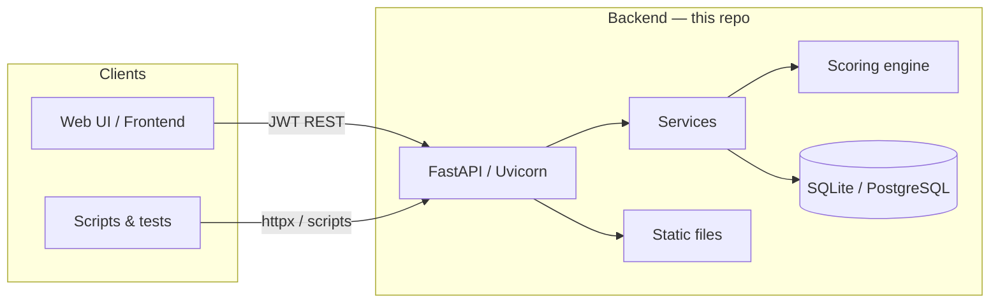
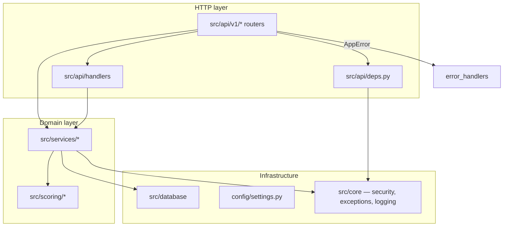
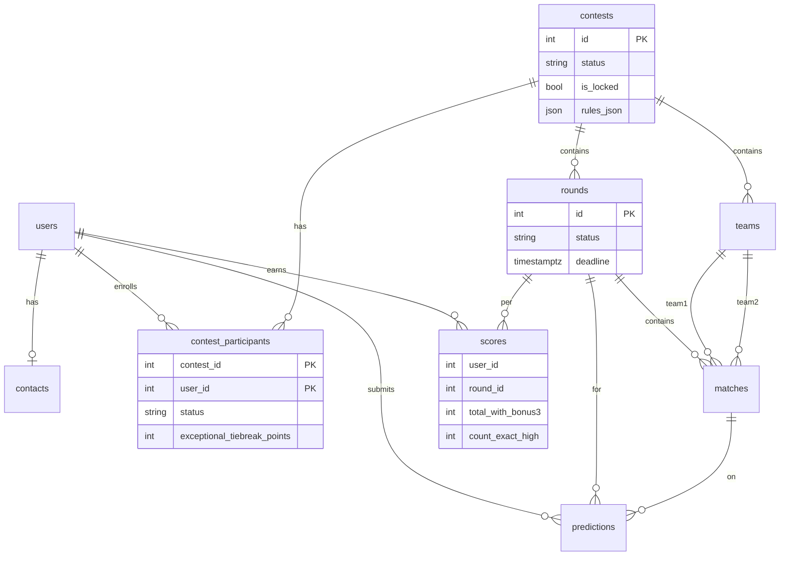
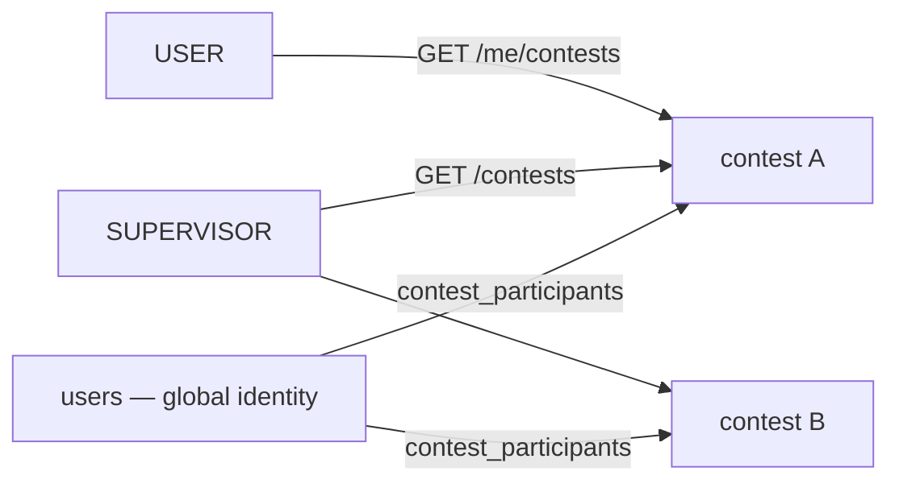
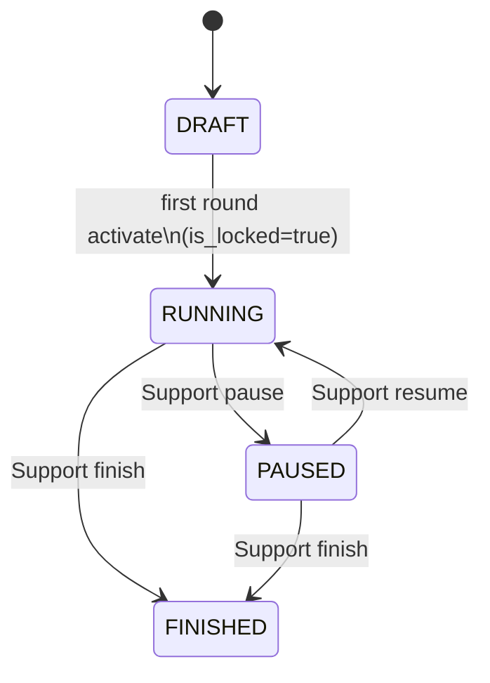
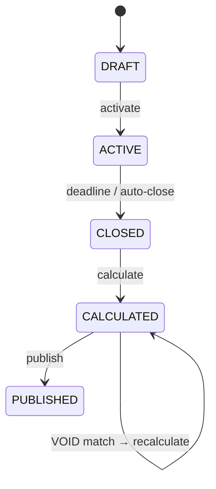
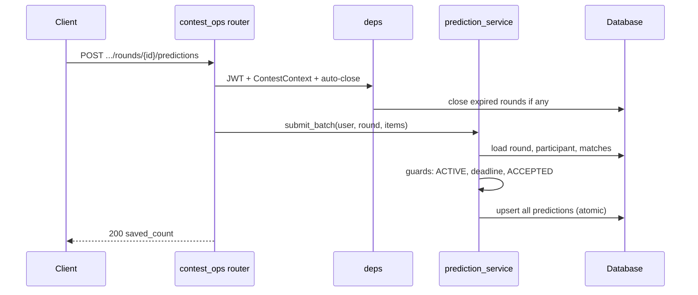
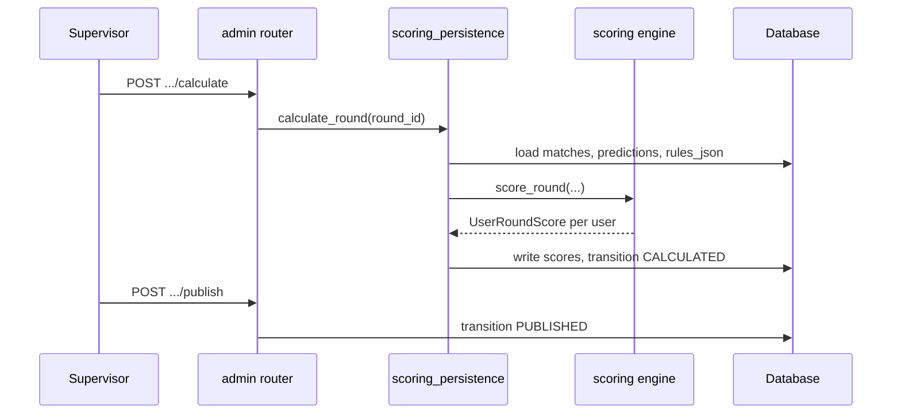
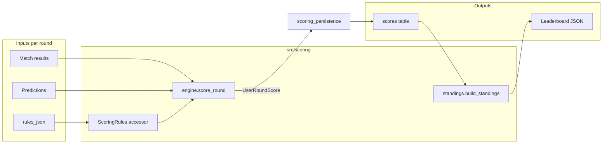
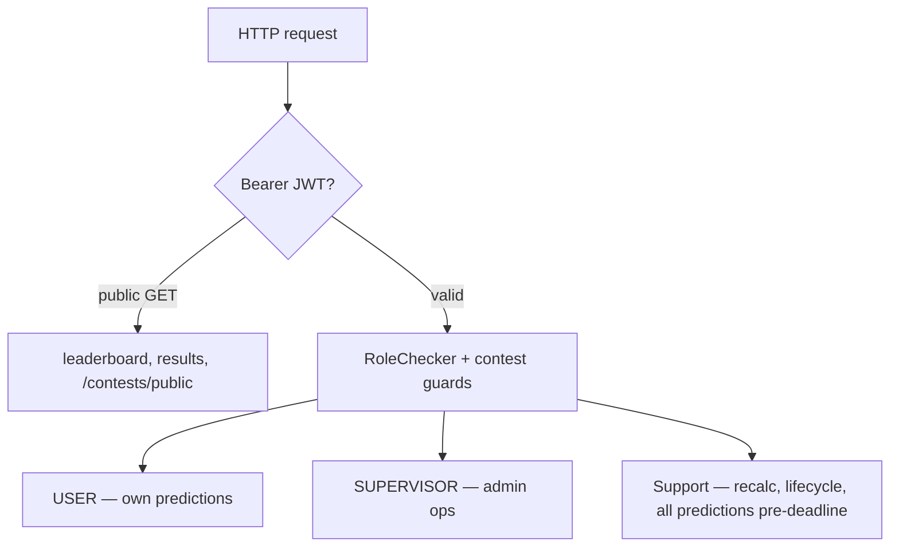

# System Architecture

High-level view of the Football Predictions Contest backend. For endpoint lists, table columns, and scoring formulas, follow the links at the end — this document does not duplicate those specs.

## Table of Contents

- [Purpose](#purpose)
- [System Context](#system-context)
- [Layered Architecture](#layered-architecture)
- [Code Layout](#code-layout)
- [Data Model](#data-model)
- [Multi-Contest Model](#multi-contest-model)
- [Lifecycle State Machines](#lifecycle-state-machines)
- [Request & Data Flows](#request--data-flows)
- [Scoring Pipeline](#scoring-pipeline)
- [Security & Access](#security--access)
- [Cross-Cutting Concerns](#cross-cutting-concerns)
- [Further Reading](#further-reading)

## Purpose

The backend supports a **multi-contest** football prediction platform:

- Organizers configure contests (teams, participants, rules), run rounds, enter results, calculate and publish standings.
- Participants submit batch predictions before round deadlines.
- Visitors read public leaderboards and published results.
- Scoring rules live in `contests.rules_json`; a **pure** scoring engine computes points without touching the database.

**API surface:** OpenAPI v1.2.0 — [`agent_docs/contracts/api_v1.yaml`](../agent_docs/contracts/api_v1.yaml)  
**Primary prefix:** `/api/v1/contests/{contest_id}/…`

## System Context



| Boundary | Technology |
|----------|------------|
| HTTP | FastAPI, Pydantic validation, OpenAPI |
| Persistence | SQLAlchemy 2 async, Alembic migrations |
| Auth | JWT (HS256), bcrypt passwords |
| Rules & config | `contests.rules_json`, `config/settings.py`, `.env` |
| Static assets | `/static/assets/*` (bundled), `/static/teams/*` (uploads) |

## Layered Architecture



**Principles:**

| Rule | Where |
|------|--------|
| Routers stay thin | Delegate to `services/` or shared `handlers/` |
| Business rules in services | Status machines, guards, transactions |
| Pure scoring | `src/scoring/` — no DB I/O; called from `scoring_persistence` |
| Typed domain errors | `AppError` → `{detail, code}` JSON; no `HTTPException` in services |
| Contest-scoped side effects | Auto-close expired rounds via dependency on contest routes |

Details: [API Guide — Architecture](API_GUIDE.md#architecture-updated)

## Code Layout

```
main.py              → app factory, CORS, routers, static mounts
config/settings.py   → env-backed Settings singleton
src/
  api/v1/            → REST endpoints (auth, contests, setup, predictions, admin)
  api/handlers/      → shared leaderboard / predictions response builders
  api/deps.py        → DB session, JWT user, RoleChecker, ContestContext, auto-close
  core/              → security, exceptions, logging
  database/          → models, async engine
  schemas/           → Pydantic DTOs (mirror OpenAPI components)
  scoring/           → engine, rules accessor, standings builder
  services/          → all mutable business logic
  scripts/           → seed, bootstrap_users, load_test_data
alembic/             → schema migrations
static/assets/       → default team logo (committed)
uploads/teams/       → supervisor uploads (gitignored)
```

## Data Model

Ten tables. Contest is the **aggregate root** for teams, rounds, and membership.



**Global vs per-contest:**

| Concept | Storage |
|---------|---------|
| Login, password, global role | `users.role` — one of `USER`, `SUPERVISOR`, `ADMIN` (support) |
| Playing in a contest | `contest_participants` — `PENDING` / `ACCEPTED` |
| Scoring rules | `contests.rules_json` (frozen when `is_locked`) |
| Manual tie-break override | `contest_participants.exceptional_tiebreak_points` (not in `rules_json`) |

Full column list: [`agent_docs/contracts/db_schema.md`](../agent_docs/contracts/db_schema.md) · [DB Reference](DB_REFERENCE.md)

## Multi-Contest Model

Stage 1.4+ supports **many contests** in one database. Each contest owns its teams, rounds, and participant rows.



Legacy routes without `{contest_id}` resolve the default contest (`id=1`) for backward-compatible tests.

## Lifecycle State Machines

### Contest



| Phase | `status` | `is_locked` | Typical operations |
|-------|----------|-------------|-------------------|
| Setup | `DRAFT` | `false` | Teams, invites, logos, PATCH rules |
| Operational | `RUNNING` | `true` | Predictions, results, calculate |
| Frozen | `PAUSED` | `true` | Read-only mutations; safe delete after grace |
| Terminal | `FINISHED` | `true` | Read-only; Support recalculate allowed |

Matrix of allowed operations: [`agent_docs/contracts/contest_lifecycle_flow.md`](../agent_docs/contracts/contest_lifecycle_flow.md)

### Round



**Auto-close:** on every contest-scoped API call, `auto_close_expired_rounds` transitions `ACTIVE → CLOSED` when `now >= deadline` (sync, same transaction when possible).

## Request & Data Flows

### Prediction submit (participant)



Missing prediction = **no row** (never score `0` as “empty”). Batch must cover every match in the round.

### Calculate & publish (supervisor)



After publish, public GET leaderboard/results include ETag caching.

## Scoring Pipeline

Rules are **data-driven** from `contests.rules_json`. The engine applies a fixed algorithm documented in the scoring contract.



| Stage | What happens |
|-------|----------------|
| **Base points** | Per match: one category — exact high, exact, diff+outcome, outcome, or miss |
| **Bonus 1** | Unique exact prediction multiplier |
| **Bonus 2** | Threshold by count of correct outcomes in round |
| **Bonus 3** | Round rank by base total (+ optional extra threshold) |
| **Tie-break** | Total → exact count → base without bonuses → diff count → manual override |
| **VOID** | Match points zeroed; bonuses recalculated for remaining matches |

Contract summary: [`agent_docs/contracts/scoring_flow.md`](../agent_docs/contracts/scoring_flow.md)  
Implementation & persistence: [SCORING_LOGIC.md](SCORING_LOGIC.md)

## Security & Access



| Mechanism | Notes |
|-----------|--------|
| JWT payload | `{sub: user_id, role, exp}` |
| Invite flow | Temp password → `PENDING` participant → change password → `ACCEPTED` |
| Prediction privacy | Before deadline: USER/SUPERVISOR see own scores only; Support (ADMIN) sees all |
| Contest guards | `PAUSED` / `FINISHED` block mutating ops; `is_locked` blocks setup CRUD |

RBAC tables: [API Guide — RBAC](API_GUIDE.md#role-based-access-control)

## Cross-Cutting Concerns

| Concern | Implementation |
|---------|------------------|
| Errors | `src/core/exceptions.py` + `error_handlers.py` → `{detail, code}` |
| Logging | `LOG_LEVEL`, structured format at startup |
| HTTP cache | Public leaderboard/results: `Cache-Control` + ETag from score state |
| Migrations | Alembic async; URL from `DATABASE_URL` |
| Bootstrap | `seed.py` + `bootstrap_users.py` — see [BOOTSTRAP_USERS.md](BOOTSTRAP_USERS.md) |
| Test data | `load_test_data.py` + contracted CSVs — see [CONFIG.md](CONFIG.md) |

## Further Reading

| Topic | Document |
|-------|----------|
| Manuals index | [README.md](README.md) |
| HTTP API, services, endpoints | [API_GUIDE.md](API_GUIDE.md) |
| Tables, enums, migrations | [DB_REFERENCE.md](DB_REFERENCE.md) |
| Points, bonuses, engine code | [SCORING_LOGIC.md](SCORING_LOGIC.md) |
| Env vars, seed, loader | [CONFIG.md](CONFIG.md) |
| OpenAPI (authoritative routes) | [`api_v1.yaml`](../agent_docs/contracts/api_v1.yaml) |
| DB contract | [`db_schema.md`](../agent_docs/contracts/db_schema.md) |
| Scoring contract | [`scoring_flow.md`](../agent_docs/contracts/scoring_flow.md) |
| Lifecycle matrix | [`contest_lifecycle_flow.md`](../agent_docs/contracts/contest_lifecycle_flow.md) |
| Business rules (immutable) | [`docs/01_tech_regulations.md`](../docs/01_tech_regulations.md) |
| Project README | [`README.md`](../README.md) |
