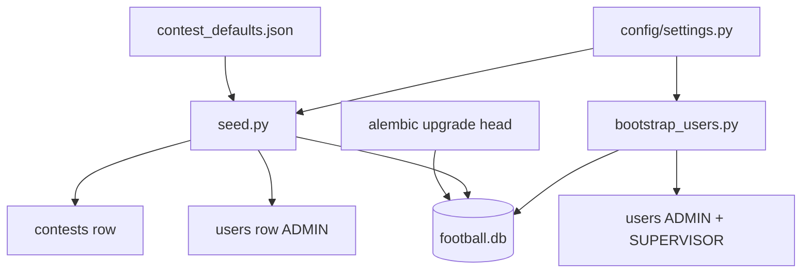

# Configuration Guide

Environment variables, application settings, seed workflow, and contest defaults.

## Table of Contents

- [Settings Module](#settings-module)
- [Environment Variables](#environment-variables)
- [Contest Defaults](#contest-defaults)
- [Seed Script](#seed-script)
- [Bootstrap Users Script](#bootstrap-users-script)
- [Database URL](#database-url)
- [Project Dependencies](#project-dependencies)

## Settings Module [UPDATED]

**Path:** `config/settings.py`

Uses `pydantic-settings` with optional `.env` file support.

```python
class Settings(BaseSettings):
    database_url: str = "sqlite+aiosqlite:///./football.db"
    contest_defaults_path: Path = PROJECT_ROOT / "docs/test_data/config/contest_defaults.json"
    seed_admin_login: str = "admin"
    seed_admin_password: str | None = None
    seed_admin_password_hash: str | None = None
    seed_admin_first_name: str = "Admin"
    seed_admin_last_name: str = "User"

    seed_supervisor_login: str | None = None
    seed_supervisor_password: str | None = None
    seed_supervisor_password_hash: str | None = None
    seed_supervisor_first_name: str = "Supervisor"
    seed_supervisor_last_name: str = "User"

    jwt_secret_key: str = "dev-secret-change-in-production"
    jwt_algorithm: str = "HS256"
    jwt_expire_minutes: int = 1440

    cors_origins: list[str] = ["*"]

    contest_delete_grace_seconds: int = 10
    contest_delete_enabled: bool = True
    contest_allow_instant_delete: bool = False

    cache_max_age_seconds: int = 300
    cache_stale_while_revalidate_seconds: int = 60

    log_level: str = "INFO"  # root logger level [NEW]
```

Access via `get_settings()` (cached singleton).

## Environment Variables [UPDATED]

| Variable | Default | Description |
|----------|---------|-------------|
| `DATABASE_URL` | `sqlite+aiosqlite:///./football.db` | Async SQLAlchemy connection URL |
| `SEED_ADMIN_LOGIN` | `admin` | Login for bootstrap ADMIN |
| `SEED_ADMIN_PASSWORD` | — | Plaintext admin password (hashed at runtime by bootstrap/seed) [NEW] |
| `SEED_ADMIN_PASSWORD_HASH` | — | Precomputed bcrypt hash (alternative to `SEED_ADMIN_PASSWORD`) |
| `SEED_ADMIN_FIRST_NAME` | `Admin` | ADMIN first name |
| `SEED_ADMIN_LAST_NAME` | `User` | ADMIN last name |
| `SEED_SUPERVISOR_LOGIN` | — | Optional organizer login for `bootstrap_users.py` [NEW] |
| `SEED_SUPERVISOR_PASSWORD` | — | Plaintext supervisor password [NEW] |
| `SEED_SUPERVISOR_PASSWORD_HASH` | — | Precomputed bcrypt hash for supervisor [NEW] |
| `SEED_SUPERVISOR_FIRST_NAME` | `Supervisor` | SUPERVISOR first name [NEW] |
| `SEED_SUPERVISOR_LAST_NAME` | `User` | SUPERVISOR last name [NEW] |
| `JWT_SECRET_KEY` | `dev-secret-change-in-production` | HS256 signing key for access tokens [NEW] |
| `JWT_ALGORITHM` | `HS256` | JWT algorithm [NEW] |
| `JWT_EXPIRE_MINUTES` | `1440` | Token lifetime in minutes (24 h) [NEW] |
| `CORS_ORIGINS` | `["*"]` | Allowed CORS origins (JSON list) [NEW] |
| `CONTEST_DELETE_GRACE_SECONDS` | `10` | Seconds after pause before safe delete allowed [NEW] |
| `CONTEST_DELETE_ENABLED` | `true` | Enable/disable contest delete endpoint [NEW] |
| `CONTEST_ALLOW_INSTANT_DELETE` | `false` | Skip grace period (test/dev only) [NEW] |
| `CACHE_MAX_AGE_SECONDS` | `300` | Public leaderboard/results cache TTL [NEW] |
| `CACHE_STALE_WHILE_REVALIDATE_SECONDS` | `60` | Stale-while-revalidate window [NEW] |
| `LOG_LEVEL` | `INFO` | Root log level (`DEBUG`, `INFO`, `WARNING`, `ERROR`) [NEW] |

> `contest_defaults_path` is a code default pointing to `docs/test_data/config/contest_defaults.json`. Override via seed CLI `--defaults-path` if needed.
>
> **Env template:** copy [`.env.example`](../.env.example) to `.env` (gitignored). Prefer `SEED_ADMIN_PASSWORD` (plaintext); scripts hash at runtime. Precomputed hash: `uv run python src/scripts/hash_password.py 'your-password'`.

## Contest Defaults [NEW]

**Source file:** `docs/test_data/config/contest_defaults.json`

Loaded at seed time into `contests` table. The `_meta` block is **not** stored in the database.

### Structural fields (top-level columns)

| JSON path | DB column | Default |
|-----------|-----------|---------|
| `contest_structure.total_teams` | `total_teams` | `16` |
| `contest_structure.matches_per_round` | `matches_per_round` | `8` |
| `contest_structure.total_rounds` | `total_rounds` | `30` |
| `contest_structure.is_round_robin` | `is_round_robin` | `true` |

### `rules_json` payload (stored as JSON)

Built by `build_rules_json()` in `src/scripts/seed.py`:

```json
{
  "scoring_rules": { "...": "..." },
  "tiebreakers": { "...": "..." },
  "constraints": { "...": "..." },
  "contest_structure": { "...": "..." }
}
```

Scoring rule values are documented in [SCORING_LOGIC.md](SCORING_LOGIC.md). DB schema in [DB_REFERENCE.md](DB_REFERENCE.md).

### Lock behavior [UPDATED]

- `contests.is_locked` defaults to `false` at seed.
- After first round activation (`DRAFT → ACTIVE`), `is_locked=true` and `status=RUNNING`.
- While locked: structural fields and `rules_json` cannot be PATCHed (HTTP 403).
- `contest_participants.exceptional_tiebreak_points` is **not** locked — ADMIN may update per contest at any time via API.

See [API_GUIDE.md — Contest Lifecycle](API_GUIDE.md#contest-lifecycle--immutability).

## Seed Script [UPDATED]

**Path:** `src/scripts/seed.py` — contest defaults + optional ADMIN (if login missing).

Uses `SEED_ADMIN_PASSWORD` when set (hashed at runtime); else `SEED_ADMIN_PASSWORD_HASH`; else dev placeholder hash (login will not work until bootstrap).

### What it does

1. Ensures tables exist (`Base.metadata.create_all`)
2. Inserts default `contests` row from `contest_defaults.json` (skips if contest exists)
3. Inserts ADMIN user from env (skips if login exists)

### Usage

```bash
uv run python src/scripts/seed.py
uv run python src/scripts/seed.py --database-url "sqlite+aiosqlite:///./football.db"
uv run python src/scripts/seed.py --defaults-path docs/test_data/config/contest_defaults.json
```

### Idempotency

- Second run logs "already exist, skipping" for both default contest and ADMIN user.
- Safe to re-run after migrations.

## Bootstrap Users Script [NEW]

**Path:** `src/scripts/bootstrap_users.py`

One-time (or fresh-DB) creation of **ADMIN** and optional **SUPERVISOR** from `.env`. Users remain in the database — **do not re-run** on every app start (see [BOOTSTRAP_USERS.md](BOOTSTRAP_USERS.md)).

```bash
uv run alembic upgrade head
uv run python src/scripts/seed.py              # contest row, optional admin
uv run python src/scripts/bootstrap_users.py   # ADMIN + SUPERVISOR from .env
```

| Flag | Description |
|------|-------------|
| `--database-url` | Override `DATABASE_URL` |
| `--no-contest-enroll` | Skip adding ADMIN to `contest_participants` |

**Requires** `SEED_ADMIN_PASSWORD` or `SEED_ADMIN_PASSWORD_HASH`. Supervisor block runs only when `SEED_SUPERVISOR_LOGIN` and password/hash are set.

**Idempotent:** existing logins skipped; passwords **not** updated on re-run.

### Password hash helper [NEW]

**Path:** `src/scripts/hash_password.py`

```bash
uv run python src/scripts/hash_password.py 'your-password'
```

Prints bcrypt string for `SEED_*_PASSWORD_HASH` in `.env`. Use from project root (`core` lives under `src/`).

### Bootstrap flow



## Database URL [NEW]

| Environment | URL pattern | Driver |
|-------------|-------------|--------|
| Dev (default) | `sqlite+aiosqlite:///./football.db` | aiosqlite |
| Production target | `postgresql+asyncpg://...` | asyncpg |

Both Alembic (`alembic/env.py`) and the seed script resolve URL via `get_settings().database_url` unless overridden by CLI.

## Test Data Loader [NEW]

Loads contracted CSV test data into the database for development and integration testing.

### Loader config: `config/test_data_loader.json`

All format/mapping rules live in config, not in code:

```json
{
  "data_dir": "docs/test_data/contracted",
  "files": {
    "teams":       {"name": "teams.csv",       "delimiter": ","},
    "users":       {"name": "users.csv",        "delimiter": ";"},
    "matches":     {"name": "matches.csv",      "delimiter": ";"},
    "predictions": {"name": "predictions.csv",  "delimiter": ";"}
  },
  "user_name_split": {"strategy": "last_name_only"},
  "datetime": {"format": "%d.%m.%Y|%H:%M", "timezone": "UTC"},
  "default_user_role": "USER"
}
```

`last_name_only` strategy: `last_name = full_name`, `first_name = ""`.

### Loader script: `src/scripts/load_test_data.py`

```bash
uv run python src/scripts/load_test_data.py [--reset] [--database-url URL]
```

| Flag | Effect |
|------|--------|
| `--reset` | DELETE all loaded tables in FK-safe order before reloading (idempotent reruns) |
| `--database-url` | Override database URL (default: from `config/settings.py`) |

**What it loads:**
- 16 teams (from `teams.csv`, comma-delimited; no id column — auto-assigned)
- 10 users (role assigned from config `default_user_role`; password is a placeholder hash)
- 10 rounds (1–9 set `CLOSED`; round 10 set `ACTIVE` — open for prediction tests)
- 80 matches (72 `FINISHED` with scores + 8 `SCHEDULED` with NULL scores for round 10)
- 712 predictions (one DB row per CSV line; serov/round4 has 0 rows — absence honored)
- `ContestSettings` from `contest_defaults.json`

**On success:** prints `✅ Data loaded successfully`, exits 0.  
**On error:** fails with the offending row — no silent skips.

## Project Dependencies [UPDATED]

Managed with `uv`. Key packages from `pyproject.toml`:

| Package | Purpose |
|---------|---------|
| `sqlalchemy` | ORM |
| `alembic` | Migrations |
| `aiosqlite` | Dev async SQLite driver |
| `asyncpg` | Production PostgreSQL driver (ready, not wired) |
| `pydantic`, `pydantic-settings` | Settings validation |
| `fastapi` | HTTP API framework [NEW] |
| `uvicorn[standard]` | ASGI server [NEW] |
| `python-jose[cryptography]` | JWT encode/decode [NEW] |
| `passlib[bcrypt]` | Listed dependency; hashing uses `bcrypt` directly [NEW] |
| `python-multipart` | Form/file upload support [NEW] |
| `pytest`, `pytest-asyncio` | Tests (dev group) |
| `httpx` | ASGI client for API integration tests (dev group) [NEW] |

Install:

```bash
uv sync
```

Run API server:

```bash
uv run uvicorn main:app --reload
```

Run Stage 1.3 HTTP tests:

```bash
uv run pytest tests/api/ -v
```
