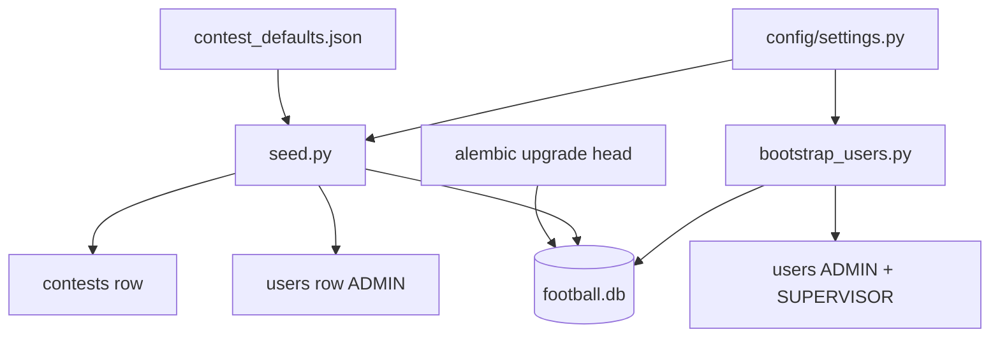

# Configuration Guide

Environment variables, application settings, seed workflow, and contest defaults.

## Table of Contents

- [Settings Module](#settings-module)
- [`.env` — secrets & deployment](#env--secrets--deployment)
- [Application defaults](#application-defaults-configsettingspy)
- [Contest Defaults](#contest-defaults)
- [Seed Script](#seed-script)
- [Bootstrap Users Script](#bootstrap-users-script)
- [Database URL](#database-url)
- [Project Dependencies](#project-dependencies)

## Settings Module [UPDATED]

**Path:** `config/settings.py` — **source of truth** for application defaults (committed, no secrets).

**Path:** `.env` — gitignored secrets and deployment overrides only (template: [`.env.example`](../.env.example)).

```
┌─────────────────────────────────────────────────────────────┐
│  config/settings.py   ← defaults (repo)                     │
│         ↑                                                   │
│  .env (optional)      ← secrets override matching fields    │
└─────────────────────────────────────────────────────────────┘
```

Uses `pydantic-settings`: any `Settings` field can be overridden by an env var (`log_level` → `LOG_LEVEL`).  
Access via `get_settings()` (cached singleton).

**Do not** duplicate non-secret defaults in `.env.example` — change `settings.py` or document optional prod overrides in the table below.

---

## `.env` — secrets & deployment

Copy [`.env.example`](../.env.example) → `.env` and fill in **before first bootstrap**:

| Variable | Required | Description |
|----------|----------|-------------|
| `DATABASE_URL` | dev: has default | Async SQLAlchemy URL; use PostgreSQL in production |
| `JWT_SECRET_KEY` | **prod: yes** | HS256 signing key for access tokens |
| `SEED_ADMIN_PASSWORD` | **bootstrap: yes** | Plaintext admin password (hashed at runtime) |
| `SEED_SUPERVISOR_PASSWORD` | recommended | Plaintext supervisor password |
| `SEED_ADMIN_PASSWORD_HASH` | alternative | Precomputed bcrypt instead of `SEED_ADMIN_PASSWORD` |
| `SEED_SUPERVISOR_PASSWORD_HASH` | alternative | Precomputed bcrypt instead of `SEED_SUPERVISOR_PASSWORD` |

Generate hash: `uv run python src/scripts/hash_password.py 'your-password'`

Logins (`admin`, `supervisor`), JWT algorithm/TTL, logging, CORS, cache, paths — **not** in `.env.example`; see [Application defaults](#application-defaults-configsettingspy) below.

---

## Application defaults (`config/settings.py`)

Change in code for dev; override via env in production (Kubernetes, etc.) if needed.

| Setting field | Env override | Default | Description |
|---------------|--------------|---------|-------------|
| `seed_admin_login` | `SEED_ADMIN_LOGIN` | `admin` | Bootstrap ADMIN login |
| `seed_admin_first_name` | `SEED_ADMIN_FIRST_NAME` | `Admin` | ADMIN first name |
| `seed_admin_last_name` | `SEED_ADMIN_LAST_NAME` | `User` | ADMIN last name |
| `seed_supervisor_login` | `SEED_SUPERVISOR_LOGIN` | `supervisor` | Bootstrap SUPERVISOR login |
| `seed_supervisor_first_name` | `SEED_SUPERVISOR_FIRST_NAME` | `Supervisor` | SUPERVISOR first name |
| `seed_supervisor_last_name` | `SEED_SUPERVISOR_LAST_NAME` | `User` | SUPERVISOR last name |
| `jwt_algorithm` | `JWT_ALGORITHM` | `HS256` | JWT algorithm |
| `jwt_expire_minutes` | `JWT_EXPIRE_MINUTES` | `1440` | Token lifetime (minutes) |
| `cors_origins` | `CORS_ORIGINS` | `["*"]` | Allowed CORS origins (JSON list) |
| `frontend_base_url` | `FRONTEND_BASE_URL` | `http://127.0.0.1:3000` | Base URL for `/auth/setup?token=…` links |
| `setup_token_expire_hours` | `SETUP_TOKEN_EXPIRE_HOURS` | `72` | Invite/reset setup token TTL |
| `enforce_password_setup` | `ENFORCE_PASSWORD_SETUP` | `true` | Block temp-password login until `complete-setup` |
| `supervisor_training_mode` | `SUPERVISOR_TRAINING_MODE` | `false` | SUPERVISOR may **finish** contest when true (delete/restore: see API_GUIDE) |
| `contest_restore_window_seconds` | `CONTEST_RESTORE_WINDOW_SECONDS` | `86400` | Undo window after training-mode delete |
| `contest_delete_grace_seconds` | `CONTEST_DELETE_GRACE_SECONDS` | `10` | Grace before safe delete after pause |
| `contest_delete_enabled` | `CONTEST_DELETE_ENABLED` | `true` | Enable contest delete endpoint |
| `contest_allow_instant_delete` | `CONTEST_ALLOW_INSTANT_DELETE` | `false` | Skip grace (test/dev only) |
| `contest_purge_retention_seconds` | `CONTEST_PURGE_RETENTION_SECONDS` | `2592000` | Hard-delete soft-deleted contests after N seconds (default 30 days) |
| `cache_max_age_seconds` | `CACHE_MAX_AGE_SECONDS` | `300` | Public cache TTL |
| `cache_stale_while_revalidate_seconds` | `CACHE_STALE_WHILE_REVALIDATE_SECONDS` | `60` | Stale-while-revalidate window |
| `log_level` | `LOG_LEVEL` | `INFO` | Root log level |
| `log_to_file` | `LOG_TO_FILE` | `true` | Write to `log_file` + stderr |
| `log_file` | `LOG_FILE` | `app.log` | Active log path (repo root) |
| `log_archive_dir` | `LOG_ARCHIVE_DIR` | `logs/archive` | Archived log copies |
| `log_archive_max_bytes` | `LOG_ARCHIVE_MAX_BYTES` | `5242880` | Archive at 5 MiB |
| `log_archive_interval_days` | `LOG_ARCHIVE_INTERVAL_DAYS` | `7` | Weekly archive trigger |
| `upload_dir` | `UPLOAD_DIR` | `./uploads` | Team logo uploads |
| `static_url_prefix` | `STATIC_URL_PREFIX` | `/static` | Static URL prefix |
| `max_logo_bytes` | `MAX_LOGO_BYTES` | `2097152` | Max logo upload (2 MiB) |
| `team_logo_target_px` | `TEAM_LOGO_TARGET_PX` | `64` | Logo resize target (px) |
| `default_team_logo_url` | `DEFAULT_TEAM_LOGO_URL` | `/static/assets/default-team-logo.jpg` | Fallback logo URL |
| `contest_defaults_path` | — | `docs/test_data/config/contest_defaults.json` | Seed JSON path (code only) |

### Local / CI tuning (not in `.env`)

Do **not** add non-secret flags to root `.env`. Use one of:

| Need | Approach |
|------|----------|
| Change default for all devs | Edit `config/settings.py` |
| One pytest run | `monkeypatch` in fixtures (`tests/api/stage_112_helpers.py`) |
| Ad-hoc command | Shell prefix, e.g. `ENFORCE_PASSWORD_SETUP=false uv run pytest tests/api/…` |
| Production | Deployment env vars (K8s manifest), not committed `.env` |

Example shell prefix for Stage 1.12 regression (see [DEV_SETUP.md](DEV_SETUP.md)):

```bash
ENFORCE_PASSWORD_SETUP=true SUPERVISOR_TRAINING_MODE=true \
  CONTEST_DELETE_GRACE_SECONDS=0 CONTEST_RESTORE_WINDOW_SECONDS=3600 \
  uv run pytest tests/api/test_contest_restore.py -v
```

Production keeps `enforce_password_setup=true` and `supervisor_training_mode=false` via `settings.py` defaults unless deployment overrides.

### Team logo storage

| Path | Git | Purpose |
|------|-----|---------|
| `static/assets/default-team-logo.jpg` | Committed | Bundled placeholder served at `/static/assets/` |
| `uploads/teams/{contest_id}/{team_id}.jpg` | Gitignored (`uploads/`) | Supervisor-uploaded logos served at `/static/teams/` |

Directories `uploads/` and `static/assets/` are created at app startup (`main.py`). See [API_GUIDE.md — Team logos](API_GUIDE.md#multi-contest-api).

> `contest_defaults_path` is a code default pointing to `docs/test_data/config/contest_defaults.json`. Override via seed CLI `--defaults-path` if needed.

## Contest Defaults [NEW]

**Source file:** `docs/test_data/config/contest_defaults.json`

Loaded at seed time into `contests` table. The `_meta` block is **not** stored in the database.

### Structural fields (top-level columns)

| JSON path | DB column | Default |
|-----------|-----------|---------|
| `contest_structure.total_teams` | `total_teams` | `16` |
| `contest_structure.matches_per_round` | `matches_per_round` | `8` |
| `contest_structure.total_rounds` | `total_rounds` | `30` |
| `contest_structure.is_round_robin` | `is_round_robin` | `true` |

### `rules_json` payload (stored as JSON)

Built by `build_rules_json()` in `src/scripts/seed.py`:

```json
{
  "scoring_rules": { "...": "..." },
  "tiebreakers": { "...": "..." },
  "constraints": { "...": "..." },
  "contest_structure": { "...": "..." }
}
```

Scoring rule values are documented in [SCORING_LOGIC.md](SCORING_LOGIC.md). DB schema in [DB_REFERENCE.md](DB_REFERENCE.md).

### Lock behavior [UPDATED]

- `contests.is_locked` defaults to `false` at seed.
- After first round activation (`DRAFT → ACTIVE`), `is_locked=true` and `status=RUNNING`.
- While locked: structural fields and `rules_json` cannot be PATCHed (HTTP 403).
- `contest_participants.exceptional_tiebreak_points` is **not** locked — ADMIN may update per contest at any time via API.

See [API_GUIDE.md — Contest Lifecycle](API_GUIDE.md#contest-lifecycle--immutability).

## Seed Script [UPDATED]

**Path:** `src/scripts/seed.py` — contest defaults + optional ADMIN (if login missing).

Uses `SEED_ADMIN_PASSWORD` when set (hashed at runtime); else `SEED_ADMIN_PASSWORD_HASH`; else dev placeholder hash (login will not work until bootstrap).

### What it does

1. Ensures tables exist (`Base.metadata.create_all`)
2. Inserts default `contests` row from `contest_defaults.json` (skips if contest exists)
3. Inserts ADMIN user from env (skips if login exists)

### Usage

```bash
uv run python src/scripts/seed.py
uv run python src/scripts/seed.py --database-url "sqlite+aiosqlite:///./football.db"
uv run python src/scripts/seed.py --defaults-path docs/test_data/config/contest_defaults.json
```

### Idempotency

- Second run logs "already exist, skipping" for both default contest and ADMIN user.
- Safe to re-run after migrations.

## Bootstrap Users Script [NEW]

**Path:** `src/scripts/bootstrap_users.py`

One-time (or fresh-DB) creation of **ADMIN** and optional **SUPERVISOR** from `.env`. Users remain in the database — **do not re-run** on every app start (see [BOOTSTRAP_USERS.md](BOOTSTRAP_USERS.md)).

```bash
uv run alembic upgrade head
uv run python src/scripts/seed.py              # contest row, optional admin
uv run python src/scripts/bootstrap_users.py   # ADMIN + SUPERVISOR from .env
```

| Flag | Description |
|------|-------------|
| `--database-url` | Override `DATABASE_URL` |
| `--no-contest-enroll` | Skip adding ADMIN to `contest_participants` |

**Requires** `SEED_ADMIN_PASSWORD` or `SEED_ADMIN_PASSWORD_HASH`. Supervisor block runs only when `SEED_SUPERVISOR_LOGIN` and password/hash are set.

**Idempotent:** existing logins skipped; passwords **not** updated on re-run.

### Password hash helper [NEW]

**Path:** `src/scripts/hash_password.py`

```bash
uv run python src/scripts/hash_password.py 'your-password'
```

Prints bcrypt string for `SEED_*_PASSWORD_HASH` in `.env`. Use from project root (`core` lives under `src/`).

### Bootstrap flow



## Database URL [NEW]

| Environment | URL pattern | Driver |
|-------------|-------------|--------|
| Dev (default) | `sqlite+aiosqlite:///./football.db` | aiosqlite |
| Production target | `postgresql+asyncpg://...` | asyncpg |

Both Alembic (`alembic/env.py`) and the seed script resolve URL via `get_settings().database_url` unless overridden by CLI.

## Test Data Loader [NEW]

Loads contracted CSV test data into the database for development and integration testing.

### Loader config: `config/test_data_loader.json`

All format/mapping rules live in config, not in code:

```json
{
  "data_dir": "docs/test_data/contracted",
  "files": {
    "teams":       {"name": "teams.csv",       "delimiter": ","},
    "users":       {"name": "users.csv",        "delimiter": ";"},
    "matches":     {"name": "matches.csv",      "delimiter": ";"},
    "predictions": {"name": "predictions.csv",  "delimiter": ";"}
  },
  "user_name_split": {"strategy": "last_name_only"},
  "datetime": {"format": "%d.%m.%Y|%H:%M", "timezone": "UTC"},
  "default_user_role": "USER"
}
```

`last_name_only` strategy: `last_name = full_name`, `first_name = ""`.

### Loader script: `src/scripts/load_test_data.py`

```bash
uv run python src/scripts/load_test_data.py [--reset] [--database-url URL]
```

| Flag | Effect |
|------|--------|
| `--reset` | DELETE all loaded tables in FK-safe order before reloading (idempotent reruns) |
| `--database-url` | Override database URL (default: from `config/settings.py`) |

**What it loads:**
- 16 teams (from `teams.csv`, comma-delimited; no id column — auto-assigned)
- 10 users (role assigned from config `default_user_role`; password is a placeholder hash)
- 10 rounds (1–9 set `CLOSED`; round 10 set `ACTIVE` — open for prediction tests)
- 80 matches (72 `FINISHED` with scores + 8 `SCHEDULED` with NULL scores for round 10)
- 712 predictions (one DB row per CSV line; serov/round4 has 0 rows — absence honored)
- `ContestSettings` from `contest_defaults.json`

**On success:** prints `✅ Data loaded successfully`, exits 0.  
**On error:** fails with the offending row — no silent skips.

## Project Dependencies [UPDATED]

Managed with `uv`. Key packages from `pyproject.toml`:

| Package | Purpose |
|---------|---------|
| `sqlalchemy` | ORM |
| `alembic` | Migrations |
| `aiosqlite` | Dev async SQLite driver |
| `asyncpg` | Production PostgreSQL driver (ready, not wired) |
| `pydantic`, `pydantic-settings` | Settings validation |
| `fastapi` | HTTP API framework [NEW] |
| `uvicorn[standard]` | ASGI server [NEW] |
| `python-jose[cryptography]` | JWT encode/decode [NEW] |
| `passlib[bcrypt]` | Listed dependency; hashing uses `bcrypt` directly [NEW] |
| `python-multipart` | Form/file upload support [NEW] |
| `pillow` | Team logo validate, center-crop, resize (Stage 1.9) [NEW] |
| `pytest`, `pytest-asyncio` | Tests (dev group) |
| `httpx` | ASGI client for API integration tests (dev group) [NEW] |

Install:

```bash
uv sync
```

Run API server:

```bash
uv run uvicorn main:app --reload
```

Run Stage 1.3 HTTP tests:

```bash
uv run pytest tests/api/ -v
```
