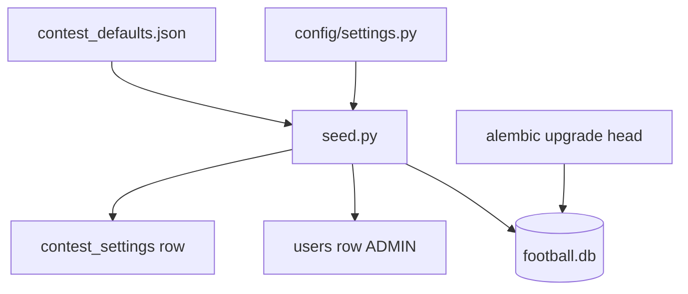

# Configuration Guide

Environment variables, application settings, seed workflow, and contest defaults.

## Table of Contents

- [Settings Module](#settings-module)
- [Environment Variables](#environment-variables)
- [Contest Defaults](#contest-defaults)
- [Seed Script](#seed-script)
- [Database URL](#database-url)
- [Project Dependencies](#project-dependencies)

## Settings Module [NEW]

**Path:** `config/settings.py`

Uses `pydantic-settings` with optional `.env` file support.

```python
class Settings(BaseSettings):
    database_url: str = "sqlite+aiosqlite:///./football.db"
    contest_defaults_path: Path = PROJECT_ROOT / "docs/test_data/config/contest_defaults.json"
    seed_admin_login: str = "admin"
    seed_admin_password_hash: str = "dev-only-placeholder-hash"
    seed_admin_first_name: str = "Admin"
    seed_admin_last_name: str = "User"
```

Access via `get_settings()` (cached singleton).

## Environment Variables [NEW]

| Variable | Default | Description |
|----------|---------|-------------|
| `DATABASE_URL` | `sqlite+aiosqlite:///./football.db` | Async SQLAlchemy connection URL |
| `SEED_ADMIN_LOGIN` | `admin` | Login for initial ADMIN user created by seed |
| `SEED_ADMIN_PASSWORD_HASH` | `dev-only-placeholder-hash` | Password hash for seed ADMIN (replace in production) |
| `SEED_ADMIN_FIRST_NAME` | `Admin` | ADMIN first name |
| `SEED_ADMIN_LAST_NAME` | `User` | ADMIN last name |

> `contest_defaults_path` is a code default pointing to `docs/test_data/config/contest_defaults.json`. Override via seed CLI `--defaults-path` if needed.

## Contest Defaults [NEW]

**Source file:** `docs/test_data/config/contest_defaults.json`

Loaded at seed time into `contest_settings` table. The `_meta` block is **not** stored in the database.

### Structural fields (top-level columns)

| JSON path | DB column | Default |
|-----------|-----------|---------|
| `contest_structure.total_teams` | `total_teams` | `16` |
| `contest_structure.matches_per_round` | `matches_per_round` | `8` |
| `contest_structure.total_rounds` | `total_rounds` | `30` |
| `contest_structure.is_round_robin` | `is_round_robin` | `true` |

### `rules_json` payload (stored as JSON)

Built by `build_rules_json()` in `src/scripts/seed.py`:

```json
{
  "scoring_rules": { "...": "..." },
  "tiebreakers": { "...": "..." },
  "constraints": { "...": "..." },
  "contest_structure": { "...": "..." }
}
```

Scoring rule values are documented in [SCORING_LOGIC.md](SCORING_LOGIC.md). DB schema in [DB_REFERENCE.md](DB_REFERENCE.md).

### Lock behavior

- `contest_settings.is_locked` defaults to `false` at seed.
- After contest start, `is_locked=true` prevents rule edits (enforced in Stage 1+ application logic).

## Seed Script [NEW]

**Path:** `src/scripts/seed.py`

### What it does

1. Ensures tables exist (`Base.metadata.create_all`)
2. Inserts `contest_settings` from `contest_defaults.json` (skips if row exists)
3. Inserts ADMIN user from env/settings (skips if login exists)

### Usage

```bash
uv run python src/scripts/seed.py
uv run python src/scripts/seed.py --database-url "sqlite+aiosqlite:///./football.db"
uv run python src/scripts/seed.py --defaults-path docs/test_data/config/contest_defaults.json
```

### Idempotency

- Second run logs "already exist, skipping" for both `contest_settings` and ADMIN user.
- Safe to re-run after migrations.

### Bootstrap flow



## Database URL [NEW]

| Environment | URL pattern | Driver |
|-------------|-------------|--------|
| Dev (default) | `sqlite+aiosqlite:///./football.db` | aiosqlite |
| Production target | `postgresql+asyncpg://...` | asyncpg |

Both Alembic (`alembic/env.py`) and the seed script resolve URL via `get_settings().database_url` unless overridden by CLI.

## Project Dependencies [NEW]

Managed with `uv`. Key packages from `pyproject.toml`:

| Package | Purpose |
|---------|---------|
| `sqlalchemy` | ORM |
| `alembic` | Migrations |
| `aiosqlite` | Dev async SQLite driver |
| `asyncpg` | Production PostgreSQL driver (ready, not wired) |
| `pydantic`, `pydantic-settings` | Settings validation |
| `pytest`, `pytest-asyncio` | Tests (dev group) |

Install:

```bash
uv sync
```
