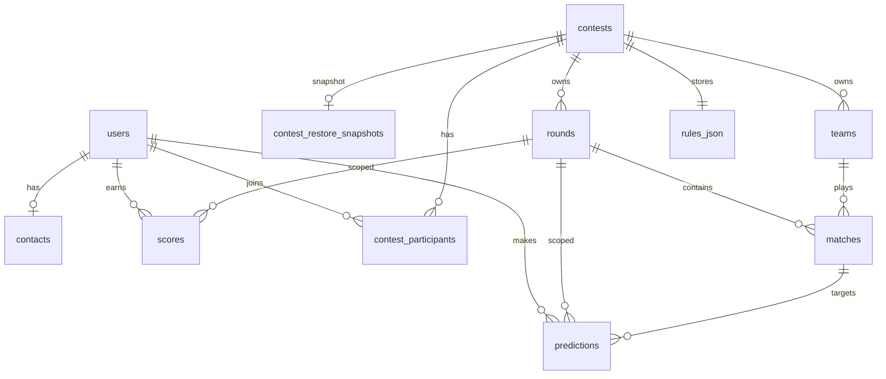

# Database Reference

Overview of the database layer: SQLAlchemy models, enums, constraints, and Alembic migrations.

## Table of Contents

- [Architecture](#architecture)
- [Enums](#enums)
- [Tables](#tables)
- [Constraints](#constraints)
- [Data Rules](#data-rules)
- [Migrations](#migrations)
- [Entity Relationships](#entity-relationships)

## Architecture [UPDATED]

| Component | Path | Role |
|-----------|------|------|
| Declarative base | `src/database/base.py` | `Base` metadata for ORM + Alembic |
| Models | `src/database/models.py` | 11 tables, enums, CHECK/UNIQUE |
| Engine | `src/database/engine.py` | Async engine + session factory |
| Initial migration | `alembic/versions/0992bb744cc8_initial_schema.py` | Creates initial 8 tables |
| Scores extension | `alembic/versions/a2b3c4d5e6f7_scores_counts.py` | Adds `count_*` columns to `scores` |
| Lifecycle extension | `alembic/versions/b3c4d5e6f7a8_contest_lifecycle_and_tiebreak.py` | Lifecycle on `contest_settings`; tie-break on `users` |
| Multi-contest | `alembic/versions/c4d5e6f7a8b9_multi_contest_and_participants.py` | `contests`, `contest_participants`, scoped FKs [NEW] |
| Restore snapshots | `alembic/versions/e6f7a8b9c0d1_contest_restore_snapshots.py` | `contest_restore_snapshots` for training-mode undo [NEW] |
| Alembic runner | `alembic/env.py` | Async migrations; URL from [CONFIG.md](CONFIG.md) |

**Stack:** SQLAlchemy 2.0+ async, `DateTime(timezone=True)` (TIMESTAMPTZ), JSON column for `rules_json`.

## Enums [NEW]

Defined in `src/database/models.py` as `StrEnum` values stored as `VARCHAR`.

### `UserRole`

| Value | Description |
|-------|-------------|
| `SUPERVISOR` | Contest organizer — setup, rounds, results, scoring (see [API_GUIDE — RBAC](API_GUIDE.md#role-based-access-control)) |
| `SUPPORT` | Technical support (`users.role=SUPPORT`) |
| `USER` | Participant — predictions and leaderboard as a player |

> **Organizer who also wants to play:** use a **separate `USER` login** invited into the contest. Global role is one per account; pre-deadline prediction privacy applies to `SUPERVISOR` same as `USER`. Details: [API_GUIDE — Organizer vs participant](API_GUIDE.md#organizer-vs-participant-same-person).

### `RoundStatus`

| Value | Description |
|-------|-------------|
| `DRAFT` | Editable, not yet open for predictions |
| `ACTIVE` | Predictions accepted |
| `CLOSED` | Deadline passed |
| `CALCULATED` | Points computed |
| `PUBLISHED` | Results immutable |

### `MatchStatus`

| Value | Description |
|-------|-------------|
| `SCHEDULED` | Planned |
| `POSTPONED` | Rescheduled (eligible for free tour) |
| `CANCELED` | Not counted |
| `VOID` | Played but annulled (0 points) |
| `FINISHED` | Result confirmed |

### `ContestLifecycleStatus` [NEW]

| Value | Description |
|-------|-------------|
| `DRAFT` | Contest not yet started; settings editable |
| `RUNNING` | Active contest (set on first round activation) |
| `PAUSED` | Mutating ops blocked; required before safe delete |
| `FINISHED` | Early termination; mutating ops blocked |

Stored on `contests.status`. Independent of `is_locked` (lock prevents rule edits; status controls operational pause/finish).

### `ParticipantStatus` [NEW]

| Value | Description |
|-------|-------------|
| `PENDING` | Invited, not yet accepted |
| `ACCEPTED` | Active participant in contest |

Stored on `contest_participants.status`.

## Tables [NEW]

### `users`

| Column | Type | Constraints |
|--------|------|-------------|
| `id` | INTEGER | PK |
| `login` | VARCHAR | UNIQUE, NOT NULL |
| `password_hash` | VARCHAR | NOT NULL |
| `role` | VARCHAR | NOT NULL (`UserRole`) |
| `first_name` | VARCHAR | NOT NULL |
| `last_name` | VARCHAR | NOT NULL |
| `is_temp_password` | BOOLEAN | NOT NULL, default `false` |

> Per-contest exceptional tie-break lives on `contest_participants.exceptional_tiebreak_points` (Stage 1.4). See [SCORING_LOGIC.md](SCORING_LOGIC.md#tie-breakers-and-final-standings).

### `contacts`

| Column | Type | Constraints |
|--------|------|-------------|
| `user_id` | INTEGER | PK, FK → `users.id` |
| `email` | VARCHAR | NULL |
| `vk_id` | VARCHAR | NULL |
| `tg_id` | VARCHAR | NULL |
| `notify_enabled` | BOOLEAN | NOT NULL, default `false` |

### `teams` [UPDATED]

| Column | Type | Constraints |
|--------|------|-------------|
| `id` | INTEGER | PK |
| `contest_id` | INTEGER | FK → `contests.id` ON DELETE CASCADE, NOT NULL [NEW] |
| `name` | VARCHAR | NOT NULL |
| `short_name` | VARCHAR | NOT NULL |
| `logo_url` | VARCHAR | NULL |

Unique per contest: `(contest_id, name)`.

### `rounds` [UPDATED]

| Column | Type | Constraints |
|--------|------|-------------|
| `id` | INTEGER | PK |
| `contest_id` | INTEGER | FK → `contests.id` ON DELETE CASCADE, NOT NULL [NEW] |
| `number` | INTEGER | NOT NULL |
| `deadline` | TIMESTAMPTZ | NOT NULL |
| `status` | VARCHAR | NOT NULL (`RoundStatus`) |
| `matches_count` | INTEGER | NOT NULL, default `0` |

Unique per contest: `(contest_id, number)`.

### `matches`

| Column | Type | Constraints |
|--------|------|-------------|
| `id` | INTEGER | PK |
| `round_id` | INTEGER | FK → `rounds.id`, NOT NULL |
| `team1_id` | INTEGER | FK → `teams.id`, NOT NULL (home) |
| `team2_id` | INTEGER | FK → `teams.id`, NOT NULL (away) |
| `date_time` | TIMESTAMPTZ | NOT NULL |
| `score1` | INTEGER | NULL |
| `score2` | INTEGER | NULL |
| `status` | VARCHAR | NOT NULL (`MatchStatus`) |

### `predictions`

| Column | Type | Constraints |
|--------|------|-------------|
| `id` | INTEGER | PK |
| `user_id` | INTEGER | FK → `users.id`, NOT NULL |
| `round_id` | INTEGER | FK → `rounds.id`, NOT NULL |
| `match_id` | INTEGER | FK → `matches.id`, NOT NULL |
| `score1` | INTEGER | NULL |
| `score2` | INTEGER | NULL |

### `scores`

| Column | Type | Constraints |
|--------|------|-------------|
| `id` | INTEGER | PK |
| `user_id` | INTEGER | FK → `users.id`, NOT NULL |
| `round_id` | INTEGER | FK → `rounds.id`, NOT NULL |
| `points_exact` | INTEGER | NOT NULL, default `0` |
| `points_diff` | INTEGER | NOT NULL, default `0` |
| `points_outcome` | INTEGER | NOT NULL, default `0` |
| `bonus1` | INTEGER | NOT NULL, default `0` |
| `bonus2` | INTEGER | NOT NULL, default `0` |
| `bonus3` | INTEGER | NOT NULL, default `0` |
| `total_without_bonus3` | INTEGER | NOT NULL, default `0` |
| `total_with_bonus3` | INTEGER | NOT NULL, default `0` |
| `correct_outcomes` | INTEGER | NOT NULL, default `0` |
| `count_exact_high` | INTEGER | NOT NULL, default `0` [UPDATED] |
| `count_exact` | INTEGER | NOT NULL, default `0` [UPDATED] |
| `count_diff` | INTEGER | NOT NULL, default `0` [UPDATED] |
| `count_outcome` | INTEGER | NOT NULL, default `0` [UPDATED] |

**Before → After:** `count_*` columns were added by migration `a2b3c4d5e6f7`. They store the **frequency of hits** per exclusive category (not points) and are required for leaderboard tie-breaking (see [SCORING_LOGIC.md](SCORING_LOGIC.md#tie-breakers)) and display.

> All aggregation fields default to `0` because they store **computed totals**, not raw match predictions. See [Data Rules](#data-rules).

### `contests` [NEW]

Replaces singleton `contest_settings` (Stage 1.4). Multiple contests may coexist.

| Column | Type | Constraints |
|--------|------|-------------|
| `id` | INTEGER | PK |
| `name` | VARCHAR | NOT NULL |
| `slug` | VARCHAR | UNIQUE, NULL |
| `is_locked` | BOOLEAN | NOT NULL, default `false` |
| `status` | VARCHAR | NOT NULL, default `'DRAFT'` (`ContestLifecycleStatus`) |
| `paused_at` | TIMESTAMPTZ | NULL — set on pause |
| `finished_at` | TIMESTAMPTZ | NULL — set on early finish |
| `total_teams` | INTEGER | NOT NULL |
| `matches_per_round` | INTEGER | NOT NULL |
| `total_rounds` | INTEGER | NOT NULL |
| `is_round_robin` | BOOLEAN | NOT NULL |
| `rules_json` | JSON | NOT NULL — see [CONFIG.md](CONFIG.md) and [SCORING_LOGIC.md](SCORING_LOGIC.md) |

### `contest_participants` [NEW]

| Column | Type | Constraints |
|--------|------|-------------|
| `contest_id` | INTEGER | PK (part 1), FK → `contests.id` ON DELETE CASCADE |
| `user_id` | INTEGER | PK (part 2), FK → `users.id` |
| `status` | VARCHAR | NOT NULL, default `'ACCEPTED'` (`ParticipantStatus`) |
| `exceptional_tiebreak_points` | INTEGER | NOT NULL, default `0` |

> `exceptional_tiebreak_points` is per-contest, admin-set (criterion 5). Not part of `rules_json`; updatable when contest is locked.

### `contest_restore_snapshots` [NEW]

Training-mode undo buffer written before contest delete wipe (Stage 1.12).

| Column | Type | Constraints |
|--------|------|-------------|
| `contest_id` | INTEGER | PK, FK → `contests.id` |
| `snapshot_json` | JSON | NOT NULL — contest fields, teams, rounds, matches, participant user IDs |
| `deleted_at` | TIMESTAMPTZ | NOT NULL |
| `expires_at` | TIMESTAMPTZ | NOT NULL — `deleted_at + contest_restore_window_seconds` |
| `deleted_by_user_id` | INTEGER | FK → `users.id`, NULL |

At most one snapshot row per contest (PK on `contest_id`). Row deleted after successful restore or when expired. See [API_GUIDE — Contest Lifecycle](API_GUIDE.md#contest-lifecycle--immutability).

**Before → After (Stage 1.4):** `contest_settings` (singleton) → `contests` (multi-row). `users.exceptional_tiebreak_points` → `contest_participants.exceptional_tiebreak_points`. `teams` and `rounds` scoped by `contest_id`.

## Constraints [NEW]

### CHECK constraints

| Name | Table | Rule |
|------|-------|------|
| `ck_matches_different_teams` | `matches` | `team1_id != team2_id` |
| `ck_matches_score1_range` | `matches` | `score1 IS NULL OR (score1 >= 0 AND score1 <= 20)` |
| `ck_matches_score2_range` | `matches` | `score2 IS NULL OR (score2 >= 0 AND score2 <= 20)` |
| `ck_predictions_score1_range` | `predictions` | same as matches `score1` |
| `ck_predictions_score2_range` | `predictions` | same as matches `score2` |
| `ck_contests_status` | `contests` | `status IN ('DRAFT','RUNNING','PAUSED','FINISHED')` [UPDATED] |
| `ck_contest_participants_tiebreak_nonneg` | `contest_participants` | `exceptional_tiebreak_points >= 0` [NEW] |
| `ck_contest_participants_status` | `contest_participants` | `status IN ('PENDING','ACCEPTED')` [NEW] |

### UNIQUE constraints

| Name | Table | Columns |
|------|-------|---------|
| (implicit) | `users` | `login` |
| `uq_teams_contest_name` | `teams` | `contest_id`, `name` [UPDATED] |
| `uq_rounds_contest_number` | `rounds` | `contest_id`, `number` [UPDATED] |
| (implicit) | `contests` | `slug` [NEW] |
| `uq_predictions_user_round_match` | `predictions` | `user_id`, `round_id`, `match_id` |
| `uq_scores_user_round` | `scores` | `user_id`, `round_id` |

### Foreign keys

```
users ← contacts.user_id
users ← predictions.user_id, scores.user_id
users ← contest_participants.user_id
users ← contest_restore_snapshots.deleted_by_user_id
contests ← contest_restore_snapshots.contest_id
contests ← contest_participants.contest_id, teams.contest_id, rounds.contest_id
rounds ← matches.round_id, predictions.round_id, scores.round_id
teams ← matches.team1_id, matches.team2_id
matches ← predictions.match_id
```

## Data Rules [NEW]

Critical distinction enforced at schema and test level:

| Concept | Representation | Invalid |
|---------|----------------|---------|
| Valid zero score | `score1=0`, `score2=0` | — |
| Unplayed match / no result | `score1=NULL`, `score2=NULL` | — |
| **Missing prediction** | **No row** in `predictions` | Using `0` as absence sentinel |
| Player without prediction | No row → no points (Stage 1 scoring) | Defaulting to `0` |

**Before → After:** No database layer existed. Stage 0 introduces nullable score columns with CHECK `0..20 OR NULL`, and tests confirm `0:0` succeeds while absence is modeled as missing rows.

## Migrations [UPDATED]

```bash
uv run alembic upgrade head      # apply all pending
uv run alembic downgrade -1      # roll back one revision
uv run alembic downgrade base    # roll back all
```

| Revision | File | Description |
|----------|------|-------------|
| `0992bb744cc8` | `alembic/versions/0992bb744cc8_initial_schema.py` | Creates all 8 tables |
| `a2b3c4d5e6f7` | `alembic/versions/a2b3c4d5e6f7_scores_counts.py` | Adds 4 `count_*` columns to `scores` |
| `b3c4d5e6f7a8` | `alembic/versions/b3c4d5e6f7a8_contest_lifecycle_and_tiebreak.py` | Lifecycle columns on `contest_settings`; `exceptional_tiebreak_points` on `users` |
| `c4d5e6f7a8b9` | `alembic/versions/c4d5e6f7a8b9_multi_contest_and_participants.py` | Multi-contest: `contests`, `contest_participants`, `contest_id` on teams/rounds; drops `contest_settings` [NEW] |
| `d5e6f7a8b9c0` | `alembic/versions/d5e6f7a8b9c0_drop_legacy_global_uniques.py` | Drops legacy global UNIQUE on `rounds.number` and `teams.name` |
| `e6f7a8b9c0d1` | `alembic/versions/e6f7a8b9c0d1_contest_restore_snapshots.py` | Adds `contest_restore_snapshots` for training-mode restore [NEW] |

Migration `c4d5e6f7a8b9` migrates existing `contest_settings` row → `contests` id=1, copies users into `contest_participants`, sets `contest_id=1` on teams/rounds, then drops `users.exceptional_tiebreak_points`.

**Downgrade note [UPDATED]:** when restoring `users.exceptional_tiebreak_points`, users without a `contest_participants` row for contest id=1 (e.g. bootstrap SUPERVISOR) get `0` via `COALESCE`, not `NULL`.

> **SQLite operational note [UPDATED]:** Columns declared `DateTime(timezone=True)` may return naive datetimes when read via aiosqlite. API handlers normalize deadlines for prediction visibility; grace-period delete logic should normalize `paused_at` to UTC-aware before comparison.

Alembic uses async engine (`alembic init -t async`). Database URL resolved from `config/settings.py` — see [CONFIG.md](CONFIG.md).

## Entity Relationships


