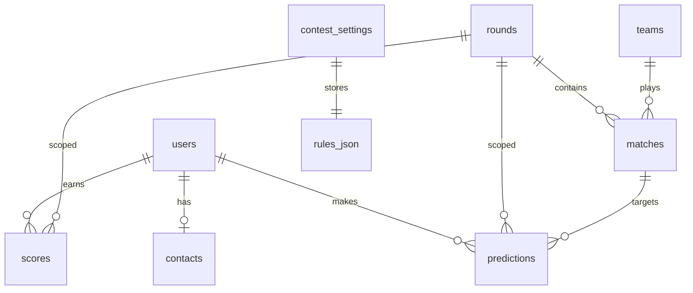

# Database Reference

Overview of the database layer: SQLAlchemy models, enums, constraints, and Alembic migrations.

## Table of Contents

- [Architecture](#architecture)
- [Enums](#enums)
- [Tables](#tables)
- [Constraints](#constraints)
- [Data Rules](#data-rules)
- [Migrations](#migrations)
- [Entity Relationships](#entity-relationships)

## Architecture [UPDATED]

| Component | Path | Role |
|-----------|------|------|
| Declarative base | `src/database/base.py` | `Base` metadata for ORM + Alembic |
| Models | `src/database/models.py` | 8 tables, enums, CHECK/UNIQUE |
| Engine | `src/database/engine.py` | Async engine + session factory |
| Initial migration | `alembic/versions/0992bb744cc8_initial_schema.py` | Creates all 8 tables |
| Scores extension | `alembic/versions/a2b3c4d5e6f7_scores_counts.py` | Adds `count_*` columns to `scores` |
| Lifecycle extension | `alembic/versions/b3c4d5e6f7a8_contest_lifecycle_and_tiebreak.py` | Adds contest lifecycle + tie-break columns [NEW] |
| Alembic runner | `alembic/env.py` | Async migrations; URL from [CONFIG.md](CONFIG.md) |

**Stack:** SQLAlchemy 2.0+ async, `DateTime(timezone=True)` (TIMESTAMPTZ), JSON column for `rules_json`.

## Enums [NEW]

Defined in `src/database/models.py` as `StrEnum` values stored as `VARCHAR`.

### `UserRole`

| Value | Description |
|-------|-------------|
| `SUPERVISOR` | Contest organizer |
| `ADMIN` | Technical administrator |
| `USER` | Participant |

### `RoundStatus`

| Value | Description |
|-------|-------------|
| `DRAFT` | Editable, not yet open for predictions |
| `ACTIVE` | Predictions accepted |
| `CLOSED` | Deadline passed |
| `CALCULATED` | Points computed |
| `PUBLISHED` | Results immutable |

### `MatchStatus`

| Value | Description |
|-------|-------------|
| `SCHEDULED` | Planned |
| `POSTPONED` | Rescheduled (eligible for free tour) |
| `CANCELED` | Not counted |
| `VOID` | Played but annulled (0 points) |
| `FINISHED` | Result confirmed |

### `ContestLifecycleStatus` [NEW]

| Value | Description |
|-------|-------------|
| `DRAFT` | Contest not yet started; settings editable |
| `RUNNING` | Active contest (set on first round activation) |
| `PAUSED` | Mutating ops blocked; required before safe delete |
| `FINISHED` | Early termination; mutating ops blocked |

Stored on `contest_settings.status`. Independent of `is_locked` (lock prevents rule edits; status controls operational pause/finish).

## Tables [NEW]

### `users`

| Column | Type | Constraints |
|--------|------|-------------|
| `id` | INTEGER | PK |
| `login` | VARCHAR | UNIQUE, NOT NULL |
| `password_hash` | VARCHAR | NOT NULL |
| `role` | VARCHAR | NOT NULL (`UserRole`) |
| `first_name` | VARCHAR | NOT NULL |
| `last_name` | VARCHAR | NOT NULL |
| `is_temp_password` | BOOLEAN | NOT NULL, default `false` |
| `exceptional_tiebreak_points` | INTEGER | NOT NULL, default `0` [NEW] |

> `exceptional_tiebreak_points` is an admin-entered operational tie-break (criterion 5 only). It is **not** part of `rules_json` and is **not** frozen by `is_locked`. See [SCORING_LOGIC.md](SCORING_LOGIC.md#tie-breakers-and-final-standings).

### `contacts`

| Column | Type | Constraints |
|--------|------|-------------|
| `user_id` | INTEGER | PK, FK → `users.id` |
| `email` | VARCHAR | NULL |
| `vk_id` | VARCHAR | NULL |
| `tg_id` | VARCHAR | NULL |
| `notify_enabled` | BOOLEAN | NOT NULL, default `false` |

### `teams`

| Column | Type | Constraints |
|--------|------|-------------|
| `id` | INTEGER | PK |
| `name` | VARCHAR | UNIQUE, NOT NULL |
| `short_name` | VARCHAR | NOT NULL |
| `logo_url` | VARCHAR | NULL |

### `rounds`

| Column | Type | Constraints |
|--------|------|-------------|
| `id` | INTEGER | PK |
| `number` | INTEGER | UNIQUE, NOT NULL |
| `deadline` | TIMESTAMPTZ | NOT NULL |
| `status` | VARCHAR | NOT NULL (`RoundStatus`) |
| `matches_count` | INTEGER | NOT NULL, default `0` |

### `matches`

| Column | Type | Constraints |
|--------|------|-------------|
| `id` | INTEGER | PK |
| `round_id` | INTEGER | FK → `rounds.id`, NOT NULL |
| `team1_id` | INTEGER | FK → `teams.id`, NOT NULL (home) |
| `team2_id` | INTEGER | FK → `teams.id`, NOT NULL (away) |
| `date_time` | TIMESTAMPTZ | NOT NULL |
| `score1` | INTEGER | NULL |
| `score2` | INTEGER | NULL |
| `status` | VARCHAR | NOT NULL (`MatchStatus`) |

### `predictions`

| Column | Type | Constraints |
|--------|------|-------------|
| `id` | INTEGER | PK |
| `user_id` | INTEGER | FK → `users.id`, NOT NULL |
| `round_id` | INTEGER | FK → `rounds.id`, NOT NULL |
| `match_id` | INTEGER | FK → `matches.id`, NOT NULL |
| `score1` | INTEGER | NULL |
| `score2` | INTEGER | NULL |

### `scores`

| Column | Type | Constraints |
|--------|------|-------------|
| `id` | INTEGER | PK |
| `user_id` | INTEGER | FK → `users.id`, NOT NULL |
| `round_id` | INTEGER | FK → `rounds.id`, NOT NULL |
| `points_exact` | INTEGER | NOT NULL, default `0` |
| `points_diff` | INTEGER | NOT NULL, default `0` |
| `points_outcome` | INTEGER | NOT NULL, default `0` |
| `bonus1` | INTEGER | NOT NULL, default `0` |
| `bonus2` | INTEGER | NOT NULL, default `0` |
| `bonus3` | INTEGER | NOT NULL, default `0` |
| `total_without_bonus3` | INTEGER | NOT NULL, default `0` |
| `total_with_bonus3` | INTEGER | NOT NULL, default `0` |
| `correct_outcomes` | INTEGER | NOT NULL, default `0` |
| `count_exact_high` | INTEGER | NOT NULL, default `0` [UPDATED] |
| `count_exact` | INTEGER | NOT NULL, default `0` [UPDATED] |
| `count_diff` | INTEGER | NOT NULL, default `0` [UPDATED] |
| `count_outcome` | INTEGER | NOT NULL, default `0` [UPDATED] |

**Before → After:** `count_*` columns were added by migration `a2b3c4d5e6f7`. They store the **frequency of hits** per exclusive category (not points) and are required for leaderboard tie-breaking (see [SCORING_LOGIC.md](SCORING_LOGIC.md#tie-breakers)) and display.

> All aggregation fields default to `0` because they store **computed totals**, not raw match predictions. See [Data Rules](#data-rules).

### `contest_settings`

| Column | Type | Constraints |
|--------|------|-------------|
| `id` | INTEGER | PK |
| `is_locked` | BOOLEAN | NOT NULL, default `false` |
| `status` | VARCHAR | NOT NULL, default `'DRAFT'` (`ContestLifecycleStatus`) [NEW] |
| `paused_at` | TIMESTAMPTZ | NULL — set on pause [NEW] |
| `finished_at` | TIMESTAMPTZ | NULL — set on early finish [NEW] |
| `total_teams` | INTEGER | NOT NULL |
| `matches_per_round` | INTEGER | NOT NULL |
| `total_rounds` | INTEGER | NOT NULL |
| `is_round_robin` | BOOLEAN | NOT NULL |
| `rules_json` | JSON | NOT NULL — see [CONFIG.md](CONFIG.md) and [SCORING_LOGIC.md](SCORING_LOGIC.md) |

## Constraints [NEW]

### CHECK constraints

| Name | Table | Rule |
|------|-------|------|
| `ck_matches_different_teams` | `matches` | `team1_id != team2_id` |
| `ck_matches_score1_range` | `matches` | `score1 IS NULL OR (score1 >= 0 AND score1 <= 20)` |
| `ck_matches_score2_range` | `matches` | `score2 IS NULL OR (score2 >= 0 AND score2 <= 20)` |
| `ck_predictions_score1_range` | `predictions` | same as matches `score1` |
| `ck_predictions_score2_range` | `predictions` | same as matches `score2` |
| `ck_contest_settings_status` | `contest_settings` | `status IN ('DRAFT','RUNNING','PAUSED','FINISHED')` [NEW] |
| `ck_users_exceptional_tiebreak_nonneg` | `users` | `exceptional_tiebreak_points >= 0` [NEW] |

### UNIQUE constraints

| Name | Table | Columns |
|------|-------|---------|
| (implicit) | `users` | `login` |
| (implicit) | `teams` | `name` |
| (implicit) | `rounds` | `number` |
| `uq_predictions_user_round_match` | `predictions` | `user_id`, `round_id`, `match_id` |
| `uq_scores_user_round` | `scores` | `user_id`, `round_id` |

### Foreign keys

```
users ← contacts.user_id
users ← predictions.user_id, scores.user_id
rounds ← matches.round_id, predictions.round_id, scores.round_id
teams ← matches.team1_id, matches.team2_id
matches ← predictions.match_id
```

## Data Rules [NEW]

Critical distinction enforced at schema and test level:

| Concept | Representation | Invalid |
|---------|----------------|---------|
| Valid zero score | `score1=0`, `score2=0` | — |
| Unplayed match / no result | `score1=NULL`, `score2=NULL` | — |
| **Missing prediction** | **No row** in `predictions` | Using `0` as absence sentinel |
| Player without prediction | No row → no points (Stage 1 scoring) | Defaulting to `0` |

**Before → After:** No database layer existed. Stage 0 introduces nullable score columns with CHECK `0..20 OR NULL`, and tests confirm `0:0` succeeds while absence is modeled as missing rows.

## Migrations [UPDATED]

```bash
uv run alembic upgrade head      # apply all pending
uv run alembic downgrade -1      # roll back one revision
uv run alembic downgrade base    # roll back all
```

| Revision | File | Description |
|----------|------|-------------|
| `0992bb744cc8` | `alembic/versions/0992bb744cc8_initial_schema.py` | Creates all 8 tables |
| `a2b3c4d5e6f7` | `alembic/versions/a2b3c4d5e6f7_scores_counts.py` | Adds 4 `count_*` columns to `scores` |
| `b3c4d5e6f7a8` | `alembic/versions/b3c4d5e6f7a8_contest_lifecycle_and_tiebreak.py` | Lifecycle columns on `contest_settings`; `exceptional_tiebreak_points` on `users` [NEW] |

Migration `b3c4d5e6f7a8` backfills `status = 'RUNNING'` where `is_locked = TRUE`. Uses batch operations for SQLite compatibility.

Alembic uses async engine (`alembic init -t async`). Database URL resolved from `config/settings.py` — see [CONFIG.md](CONFIG.md).

## Entity Relationships


