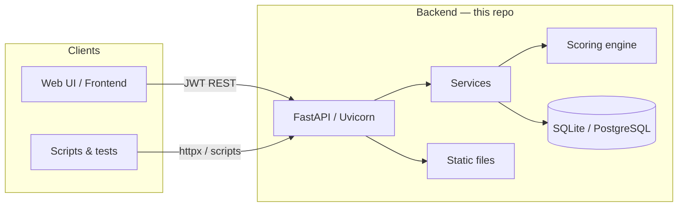
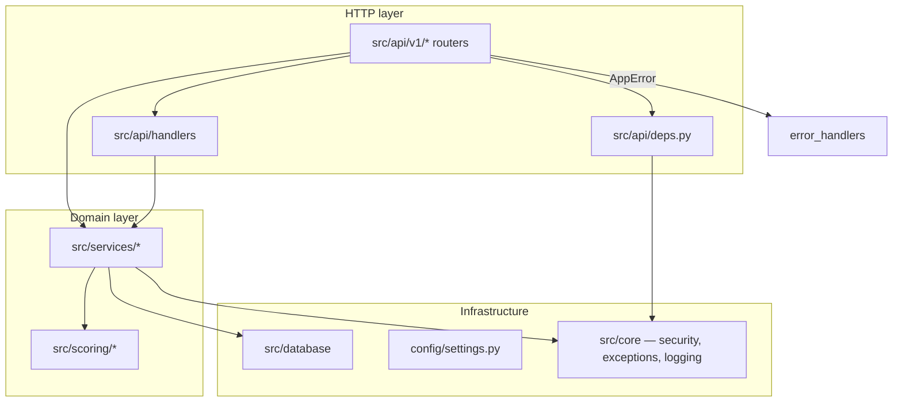
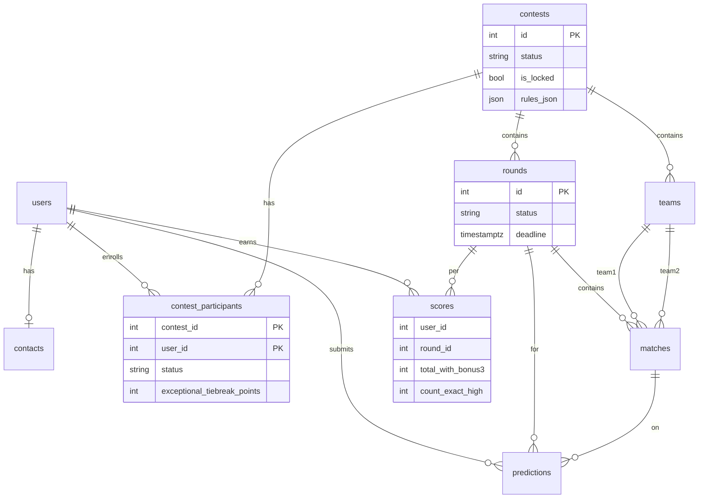
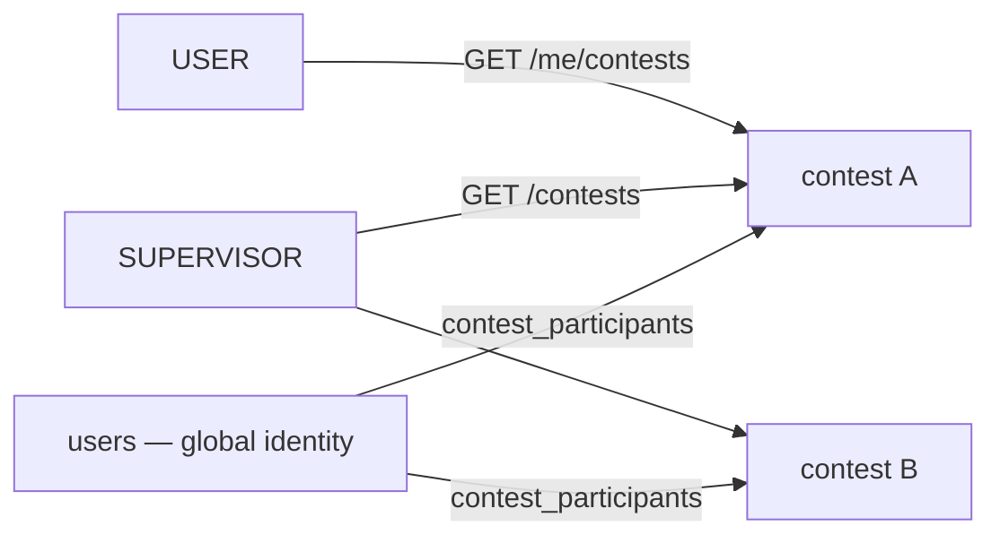
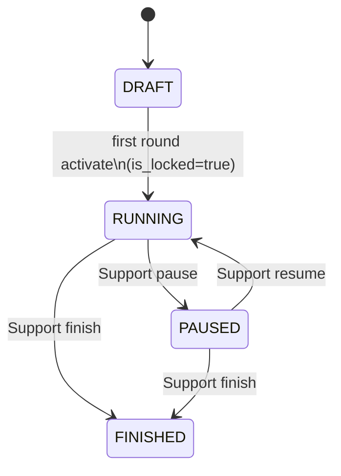
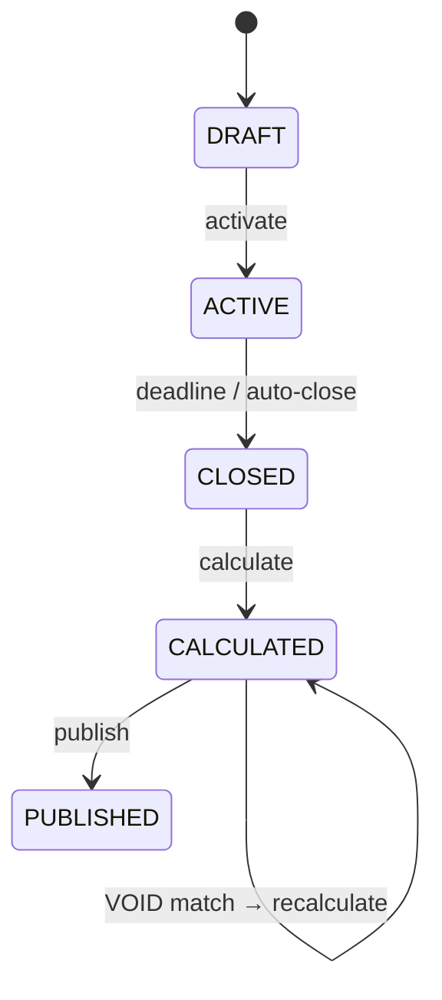
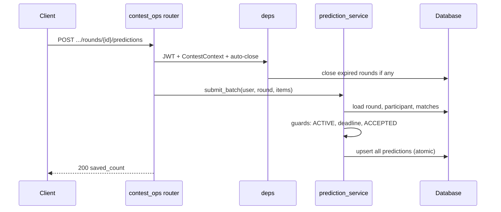
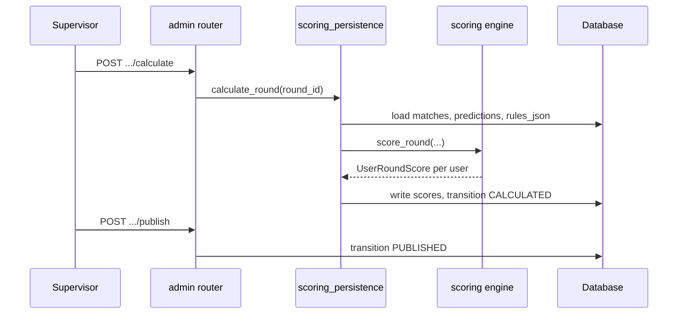
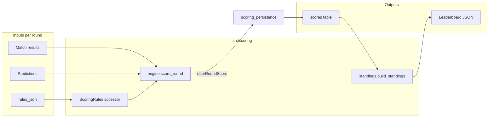
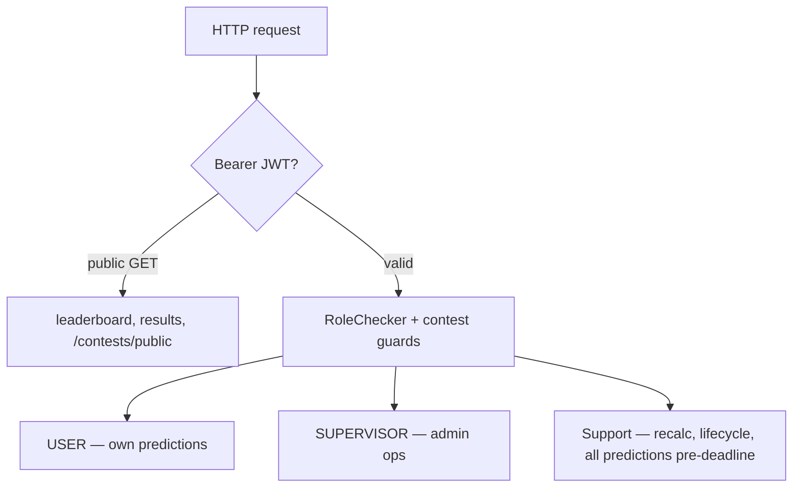

# Архитектура системы

Высокоуровневое описание бэкенда платформы конкурсов футбольных прогнозов (Football Predictions Contest). Списки эндпоинтов, столбцы таблиц и формулы начисления очков — по ссылкам в конце документа; этот документ не дублирует эти спецификации.

## Содержание

- [Назначение](#назначение)
- [Контекст системы](#контекст-системы)
- [Слоистая архитектура](#слоистая-архитектура)
- [Структура кода](#структура-кода)
- [Модель данных](#модель-данных)
- [Модель мультиконкурса](#модель-мультиконкурса)
- [Конечные автоматы жизненного цикла](#конечные-автоматы-жизненного-цикла)
- [Потоки запросов и данных](#потоки-запросов-и-данных)
- [Конвейер начисления очков](#конвейер-начисления-очков)
- [Безопасность и доступ](#безопасность-и-доступ)
- [Сквозные аспекты](#сквозные-аспекты)
- [Дополнительные материалы](#дополнительные-материалы)

## Назначение

Бэкенд поддерживает платформу футбольных прогнозов с поддержкой **нескольких конкурсов** (multi-contest):

- Организаторы настраивают конкурсы (команды, участники, правила), проводят туры, вводят результаты, рассчитывают и публикуют таблицы результатов.
- Участники отправляют пакет прогнозов до дедлайна тура.
- Посетители читают публичные таблицы лидеров и опубликованные результаты.
- Правила начисления очков хранятся в `contests.rules_json`; **чистый (pure)** движок начисления очков вычисляет баллы без обращения к базе данных.

**Поверхность API:** OpenAPI v1.2.0 — [`agent_docs/contracts/api_v1.yaml`](../../agent_docs/contracts/api_v1.yaml)  
**Основной префикс:** `/api/v1/contests/{contest_id}/…`

## Контекст системы



| Граница | Технология |
|----------|------------|
| HTTP | FastAPI, валидация Pydantic, OpenAPI |
| Хранение данных | SQLAlchemy 2 async, миграции Alembic |
| Аутентификация | JWT (HS256), пароли bcrypt |
| Правила и конфигурация | `contests.rules_json`, `config/settings.py`, `.env` |
| Статические ресурсы | `/static/assets/*` (встроенные), `/static/teams/*` (загрузки) |

## Слоистая архитектура



**Принципы:**

| Правило | Где |
|------|--------|
| Роутеры остаются «тонкими» | Делегируют логику в `services/` или общие `handlers/` |
| Бизнес-правила в сервисах | Конечные автоматы состояний, guard-проверки, транзакции |
| Чистое начисление очков | `src/scoring/` — без обращений к БД; вызывается из `scoring_persistence` |
| Типизированные ошибки домена | `AppError` → JSON `{detail, code}`; без `HTTPException` в сервисах |
| Побочные эффекты в рамках конкурса | Автозакрытие истёкших туров через зависимость на маршрутах конкурса |

Подробнее: [API Guide — Архитектура](API_GUIDE.md#architecture)

## Структура кода

```
main.py              → app factory, CORS, routers, static mounts
config/settings.py   → env-backed Settings singleton
src/
  api/v1/            → REST endpoints (auth, contests, setup, predictions, admin)
  api/handlers/      → shared leaderboard / predictions response builders
  api/deps.py        → DB session, JWT user, RoleChecker, ContestContext, auto-close
  core/              → security, exceptions, logging
  database/          → models, async engine
  schemas/           → Pydantic DTOs (mirror OpenAPI components)
  scoring/           → engine, rules accessor, standings builder
  services/          → all mutable business logic
  scripts/           → seed, bootstrap_users, load_test_data
alembic/             → schema migrations
static/assets/       → default team logo (committed)
uploads/teams/       → supervisor uploads (gitignored)
```

## Модель данных

Десять таблиц. Конкурс (Contest) — это **корневой агрегат** для команд, туров и участия.



**Глобальное и в рамках конкурса:**

| Понятие | Хранение |
|---------|----------|
| Логин, пароль, глобальная роль | `users.role` — одно из `USER`, `SUPERVISOR`, `SUPPORT` |
| Участие в конкурсе | `contest_participants` — `PENDING` / `ACCEPTED` |
| Правила начисления очков | `contests.rules_json` (фиксируются при `is_locked`) |
| Ручное переопределение тай-брейка | `contest_participants.exceptional_tiebreak_points` (не входит в `rules_json`) |

Полный список столбцов: [`agent_docs/contracts/db_schema.md`](../../agent_docs/contracts/db_schema.md) · [Справочник БД](DB_REFERENCE.md)

## Модель мультиконкурса

Начиная с этапа 1.4 поддерживается **несколько конкурсов** в одной базе данных. Каждый конкурс владеет своими командами, турами и записями участников.



Устаревшие маршруты без `{contest_id}` разрешаются в конкурс по умолчанию (`id=1`) для обратной совместимости тестов.

<a id="lifecycle-state-machines"></a>

## Конечные автоматы жизненного цикла

### Конкурс



| Фаза | `status` | `is_locked` | Типичные операции |
|-------|----------|-------------|-------------------|
| Настройка | `DRAFT` | `false` | Команды, приглашения, логотипы, PATCH правил |
| Рабочая | `RUNNING` | `true` | Прогнозы, результаты, расчёт |
| Заморожена | `PAUSED` | `true` | Изменения только для чтения; безопасное удаление после grace-периода |
| Финальная | `FINISHED` | `true` | Только чтение; Поддержке (SUPPORT) разрешён пересчёт |

Матрица разрешённых операций: [`agent_docs/contracts/contest_lifecycle_flow.md`](../../agent_docs/contracts/contest_lifecycle_flow.md)

### Тур



**Автозакрытие:** при каждом вызове API в рамках конкурса `auto_close_expired_rounds` переводит тур `ACTIVE → CLOSED`, когда `now >= deadline` (синхронно, по возможности в той же транзакции).

## Потоки запросов и данных

### Отправка прогноза (участник)



Отсутствующий прогноз = **отсутствие строки** (никогда не используйте `0` как признак «пусто»). Пакет должен покрывать все матчи тура.

### Расчёт и публикация (организатор)



После публикации публичные GET-запросы лидерборда/результатов включают кэширование по ETag.

## Конвейер начисления очков

Правила **управляются данными** из `contests.rules_json`. Движок применяет фиксированный алгоритм, описанный в контракте начисления очков.



| Этап | Что происходит |
|-------|----------------|
| **Базовые очки** | На матч: одна категория — exact high, exact, diff+outcome, outcome или miss |
| **Бонус 1** | Множитель за уникальный точный прогноз |
| **Бонус 2** | Порог по количеству верных исходов в туре |
| **Бонус 3** | Место в туре по базовой сумме (+ опциональный дополнительный порог) |
| **Тай-брейк** | Сумма → количество точных → база без бонусов → количество диффов → ручное переопределение |
| **VOID** | Очки за матч обнуляются; бонусы пересчитываются для оставшихся матчей |

Сводка контракта: [`agent_docs/contracts/scoring_flow.md`](../../agent_docs/contracts/scoring_flow.md)  
Реализация и сохранение: [SCORING_LOGIC.md](SCORING_LOGIC.md)

## Безопасность и доступ



| Механизм | Примечания |
|-----------|--------|
| Payload JWT | `{sub: user_id, role, exp}` |
| Процесс приглашения | Временный пароль → участник `PENDING` → смена пароля → `ACCEPTED` |
| Приватность прогнозов | До дедлайна: USER/SUPERVISOR видят только свои очки; Поддержка (SUPPORT) видит все |
| Защитные проверки конкурса | `PAUSED` / `FINISHED` блокируют изменяющие операции; `is_locked` блокирует CRUD настройки |

Таблицы RBAC: [API Guide — RBAC](API_GUIDE.md#role-based-access-control)

## Сквозные аспекты

| Аспект | Реализация |
|---------|------------------|
| Ошибки | `src/core/exceptions.py` + `error_handlers.py` → `{detail, code}` |
| Логирование | `LOG_LEVEL`, структурированный формат при запуске |
| HTTP-кэш | Публичный лидерборд/результаты: `Cache-Control` + ETag на основе состояния очков |
| Миграции | Alembic async; URL из `DATABASE_URL` |
| Начальная загрузка | `seed.py` + `bootstrap_users.py` — см. [BOOTSTRAP_USERS.md](../setup/BOOTSTRAP_USERS.md) |
| Тестовые данные | `load_test_data.py` + CSV по контракту — см. [CONFIG.md](../setup/CONFIG.md) |

## Дополнительные материалы

| Тема | Документ |
|-------|----------|
| Индекс справочников | [INDEX.md](../INDEX.md) |
| HTTP API, сервисы, эндпоинты | [API_GUIDE.md](API_GUIDE.md) |
| Таблицы, перечисления, миграции | [DB_REFERENCE.md](DB_REFERENCE.md) |
| Очки, бонусы, код движка | [SCORING_LOGIC.md](SCORING_LOGIC.md) |
| Переменные окружения, seed, загрузчик | [CONFIG.md](../setup/CONFIG.md) |
| OpenAPI (эталонные маршруты) | [`api_v1.yaml`](../../agent_docs/contracts/api_v1.yaml) |
| Контракт БД | [`db_schema.md`](../../agent_docs/contracts/db_schema.md) |
| Контракт начисления очков | [`scoring_flow.md`](../../agent_docs/contracts/scoring_flow.md) |
| Матрица жизненного цикла | [`contest_lifecycle_flow.md`](../../agent_docs/contracts/contest_lifecycle_flow.md) |
| Бизнес-правила (неизменяемые) | [`docs/01_tech_regulations.md`](../../docs/01_tech_regulations.md) |
| README проекта | [`README.md`](../../README.md) |
