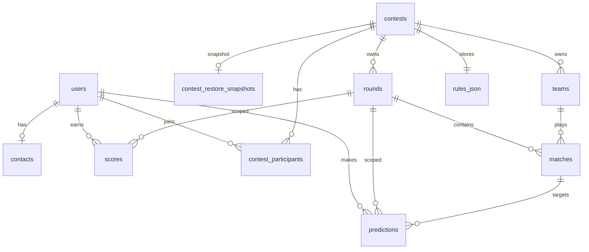

# Справочник базы данных

Обзор слоя базы данных: модели SQLAlchemy, перечисления, ограничения и миграции Alembic.

## Содержание

- [Архитектура](#архитектура)
- [Перечисления](#перечисления)
- [Таблицы](#таблицы)
- [Ограничения](#ограничения)
- [Правила данных](#правила-данных)
- [Миграции](#миграции)
- [Связи сущностей](#связи-сущностей)

## Архитектура [UPDATED]

| Компонент | Путь | Роль |
|-----------|------|------|
| Декларативная база | `src/database/base.py` | метаданные `Base` для ORM + Alembic |
| Модели | `src/database/models.py` | 11 таблиц, перечисления, CHECK/UNIQUE |
| Движок | `src/database/engine.py` | Асинхронный engine + фабрика сессий |
| Начальная миграция | `alembic/versions/0992bb744cc8_initial_schema.py` | Создаёт первые 8 таблиц |
| Расширение scores | `alembic/versions/a2b3c4d5e6f7_scores_counts.py` | Добавляет столбцы `count_*` в `scores` |
| Расширение жизненного цикла | `alembic/versions/b3c4d5e6f7a8_contest_lifecycle_and_tiebreak.py` | Жизненный цикл в `contest_settings`; тай-брейк в `users` |
| Мультиконкурс | `alembic/versions/c4d5e6f7a8b9_multi_contest_and_participants.py` | `contests`, `contest_participants`, ограниченные по конкурсу FK [NEW] |
| Снимки восстановления | `alembic/versions/e6f7a8b9c0d1_contest_restore_snapshots.py` | `contest_restore_snapshots` для отмены удаления в тренировочном режиме [NEW] |
| Запуск Alembic | `alembic/env.py` | Асинхронные миграции; URL из [CONFIG.md](../setup/CONFIG.md) |

**Стек:** SQLAlchemy 2.0+ async, `DateTime(timezone=True)` (TIMESTAMPTZ), JSON-столбец для `rules_json`.

## Перечисления [NEW]

Определены в `src/database/models.py` как значения `StrEnum`, хранимые как `VARCHAR`.

### `UserRole`

| Значение | Описание |
|-------|-------------|
| `SUPERVISOR` | Организатор конкурса — настройка, туры, результаты, начисление очков (см. [API_GUIDE — RBAC](API_GUIDE.md#role-based-access-control)) |
| `SUPPORT` | Техническая поддержка (`users.role=SUPPORT`) |
| `USER` | Участник — прогнозы и лидерборд как игрок |

> **Организатор, который хочет также играть:** используйте **отдельный логин `USER`**, приглашённый в конкурс. Глобальная роль — одна на аккаунт; приватность прогнозов до дедлайна действует для `SUPERVISOR` так же, как и для `USER`. Подробнее: [API_GUIDE — Organizer vs participant](API_GUIDE.md#organizer-vs-participant-same-person).

### `RoundStatus`

| Значение | Описание |
|-------|-------------|
| `DRAFT` | Редактируемый, ещё не открыт для прогнозов |
| `ACTIVE` | Прогнозы принимаются |
| `CLOSED` | Дедлайн прошёл |
| `CALCULATED` | Очки рассчитаны |
| `PUBLISHED` | Результаты неизменяемы |

### `MatchStatus`

| Значение | Описание |
|-------|-------------|
| `SCHEDULED` | Запланирован |
| `POSTPONED` | Перенесён (подходит для свободного тура) |
| `CANCELED` | Не засчитывается |
| `VOID` | Сыгран, но аннулирован (0 очков) |
| `FINISHED` | Результат подтверждён |

### `ContestLifecycleStatus` [NEW]

| Значение | Описание |
|-------|-------------|
| `DRAFT` | Конкурс ещё не начался; настройки редактируемы |
| `RUNNING` | Активный конкурс (устанавливается при активации первого тура) |
| `PAUSED` | Изменяющие операции блокированы; требуется перед безопасным удалением |
| `FINISHED` | Досрочное завершение; изменяющие операции блокированы |

Хранится в `contests.status`. Независим от `is_locked` (блокировка запрещает изменение правил; статус управляет рабочей паузой/завершением).

### `ParticipantStatus` [NEW]

| Значение | Описание |
|-------|-------------|
| `PENDING` | Приглашён, ещё не принял |
| `ACCEPTED` | Активный участник конкурса |

Хранится в `contest_participants.status`.

## Таблицы [NEW]

### `users`

| Столбец | Тип | Ограничения |
|--------|------|-------------|
| `id` | INTEGER | PK |
| `login` | VARCHAR | UNIQUE, NOT NULL |
| `password_hash` | VARCHAR | NOT NULL |
| `role` | VARCHAR | NOT NULL (`UserRole`) |
| `first_name` | VARCHAR | NOT NULL |
| `last_name` | VARCHAR | NOT NULL |
| `is_temp_password` | BOOLEAN | NOT NULL, default `false` |

> Тай-брейк с исключением, привязанный к конкурсу, хранится в `contest_participants.exceptional_tiebreak_points` (этап 1.4). См. [SCORING_LOGIC.md](SCORING_LOGIC.md#тай-брейки-и-итоговая-таблица).

### `contacts`

| Столбец | Тип | Ограничения |
|--------|------|-------------|
| `user_id` | INTEGER | PK, FK → `users.id` |
| `email` | VARCHAR | NULL |
| `vk_id` | VARCHAR | NULL |
| `tg_id` | VARCHAR | NULL |
| `notify_enabled` | BOOLEAN | NOT NULL, default `false` |

### `teams` [UPDATED]

| Столбец | Тип | Ограничения |
|--------|------|-------------|
| `id` | INTEGER | PK |
| `contest_id` | INTEGER | FK → `contests.id` ON DELETE CASCADE, NOT NULL [NEW] |
| `name` | VARCHAR | NOT NULL |
| `short_name` | VARCHAR | NOT NULL |
| `logo_url` | VARCHAR | NULL |

Уникальность в рамках конкурса: `(contest_id, name)`.

### `rounds` [UPDATED]

| Столбец | Тип | Ограничения |
|--------|------|-------------|
| `id` | INTEGER | PK |
| `contest_id` | INTEGER | FK → `contests.id` ON DELETE CASCADE, NOT NULL [NEW] |
| `number` | INTEGER | NOT NULL |
| `deadline` | TIMESTAMPTZ | NOT NULL |
| `status` | VARCHAR | NOT NULL (`RoundStatus`) |
| `matches_count` | INTEGER | NOT NULL, default `0` |

Уникальность в рамках конкурса: `(contest_id, number)`.

### `matches`

| Столбец | Тип | Ограничения |
|--------|------|-------------|
| `id` | INTEGER | PK |
| `round_id` | INTEGER | FK → `rounds.id`, NOT NULL |
| `team1_id` | INTEGER | FK → `teams.id`, NOT NULL (хозяева) |
| `team2_id` | INTEGER | FK → `teams.id`, NOT NULL (гости) |
| `date_time` | TIMESTAMPTZ | NOT NULL |
| `score1` | INTEGER | NULL |
| `score2` | INTEGER | NULL |
| `status` | VARCHAR | NOT NULL (`MatchStatus`) |

### `predictions`

| Столбец | Тип | Ограничения |
|--------|------|-------------|
| `id` | INTEGER | PK |
| `user_id` | INTEGER | FK → `users.id`, NOT NULL |
| `round_id` | INTEGER | FK → `rounds.id`, NOT NULL |
| `match_id` | INTEGER | FK → `matches.id`, NOT NULL |
| `score1` | INTEGER | NULL |
| `score2` | INTEGER | NULL |

### `scores`

| Столбец | Тип | Ограничения |
|--------|------|-------------|
| `id` | INTEGER | PK |
| `user_id` | INTEGER | FK → `users.id`, NOT NULL |
| `round_id` | INTEGER | FK → `rounds.id`, NOT NULL |
| `points_exact` | INTEGER | NOT NULL, default `0` |
| `points_diff` | INTEGER | NOT NULL, default `0` |
| `points_outcome` | INTEGER | NOT NULL, default `0` |
| `bonus1` | INTEGER | NOT NULL, default `0` |
| `bonus2` | INTEGER | NOT NULL, default `0` |
| `bonus3` | INTEGER | NOT NULL, default `0` |
| `total_without_bonus3` | INTEGER | NOT NULL, default `0` |
| `total_with_bonus3` | INTEGER | NOT NULL, default `0` |
| `correct_outcomes` | INTEGER | NOT NULL, default `0` |
| `count_exact_high` | INTEGER | NOT NULL, default `0` [UPDATED] |
| `count_exact` | INTEGER | NOT NULL, default `0` [UPDATED] |
| `count_diff` | INTEGER | NOT NULL, default `0` [UPDATED] |
| `count_outcome` | INTEGER | NOT NULL, default `0` [UPDATED] |

**Было → Стало:** столбцы `count_*` были добавлены миграцией `a2b3c4d5e6f7`. Они хранят **частоту попаданий** по каждой эксклюзивной категории (а не очки) и необходимы для тай-брейка лидерборда (см. [SCORING_LOGIC.md](SCORING_LOGIC.md#тай-брейки-и-итоговая-таблица)) и отображения.

> Все агрегирующие поля по умолчанию равны `0`, так как хранят **вычисленные итоги**, а не исходные прогнозы на матчи. См. [Правила данных](#правила-данных).

### `contests` [NEW]

Заменяет singleton-таблицу `contest_settings` (этап 1.4). Может существовать несколько конкурсов одновременно.

| Столбец | Тип | Ограничения |
|--------|------|-------------|
| `id` | INTEGER | PK |
| `name` | VARCHAR | NOT NULL |
| `slug` | VARCHAR | UNIQUE, NULL |
| `is_locked` | BOOLEAN | NOT NULL, default `false` |
| `status` | VARCHAR | NOT NULL, default `'DRAFT'` (`ContestLifecycleStatus`) |
| `paused_at` | TIMESTAMPTZ | NULL — устанавливается при постановке на паузу |
| `finished_at` | TIMESTAMPTZ | NULL — устанавливается при досрочном завершении |
| `total_teams` | INTEGER | NOT NULL |
| `matches_per_round` | INTEGER | NOT NULL |
| `total_rounds` | INTEGER | NOT NULL |
| `is_round_robin` | BOOLEAN | NOT NULL |
| `rules_json` | JSON | NOT NULL — см. [CONFIG.md](../setup/CONFIG.md) и [SCORING_LOGIC.md](SCORING_LOGIC.md) |

### `contest_participants` [NEW]

| Столбец | Тип | Ограничения |
|--------|------|-------------|
| `contest_id` | INTEGER | PK (часть 1), FK → `contests.id` ON DELETE CASCADE |
| `user_id` | INTEGER | PK (часть 2), FK → `users.id` |
| `status` | VARCHAR | NOT NULL, default `'ACCEPTED'` (`ParticipantStatus`) |
| `exceptional_tiebreak_points` | INTEGER | NOT NULL, default `0` |

> `exceptional_tiebreak_points` задаётся в рамках конкурса администратором (критерий 5). Не входит в `rules_json`; может обновляться, даже если конкурс заблокирован.

### `contest_restore_snapshots` [NEW]

Буфер отмены для тренировочного режима, записываемый перед полным удалением конкурса (этап 1.12).

| Столбец | Тип | Ограничения |
|--------|------|-------------|
| `contest_id` | INTEGER | PK, FK → `contests.id` |
| `snapshot_json` | JSON | NOT NULL — поля конкурса, команды, туры, матчи, ID пользователей-участников |
| `deleted_at` | TIMESTAMPTZ | NOT NULL |
| `expires_at` | TIMESTAMPTZ | NOT NULL — `deleted_at + contest_restore_window_seconds` |
| `deleted_by_user_id` | INTEGER | FK → `users.id`, NULL |

Не более одной строки снимка на конкурс (PK на `contest_id`). Строка удаляется после успешного восстановления или по истечении срока. См. [API_GUIDE — Contest Lifecycle](API_GUIDE.md#contest-lifecycle--immutability).

**Было → Стало (этап 1.4):** `contest_settings` (singleton) → `contests` (много строк). `users.exceptional_tiebreak_points` → `contest_participants.exceptional_tiebreak_points`. `teams` и `rounds` привязаны к `contest_id`.

## Ограничения [NEW]

### Ограничения CHECK

| Имя | Таблица | Правило |
|------|-------|------|
| `ck_matches_different_teams` | `matches` | `team1_id != team2_id` |
| `ck_matches_score1_range` | `matches` | `score1 IS NULL OR (score1 >= 0 AND score1 <= 20)` |
| `ck_matches_score2_range` | `matches` | `score2 IS NULL OR (score2 >= 0 AND score2 <= 20)` |
| `ck_predictions_score1_range` | `predictions` | как у `score1` в matches |
| `ck_predictions_score2_range` | `predictions` | как у `score2` в matches |
| `ck_contests_status` | `contests` | `status IN ('DRAFT','RUNNING','PAUSED','FINISHED')` [UPDATED] |
| `ck_contest_participants_tiebreak_nonneg` | `contest_participants` | `exceptional_tiebreak_points >= 0` [NEW] |
| `ck_contest_participants_status` | `contest_participants` | `status IN ('PENDING','ACCEPTED')` [NEW] |

### Ограничения UNIQUE

| Имя | Таблица | Столбцы |
|------|-------|---------|
| (неявное) | `users` | `login` |
| `uq_teams_contest_name` | `teams` | `contest_id`, `name` [UPDATED] |
| `uq_rounds_contest_number` | `rounds` | `contest_id`, `number` [UPDATED] |
| (неявное) | `contests` | `slug` [NEW] |
| `uq_predictions_user_round_match` | `predictions` | `user_id`, `round_id`, `match_id` |
| `uq_scores_user_round` | `scores` | `user_id`, `round_id` |

### Внешние ключи

```
users ← contacts.user_id
users ← predictions.user_id, scores.user_id
users ← contest_participants.user_id
users ← contest_restore_snapshots.deleted_by_user_id
contests ← contest_restore_snapshots.contest_id
contests ← contest_participants.contest_id, teams.contest_id, rounds.contest_id
rounds ← matches.round_id, predictions.round_id, scores.round_id
teams ← matches.team1_id, matches.team2_id
matches ← predictions.match_id
```

## Правила данных [NEW]

Критическое различие, закреплённое на уровне схемы и тестов:

| Понятие | Представление | Недопустимо |
|---------|----------------|---------|
| Корректный нулевой счёт | `score1=0`, `score2=0` | — |
| Несыгранный матч / нет результата | `score1=NULL`, `score2=NULL` | — |
| **Отсутствующий прогноз** | **Отсутствие строки** в `predictions` | Использование `0` как признака отсутствия |
| Игрок без прогноза | Нет строки → нет очков (начисление, этап 1) | Значение по умолчанию `0` |

**Было → Стало:** слоя базы данных не существовало. Этап 0 вводит nullable-столбцы счёта с CHECK `0..20 OR NULL`, а тесты подтверждают, что `0:0` успешно сохраняется, а отсутствие моделируется отсутствующими строками.

## Миграции [UPDATED]

```bash
uv run alembic upgrade head      # apply all pending
uv run alembic downgrade -1      # roll back one revision
uv run alembic downgrade base    # roll back all
```

| Ревизия | Файл | Описание |
|----------|------|------|
| `0992bb744cc8` | `alembic/versions/0992bb744cc8_initial_schema.py` | Создаёт все 8 таблиц |
| `a2b3c4d5e6f7` | `alembic/versions/a2b3c4d5e6f7_scores_counts.py` | Добавляет 4 столбца `count_*` в `scores` |
| `b3c4d5e6f7a8` | `alembic/versions/b3c4d5e6f7a8_contest_lifecycle_and_tiebreak.py` | Столбцы жизненного цикла в `contest_settings`; `exceptional_tiebreak_points` в `users` |
| `c4d5e6f7a8b9` | `alembic/versions/c4d5e6f7a8b9_multi_contest_and_participants.py` | Мультиконкурс: `contests`, `contest_participants`, `contest_id` в teams/rounds; удаляет `contest_settings` [NEW] |
| `d5e6f7a8b9c0` | `alembic/versions/d5e6f7a8b9c0_drop_legacy_global_uniques.py` | Удаляет устаревшие глобальные UNIQUE на `rounds.number` и `teams.name` |
| `e6f7a8b9c0d1` | `alembic/versions/e6f7a8b9c0d1_contest_restore_snapshots.py` | Добавляет `contest_restore_snapshots` для восстановления в тренировочном режиме [NEW] |

Миграция `c4d5e6f7a8b9` переносит существующую строку `contest_settings` → `contests` с id=1, копирует пользователей в `contest_participants`, устанавливает `contest_id=1` в teams/rounds, затем удаляет `users.exceptional_tiebreak_points`.

**Примечание о downgrade [UPDATED]:** при восстановлении `users.exceptional_tiebreak_points` пользователи без строки `contest_participants` для конкурса id=1 (например, стартовый SUPERVISOR) получают `0` через `COALESCE`, а не `NULL`.

> **Эксплуатационное примечание по SQLite [UPDATED]:** столбцы, объявленные как `DateTime(timezone=True)`, при чтении через aiosqlite могут возвращать naive datetime (без временной зоны). Обработчики API нормализуют дедлайны для видимости прогнозов; логика удаления с grace-периодом должна нормализовать `paused_at` в UTC-aware перед сравнением.

Alembic использует асинхронный engine (`alembic init -t async`). URL базы данных определяется из `config/settings.py` — см. [CONFIG.md](../setup/CONFIG.md).

## Связи сущностей


