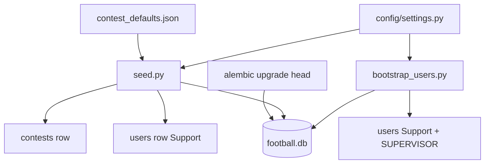

# Руководство по конфигурации

Переменные окружения, настройки приложения, seed-процесс и настройки конкурса по умолчанию.

## Содержание

- [Режимы деплоя (`APP_MODE`)](#deployment-modes-app_mode)
- [Модуль настроек](#settings-module)
- [`.env` — секреты и деплой](#env--secrets--deployment)
- [Настройки приложения по умолчанию](#application-defaults-configsettingspy)
- [Настройки конкурса по умолчанию](#contest-defaults)
- [Скрипт seed](#seed-script)
- [Скрипт bootstrap пользователей](#bootstrap-users-script)
- [URL базы данных](#database-url)
- [Зависимости проекта](#project-dependencies)

<a id="deployment-modes-app_mode"></a>

## Режимы деплоя (`APP_MODE`) [UPDATED]

**Переменная окружения:** `APP_MODE` в корневом `.env` (вне git на сервере — переживает `git pull`).

| Значение | Сценарий | БД по умолчанию | URL / CORS |
|-------|----------|------------------|-------------|
| `local` | Разработка на ноутбуке (`uv run`, `npm run dev`) | SQLite (`./football.db`) | `http://127.0.0.1:3000`, CORS `*` |
| `web_dev` | Staging на сервере/docker | SQLite (`./data/football.db`), если не задан `DATABASE_URL` | `PUBLIC_FRONTEND_URL` или `http://localhost:3000` |
| `web_prod` | Production-сервер | PostgreSQL, если не задан `DATABASE_URL` | **`PUBLIC_FRONTEND_URL` обязателен**; CORS = только этот origin |

**Переменные URL только для сервера** (задаются в `.env`, не коммитятся):

| Переменная | Обязательна когда | Назначение |
|----------|---------------|---------|
| `PUBLIC_FRONTEND_URL` | `web_prod`; опционально для `web_dev` | База для invite `setup_url`; origin для CORS |
| `PUBLIC_API_URL` | Docker-сборка frontend | Вшивается в Next.js как `NEXT_PUBLIC_API_URL` |
| `POSTGRES_PASSWORD` | `web_prod` + `--profile prod` | Пароль PostgreSQL в preset-URL режима |

Пресеты режимов определены в ``resolve_app_mode_preset()`` (`config/settings.py`) — один блок `if/elif` на режим, все поля, управляемые режимом, перечислены явно. После загрузки ``.env`` валидатор применяет этот набор. Явный ``DATABASE_URL`` в ``.env`` всегда переопределяет дефолт режима.

Полный Docker-workflow: [DEPLOYMENT.md](DEPLOYMENT.md).

---

<a id="settings-module"></a>

## Модуль настроек [UPDATED]

**Путь:** `config/settings.py` — **источник истины** для настроек приложения по умолчанию (в git, без секретов).

**Путь:** `.env` — только секреты вне git и переопределения для деплоя (шаблон: [`.env.example`](../../.env.example)).

```
┌─────────────────────────────────────────────────────────────┐
│  config/settings.py   ← defaults (repo)                     │
│         ↑                                                   │
│  .env (optional)      ← secrets override matching fields    │
└─────────────────────────────────────────────────────────────┘
```

Используется `pydantic-settings`: любое поле `Settings` можно переопределить через переменную окружения (`log_level` → `LOG_LEVEL`).
Доступ через `get_settings()` (кэшированный singleton).

**Не дублируйте** несекретные дефолты в `.env.example` — меняйте `settings.py` или документируйте опциональные prod-переопределения в таблице ниже.

---

<a id="env--secrets--deployment"></a>

## `.env` — секреты и деплой

Скопируйте [`.env.example`](../../.env.example) → `.env` и заполните **до первого bootstrap**:

| Переменная | Обязательна | Описание |
|----------|----------|-------------|
| `APP_MODE` | рекомендуется | `local` \| `web_dev` \| `web_prod` — см. [Режимы деплоя](#deployment-modes-app_mode) |
| `PUBLIC_FRONTEND_URL` | `web_prod` | Публичный HTTPS URL UI на Next.js |
| `PUBLIC_API_URL` | Docker-сборка | Публичный URL API (frontend `NEXT_PUBLIC_*`) |
| `POSTGRES_PASSWORD` | Docker | Пароль БД для compose-сервиса `db` |
| `DATABASE_URL` | dev: есть дефолт | Async SQLAlchemy URL; в production используйте PostgreSQL |
| `JWT_SECRET_KEY` | **prod: да** | Ключ подписи HS256 для access-токенов |
| `SEED_SUPPORT_PASSWORD` | **bootstrap: да** | Пароль support в открытом виде (хешируется во время выполнения) |
| `SEED_SUPERVISOR_PASSWORD` | рекомендуется | Пароль supervisor в открытом виде |
| `SEED_SUPPORT_PASSWORD_HASH` | альтернатива | Готовый bcrypt-хеш вместо `SEED_SUPPORT_PASSWORD` |
| `SEED_SUPERVISOR_PASSWORD_HASH` | альтернатива | Готовый bcrypt-хеш вместо `SEED_SUPERVISOR_PASSWORD` |

Сгенерировать хеш: `uv run python src/scripts/hash_password.py 'your-password'`

Логины (`admin`, `supervisor`), алгоритм/TTL JWT, логирование, CORS, кэш, пути — **не** в `.env.example`; см. [Настройки приложения по умолчанию](#application-defaults-configsettingspy) ниже.

---

<a id="application-defaults-configsettingspy"></a>
<a id="environment-variables"></a>

## Настройки приложения по умолчанию (`config/settings.py`)

Меняйте в коде для dev; переопределяйте через env в production (Kubernetes и т. п.) при необходимости.

| Поле настройки | Переопределение через env | По умолчанию | Описание |
|---------------|--------------|---------|-------------|
| `app_mode` | `APP_MODE` | `local` | Набор пресетов деплоя |
| `public_frontend_url` | `PUBLIC_FRONTEND_URL` | — | Публичный URL UI (web-режимы) |
| `public_api_url` | `PUBLIC_API_URL` | — | Публичный URL API (сборка frontend / docs) |
| `seed_support_login` | `SEED_SUPPORT_LOGIN` | `support` | Логин bootstrap Support |
| `seed_support_first_name` | `SEED_SUPPORT_FIRST_NAME` | `Support` | Имя Support |
| `seed_support_last_name` | `SEED_SUPPORT_LAST_NAME` | `User` | Фамилия Support |
| `seed_supervisor_login` | `SEED_SUPERVISOR_LOGIN` | `supervisor` | Логин bootstrap SUPERVISOR |
| `seed_supervisor_first_name` | `SEED_SUPERVISOR_FIRST_NAME` | `Supervisor` | Имя SUPERVISOR |
| `seed_supervisor_last_name` | `SEED_SUPERVISOR_LAST_NAME` | `User` | Фамилия SUPERVISOR |
| `jwt_algorithm` | `JWT_ALGORITHM` | `HS256` | Алгоритм JWT |
| `jwt_expire_minutes` | `JWT_EXPIRE_MINUTES` | `1440` | Время жизни токена (минуты) |
| `cors_origins` | `CORS_ORIGINS` | `["*"]` | Разрешённые CORS-origin (JSON-список) |
| `frontend_base_url` | `FRONTEND_BASE_URL` | `http://127.0.0.1:3000` | Базовый URL для ссылок `/auth/setup?token=…` |
| `setup_token_expire_hours` | `SETUP_TOKEN_EXPIRE_HOURS` | `72` | TTL setup-токена invite/reset |
| `enforce_password_setup` | `ENFORCE_PASSWORD_SETUP` | `true` | Блокировать вход с временным паролем до `complete-setup` |
| `supervisor_training_mode` | `SUPERVISOR_TRAINING_MODE` | `false` | Организатор может **завершить** конкурс, когда true (delete/restore: см. API_GUIDE) |
| `contest_restore_window_seconds` | `CONTEST_RESTORE_WINDOW_SECONDS` | `86400` | Окно отмены после удаления в training-режиме |
| `contest_delete_grace_seconds` | `CONTEST_DELETE_GRACE_SECONDS` | `10` | Задержка перед безопасным удалением после паузы |
| `contest_delete_enabled` | `CONTEST_DELETE_ENABLED` | `true` | Включить endpoint удаления конкурса |
| `contest_allow_instant_delete` | `CONTEST_ALLOW_INSTANT_DELETE` | `false` | Пропустить задержку (только test/dev) |
| `contest_purge_retention_seconds` | `CONTEST_PURGE_RETENTION_SECONDS` | `2592000` | Полное удаление soft-deleted конкурсов через N секунд (по умолчанию 30 дней) |
| `cache_max_age_seconds` | `CACHE_MAX_AGE_SECONDS` | `300` | TTL публичного кэша |
| `cache_stale_while_revalidate_seconds` | `CACHE_STALE_WHILE_REVALIDATE_SECONDS` | `60` | Окно stale-while-revalidate |
| `log_level` | `LOG_LEVEL` | `INFO` | Корневой уровень логирования |
| `log_to_file` | `LOG_TO_FILE` | `true` | Писать в `log_file` + stderr |
| `log_file` | `LOG_FILE` | `app.log` | Путь активного лога (корень репозитория) |
| `log_archive_dir` | `LOG_ARCHIVE_DIR` | `logs/archive` | Архивные копии логов |
| `log_archive_max_bytes` | `LOG_ARCHIVE_MAX_BYTES` | `5242880` | Архивация при 5 MiB |
| `log_archive_interval_days` | `LOG_ARCHIVE_INTERVAL_DAYS` | `7` | Еженедельный триггер архивации |
| `upload_dir` | `UPLOAD_DIR` | `./uploads` | Загрузки логотипов команд |
| `static_url_prefix` | `STATIC_URL_PREFIX` | `/static` | Префикс статических URL |
| `max_logo_bytes` | `MAX_LOGO_BYTES` | `2097152` | Максимальный размер загрузки логотипа (2 MiB) |
| `team_logo_target_px` | `TEAM_LOGO_TARGET_PX` | `64` | Целевой размер логотипа при resize (px) |
| `default_team_logo_url` | `DEFAULT_TEAM_LOGO_URL` | `/static/assets/default-team-logo.jpg` | URL логотипа-заглушки |
| `contest_defaults_path` | — | `config/contest_defaults.json` | Шаблон правил конкурса по умолчанию (только в коде) |
| `api_timestamp_timezone` | `API_TIMESTAMP_TIMEZONE` | `UTC` | Каноническая зона для timestamp в БД/API (поддерживается только `UTC`) |

### Политика даты/времени (backend + frontend)

Все дедлайны и время начала матчей — **моменты в UTC** в базе данных. Организаторы вводят **время по настенным часам** в отображаемой зоне; frontend конвертирует в UTC перед вызовами API.

| Слой | Зона | Настройка |
|-------|------|----------------|
| Хранение в БД / API | UTC | `API_TIMESTAMP_TIMEZONE` / `settings.api_timestamp_timezone` |
| CSV test loader | UTC | `config/test_data_loader.json` → `datetime.timezone` |
| JSON на проводе | UTC ISO 8601 | Наивное `2026-06-28T17:00:00` = **17:00 UTC**, не local |
| Datetime-local у организатора | Отображаемое время | `frontend/.env.local` → `NEXT_PUBLIC_DISPLAY_TIMEZONE` (например `Europe/Moscow`) |
| Без отображаемой зоны | Локальное время браузера | Оставить `NEXT_PUBLIC_DISPLAY_TIMEZONE` пустым |
| Подписи в UI | Отображаемая зона | `NEXT_PUBLIC_DATETIME_LOCALE` (по умолчанию `ru-RU`) |
| Разбор API при чтении | UTC | `NEXT_PUBLIC_API_TIMESTAMP_TIMEZONE=UTC` → `parseApiUtc()` |

Скопируйте [`frontend/.env.local.example`](../../frontend/.env.local.example) → `frontend/.env.local` (`dev_setup.py --run` делает это при первом запуске).

Код: `frontend/src/lib/datetime/config.ts`, `formatApiDateTime.ts`. Контракты: [frontend_api_integration.md](../../agent_docs/contracts/frontend_api_integration.md) §1.1.

### Дедлайн vs первый матч (`rules_json.contest_structure`)

| Поле | По умолчанию | Значение |
|-------|---------|---------|
| `deadline_rule_hours` | `24` | **Блокировка:** организатор может менять дедлайн только пока `now ≤ current_deadline − N часов`. **Не** зазор перед первым матчем. |
| `deadline_min_before_match_minutes` | `0` | **Размещение:** минимальный зазор между дедлайном и самым ранним началом матча. `0` = только строгое `<` (на 1 минуту раньше — ок). |

Backend: `validate_round_deadline_placement` в `round_service.py`. Frontend: `isDeadlinePlacementValid` в `deadlineRule.ts`.

<a id="local--ci-tuning-not-in-env"></a>

### Настройки local / CI (не в `.env`)

**Не** добавляйте несекретные флаги в корневой `.env`. Используйте один из вариантов:

| Потребность | Подход |
|------|----------|
| Изменить дефолт для всех разработчиков | Редактировать `config/settings.py` |
| Один прогон pytest | `monkeypatch` в фикстурах (`tests/api/stage_112_helpers.py`) |
| Разовая команда | Префикс shell, например `ENFORCE_PASSWORD_SETUP=false uv run pytest tests/api/…` |
| Production | Env-переменные деплоя (манифест K8s), не в закоммиченном `.env` |

Пример shell-префикса для регрессии Stage 1.12 (см. [DEV_SETUP.md](DEV_SETUP.md)):

```bash
ENFORCE_PASSWORD_SETUP=true SUPERVISOR_TRAINING_MODE=true \
  CONTEST_DELETE_GRACE_SECONDS=0 CONTEST_RESTORE_WINDOW_SECONDS=3600 \
  uv run pytest tests/api/test_contest_restore.py -v
```

В production `enforce_password_setup=true` и `supervisor_training_mode=false` остаются через дефолты `settings.py`, если деплой не переопределяет их.

### Хранение логотипов команд

| Путь | Git | Назначение |
|------|-----|---------|
| `static/assets/default-team-logo.jpg` | В git | Встроенная заглушка, отдаётся на `/static/assets/` |
| `uploads/teams/{contest_id}/{team_id}.jpg` | Вне git (`uploads/`) | Логотипы, загруженные организатором, отдаются на `/static/teams/` |

Каталоги `uploads/` и `static/assets/` создаются при старте приложения (`main.py`). См. [API_GUIDE.md — Логотипы команд](../dev/API_GUIDE.md#multi-contest-api).

> `contest_defaults_path` — дефолт в коде, указывающий на `config/contest_defaults.json`. Переопределяется через CLI seed `--defaults-path` при необходимости.

## Настройки конкурса по умолчанию [NEW]

**Исходный файл:** `config/contest_defaults.json`

Загружается во время seed в таблицу `contests`. Блок `_meta` **не** сохраняется в базе данных.

### Структурные поля (столбцы верхнего уровня)

| Путь в JSON | Столбец БД | По умолчанию |
|-----------|-----------|---------|
| `contest_structure.total_teams` | `total_teams` | `16` |
| `contest_structure.matches_per_round` | `matches_per_round` | `8` |
| `contest_structure.total_rounds` | `total_rounds` | `30` |
| `contest_structure.is_round_robin` | `is_round_robin` | `true` |

### Данные `rules_json` (хранятся как JSON)

Строится функцией `build_rules_json()` в `src/scripts/seed.py`:

```json
{
  "scoring_rules": { "...": "..." },
  "tiebreakers": { "...": "..." },
  "constraints": { "...": "..." },
  "contest_structure": { "...": "..." }
}
```

Значения правил подсчёта очков документированы в [SCORING_LOGIC.md](../dev/SCORING_LOGIC.md). Схема БД — в [DB_REFERENCE.md](../dev/DB_REFERENCE.md).

### Поведение блокировки [UPDATED]

- `contests.is_locked` по умолчанию `false` при seed.
- После активации первого тура (`DRAFT → ACTIVE`) выставляются `is_locked=true` и `status=RUNNING`.
- Пока заблокировано: структурные поля и `rules_json` нельзя менять через PATCH (HTTP 403).
- `contest_participants.exceptional_tiebreak_points` **не** блокируется — Support может обновлять его для любого конкурса в любой момент через API.

См. [API_GUIDE.md — Жизненный цикл конкурса](../dev/API_GUIDE.md#contest-lifecycle--immutability).

<a id="seed-script"></a>

## Скрипт seed [UPDATED]

**Путь:** `src/scripts/seed.py` — настройки конкурса по умолчанию + опциональный Support (если логин отсутствует).

Использует `SEED_SUPPORT_PASSWORD`, если задан (хешируется во время выполнения); иначе `SEED_SUPPORT_PASSWORD_HASH`; иначе dev-заглушка хеша (логин не будет работать до bootstrap).

### Что делает

1. Гарантирует существование таблиц (`Base.metadata.create_all`)
2. Вставляет строку `contests` по умолчанию из `contest_defaults.json` (пропускает, если конкурс уже есть)
3. Вставляет пользователя Support из env (пропускает, если логин уже есть)

### Использование

```bash
uv run python src/scripts/seed.py
uv run python src/scripts/seed.py --database-url "sqlite+aiosqlite:///./football.db"
uv run python src/scripts/seed.py --defaults-path config/contest_defaults.json
```

### Идемпотентность

- При повторном запуске в лог пишется «already exist, skipping» как для конкурса по умолчанию, так и для пользователя Support.
- Безопасно перезапускать после миграций.

<a id="bootstrap-users-script"></a>

## Скрипт bootstrap пользователей [NEW]

**Путь:** `src/scripts/bootstrap_users.py`

Однократное (или на свежей БД) создание **Support** и опционального **SUPERVISOR** из `.env`. Пользователи остаются в базе данных — **не запускайте повторно** при каждом старте приложения (см. [BOOTSTRAP_USERS.md](BOOTSTRAP_USERS.md)).

```bash
uv run alembic upgrade head
uv run python src/scripts/seed.py              # строка конкурса, опциональный admin
uv run python src/scripts/bootstrap_users.py   # Support + SUPERVISOR из .env
```

| Флаг | Описание |
|------|-------------|
| `--database-url` | Переопределить `DATABASE_URL` |
| `--no-contest-enroll` | Не добавлять пользователя Support в `contest_participants` |

**Требует** `SEED_SUPPORT_PASSWORD` или `SEED_SUPPORT_PASSWORD_HASH`. Блок supervisor выполняется только если заданы `SEED_SUPERVISOR_LOGIN` и пароль/хеш.

**Идемпотентность:** существующие логины пропускаются; пароли **не** обновляются при повторном запуске.

### Помощник для хеша пароля [NEW]

**Путь:** `src/scripts/hash_password.py`

```bash
uv run python src/scripts/hash_password.py 'your-password'
```

Печатает bcrypt-строку для `SEED_*_PASSWORD_HASH` в `.env`. Запускать из корня проекта (`core` находится в `src/`).

### Bootstrap-flow



<a id="database-url"></a>

## URL базы данных [NEW]

| Окружение | Шаблон URL | Драйвер |
|-------------|-------------|--------|
| Dev (по умолчанию) | `sqlite+aiosqlite:///./football.db` | aiosqlite |
| Production | `postgresql+asyncpg://...` | asyncpg |

И Alembic (`alembic/env.py`), и seed-скрипт получают URL через `get_settings().database_url`, если не переопределён через CLI.

## Загрузчик тестовых данных [NEW]

Загружает контрактные CSV тестовые данные в базу данных для разработки и интеграционного тестирования.

### Конфиг loader'а: `config/test_data_loader.json`

Все правила формата/маппинга живут в конфиге, а не в коде:

```json
{
  "data_dir": "docs/test_data/contracted",
  "files": {
    "teams":       {"name": "teams.csv",       "delimiter": ","},
    "users":       {"name": "users.csv",        "delimiter": ";"},
    "matches":     {"name": "matches.csv",      "delimiter": ";"},
    "predictions": {"name": "predictions.csv",  "delimiter": ";"}
  },
  "user_name_split": {"strategy": "last_name_only"},
  "datetime": {"format": "%d.%m.%Y|%H:%M", "timezone": "UTC"},
  "default_user_role": "USER"
}
```

Стратегия `last_name_only`: `last_name = full_name`, `first_name = ""`.

### Скрипт loader'а: `src/scripts/load_test_data.py`

```bash
uv run python src/scripts/load_test_data.py [--reset] [--database-url URL]
```

| Флаг | Эффект |
|------|--------|
| `--reset` | Удалить все загруженные таблицы в FK-безопасном порядке перед повторной загрузкой (идемпотентные перезапуски) |
| `--database-url` | Переопределить URL базы данных (по умолчанию: из `config/settings.py`) |

**Что загружается:**
- 16 команд (из `teams.csv`, через запятую; без столбца id — назначается автоматически)
- 10 пользователей (роль назначается из конфига `default_user_role`; пароль — заглушка-хеш)
- 10 туров (1–9 в статусе `CLOSED`; тур 10 в статусе `ACTIVE` — открыт для тестов прогнозов)
- 80 матчей (72 `FINISHED` со счётом + 8 `SCHEDULED` с NULL-счётом для тура 10)
- 712 прогнозов (одна строка БД на строку CSV; у serov/round4 — 0 строк, отсутствие данных сохранено как есть)
- `ContestSettings` из `contest_defaults.json`

**При успехе:** печатает `✅ Data loaded successfully`, код выхода 0.
**При ошибке:** завершается с ошибкой на проблемной строке — без тихих пропусков.

<a id="project-dependencies"></a>

## Зависимости проекта [UPDATED]

Управляются через `uv`. Ключевые пакеты из `pyproject.toml`:

| Пакет | Назначение |
|---------|---------|
| `sqlalchemy` | ORM |
| `alembic` | Миграции |
| `aiosqlite` | Async SQLite-драйвер для dev |
| `asyncpg` | Production-драйвер PostgreSQL (готов, но не подключён) |
| `pydantic`, `pydantic-settings` | Валидация настроек |
| `fastapi` | HTTP API framework [NEW] |
| `uvicorn[standard]` | ASGI-сервер [NEW] |
| `python-jose[cryptography]` | Кодирование/декодирование JWT [NEW] |
| `passlib[bcrypt]` | Указана как зависимость; хеширование напрямую через `bcrypt` [NEW] |
| `python-multipart` | Поддержка form/file upload [NEW] |
| `pillow` | Валидация, center-crop, resize логотипов команд (Stage 1.9) [NEW] |
| `pytest`, `pytest-asyncio` | Тесты (dev-группа) |
| `httpx` | ASGI-клиент для интеграционных тестов API (dev-группа) [NEW] |

Установка:

```bash
uv sync
```

Запуск API-сервера:

```bash
uv run uvicorn main:app --reload
```

Запуск HTTP-тестов Stage 1.3:

```bash
uv run pytest tests/api/ -v
```
